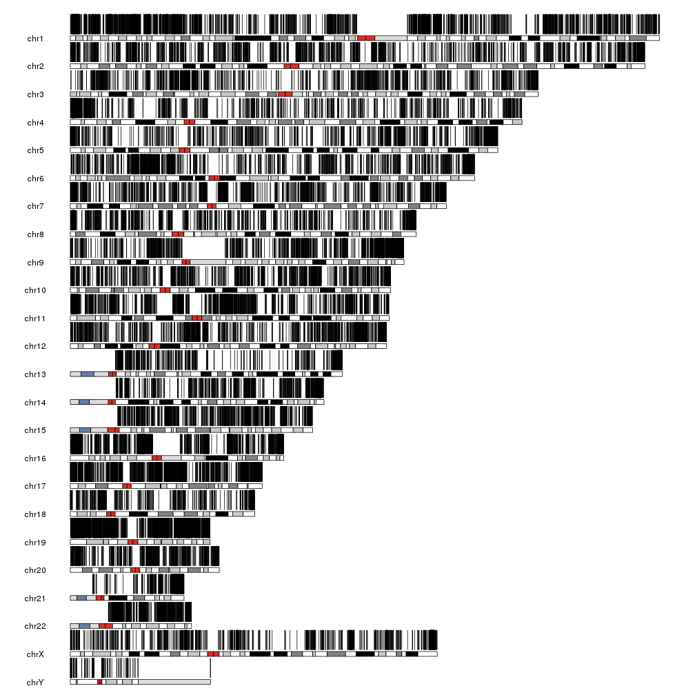
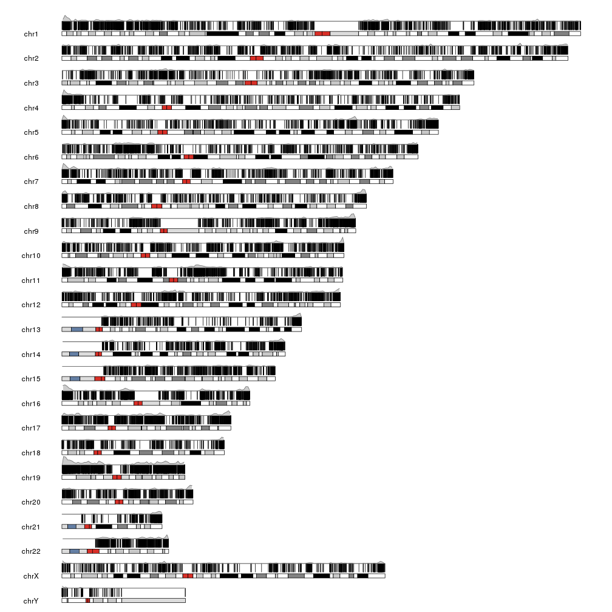
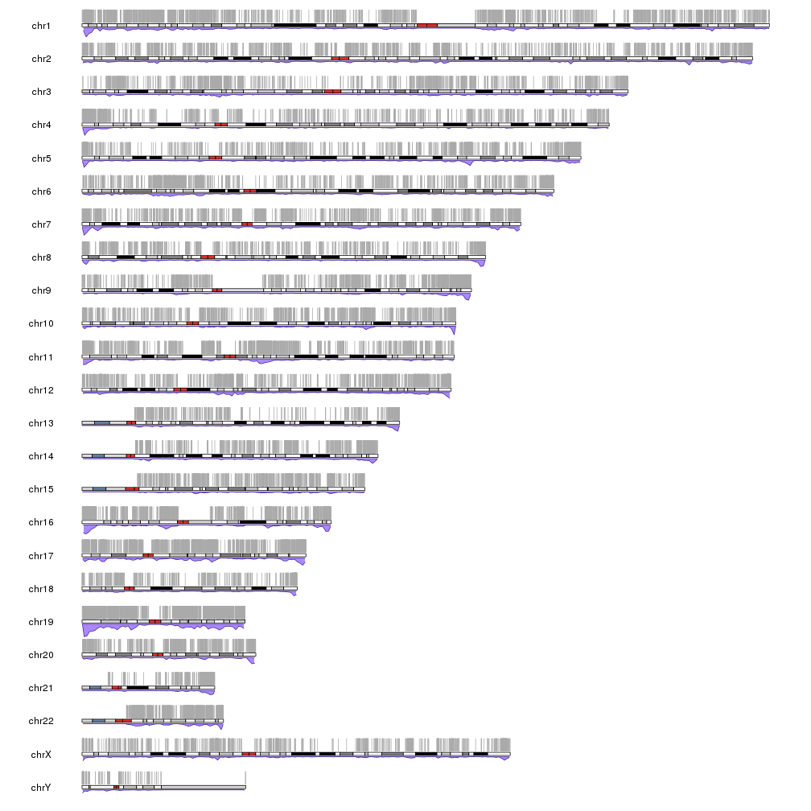
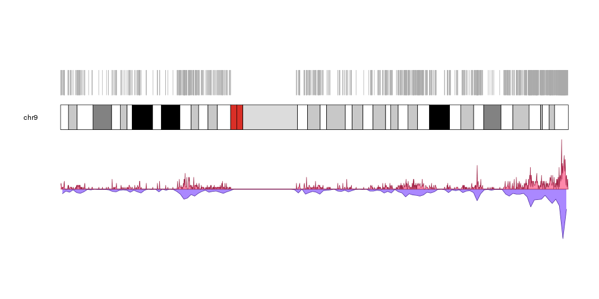
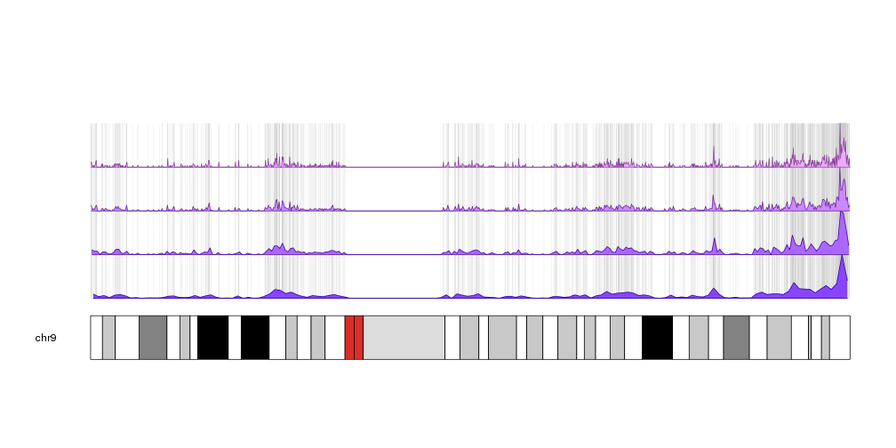

## Plot CpG Islands

In this examples we'll create a plot depicting the CpG Islands founds in the 
genome. There are about ~28K CpG islands scattered around the genome, representing
a somewhat dense set of non-overlapping regions. To get the data we'll use the 
excellent [AnnotationHub](https://bioconductor.org/packages/AnnotationHub) 
R package. In this case we'll use it to get the full set of CpG islands from 
UCSC in a GRanges object. You can find more information on how to search and 
retrieve data with the annotation hub in [its vignette](https://bioconductor.org/packages/release/bioc/vignettes/AnnotationHub/inst/doc/AnnotationHub-HOWTO.html)
 and in the [rtracklayer's import documentation](https://kasperdanielhansen.github.io/genbioconductor/html/rtracklayer_Import.html).


```r
library(AnnotationHub)
ahub <- AnnotationHub()
ahub["AH5086"]
```

```
## AnnotationHub with 1 record
## # snapshotDate(): 2017-04-25 
## # names(): AH5086
## # $dataprovider: UCSC
## # $species: Homo sapiens
## # $rdataclass: GRanges
## # $rdatadateadded: 2013-03-26
## # $title: CpG Islands
## # $description: GRanges object from UCSC track 'CpG Islands'
## # $taxonomyid: 9606
## # $genome: hg19
## # $sourcetype: UCSC track
## # $sourceurl: rtracklayer://hgdownload.cse.ucsc.edu/goldenpath/hg19/dat...
## # $sourcesize: NA
## # $tags: c("cpgIslandExt", "UCSC", "track", "Gene", "Transcript",
## #   "Annotation") 
## # retrieve record with 'object[["AH5086"]]'
```

```r
cpgs <- ahub[["AH5086"]]
cpgs
```

```
## GRanges object with 28691 ranges and 1 metadata column:
##                        seqnames           ranges strand |        name
##                           <Rle>        <IRanges>  <Rle> | <character>
##       [1]                  chr1 [ 28736,  29810]      * |    CpG:_116
##       [2]                  chr1 [135125, 135563]      * |     CpG:_30
##       [3]                  chr1 [327791, 328229]      * |     CpG:_29
##       [4]                  chr1 [437152, 438164]      * |     CpG:_84
##       [5]                  chr1 [449274, 450544]      * |     CpG:_99
##       ...                   ...              ...    ... .         ...
##   [28687]  chr9_gl000201_random [ 15651,  15909]      * |     CpG:_30
##   [28688]  chr9_gl000201_random [ 26397,  26873]      * |     CpG:_43
##   [28689] chr11_gl000202_random [ 16284,  16540]      * |     CpG:_23
##   [28690] chr17_gl000204_random [ 54686,  57368]      * |    CpG:_228
##   [28691] chr17_gl000205_random [117501, 117801]      * |     CpG:_23
##   -------
##   seqinfo: 93 sequences (1 circular) from hg19 genome
```

We can use `kpPlotRegions` to plot the CpG islands on the genome


```r
library(karyoploteR)
kp <- plotKaryotype()
kpPlotRegions(kp, data=cpgs)
```



With that many regions it's impossible to distinguish them but we can see there
are regions with different densities of CpG islands. We can plot them together 
with their density to get a more informative plot.


```r
kp <- plotKaryotype()
kpPlotRegions(kp, data=cpgs, r0=0, r1=0.5)
kpPlotDensity(kp, data=cpgs, r0=0.5, r1=1)
```



And we can futher refine the plot by plotting the regions with a lighter
color and plotting the density below the ideogram.


```r
kp <- plotKaryotype(plot.type=2)
kpPlotRegions(kp, data=cpgs, col="#AAAAAA", border="#AAAAAA")
kpPlotDensity(kp, data=cpgs, data.panel=2, col="#AA88FF")
```



Or showing the denstity with different window sizes with an inverted histogram,
a smaller data panel to plot the actual islands and, in this case, showing a 
single chromosome.


```r
pp <- getDefaultPlotParams(plot.type = 2)
pp$data1height <- 50
kp <- plotKaryotype(chromosomes="chr9", plot.type=2, plot.params = pp)
kpPlotRegions(kp, data=cpgs, col="#AAAAAA", border="#AAAAAA")
kpPlotDensity(kp, data=cpgs, data.panel=2, col="#AA88FF", r0=0.5, r1=1)
kpPlotDensity(kp, data=cpgs, data.panel=2, col="#FF88AA", window.size = 100000, r0=0.5, r1=0)
```



or making the CpG islands semitransparent to emphasize their accumulation in 
certain regions and plotting on top of them their density with different window
sizes.


```r
pp <- getDefaultPlotParams(plot.type = 2)
pp$data1height <- 50
kp <- plotKaryotype(chromosomes="chr9", plot.type=1)
kpPlotRegions(kp, data=cpgs, col="#CCCCCC44", border="#CCCCCC44")
kpPlotDensity(kp, data=cpgs, data.panel=1, col="#8844FF", window.size= 1000000, r0=0, r1=0.25)
kpPlotDensity(kp, data=cpgs, data.panel=1, col="#AA66FF", window.size = 500000, r0=0.25, r1=0.5)
kpPlotDensity(kp, data=cpgs, data.panel=1, col="#CC88FF", window.size = 200000, r0=0.5, r1=0.75)
kpPlotDensity(kp, data=cpgs, data.panel=1, col="#EEAAFF", window.size = 100000, r0=0.75, r1=1)
```


