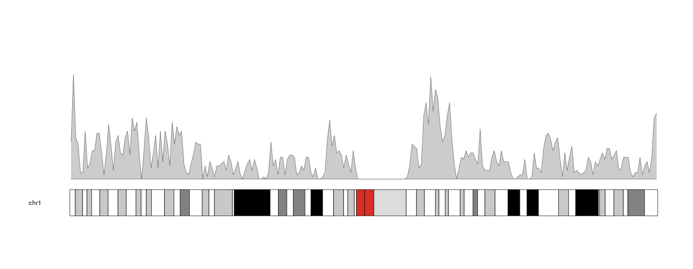
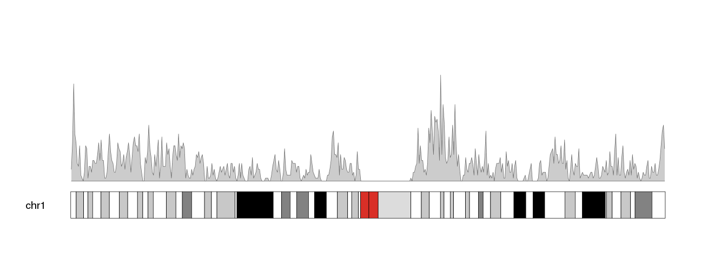
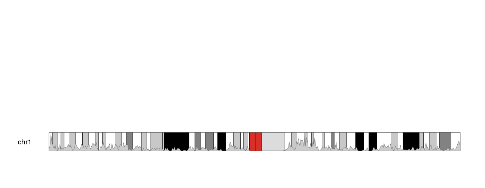
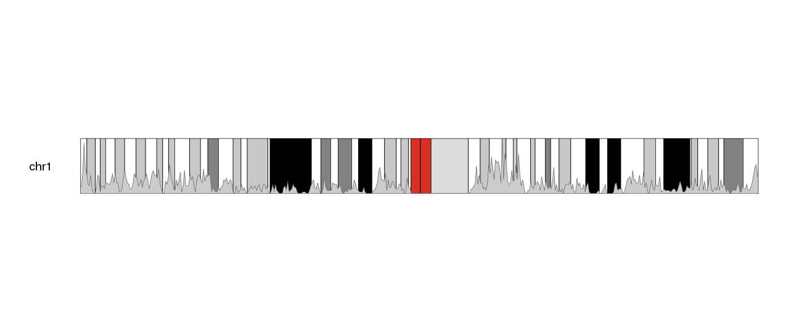
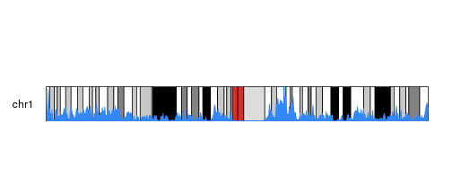
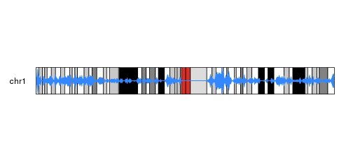
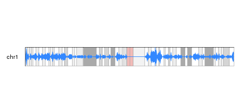
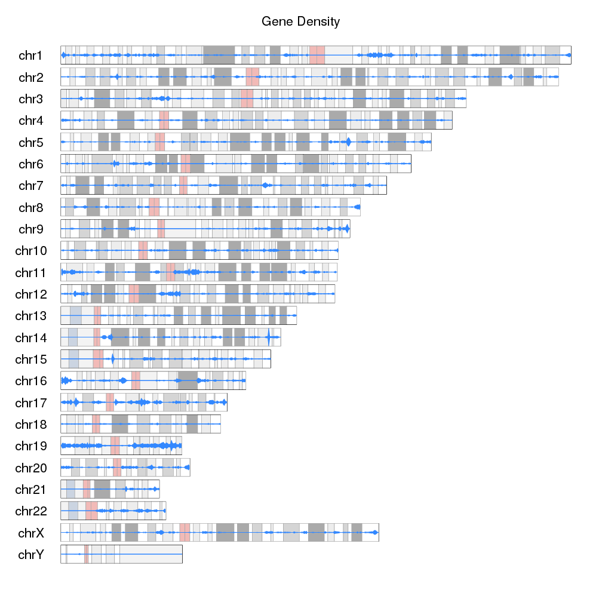

## Gene Density Ideograms

Since karyoploteR 1.8 it is possible to plot on the ideogram regions using the 
`data.plot="ideogram"`. In addtion to plotting **on** the ideograms, there's the
possibility of plotting something **instead of** the ideograms.

In this example we'll see how to use the ideogram data panel to create a 
karyoplot where ideograms are replaced by the gene density levels. We'll 
use the gene position information from the 
[TxDb.Hsapiens.UCSC.hg19.knownGene](https://bioconductor.org/packages/TxDb.Hsapiens.UCSC.hg19.knownGene)
Bioconductor package.  


We'll start by using the `genes` function to create a GRanges object
with all genes.


```r
library(TxDb.Hsapiens.UCSC.hg19.knownGene)
txdb <- TxDb.Hsapiens.UCSC.hg19.knownGene
all.genes <- genes(txdb)
head(all.genes)
```

```
## GRanges object with 6 ranges and 1 metadata column:
##             seqnames              ranges strand |     gene_id
##                <Rle>           <IRanges>  <Rle> | <character>
##           1    chr19   58858172-58874214      - |           1
##          10     chr8   18248755-18258723      + |          10
##         100    chr20   43248163-43280376      - |         100
##        1000    chr18   25530930-25757445      - |        1000
##       10000     chr1 243651535-244006886      - |       10000
##   100008586     chrX   49217763-49233491      + |   100008586
##   -------
##   seqinfo: 93 sequences (1 circular) from hg19 genome
```

And then, use the `kpPlotDensity` function to plot the gene density over the 
genome. We'll start with 1 chromosome to get a better view and then we'll 
move to the whole genome.


```r
library(karyoploteR)

kp <- plotKaryotype(plot.type=1, chromosomes="chr1")
kp <- kpPlotDensity(kp, all.genes)
```



We can see the plot density computed with the default window size, 1 megabse.
Changing the window size to 500 kilobases we'll get a less smoothed version of
the data.


```r
kp <- plotKaryotype(plot.type=1, chromosomes="chr1")
kpPlotDensity(kp, all.genes, window.size = 0.5e6)
```




Now, to move this data into the ideogram we simply need to specify that as the 
data panel with `data.panel="ideogram"`. We'll get the exact same representation
but on the ideogram.


```r
kp <- plotKaryotype(plot.type=1, chromosomes="chr1")
kpPlotDensity(kp, all.genes, window.size = 0.5e6, data.panel="ideogram")
```



The problem now is that the whole standard data panel is empty. If we do not
want to use it to plot anything else, we can use one of the 
[ideogram only plot types]({{ site.baseurl }}):
`plot.type=6` for chromosomes arranged in a stack or `plot.type=7` for all
chomosomes in a single line. With these plot types, standard data panels are 
removed and only the ideogram is available.


```r
kp <- plotKaryotype(plot.type=6, chromosomes="chr1")
kpPlotDensity(kp, all.genes, window.size = 0.5e6, data.panel="ideogram")
```



The other problem we have is that its difficult to see the density data. 
We'll change the color (bot the border and the shaded area) to make it more
apparent.


```r
kp <- plotKaryotype(plot.type=6, chromosomes="chr1")
kpPlotDensity(kp, all.genes, window.size = 0.5e6, data.panel="ideogram", col="#3388FF", border="#3388FF")
```



We can then use the trick of duplicating the plot and [inverting
one of them]({{ site.baseurl }})
with an r0 smaller than r1 to get a more interesting.


```r
kp <- plotKaryotype(plot.type=6, chromosomes="chr1")
kpPlotDensity(kp, all.genes, window.size = 0.5e6, data.panel="ideogram", col="#3388FF", border="#3388FF", r0=0.5, r1=1)
kpPlotDensity(kp, all.genes, window.size = 0.5e6, data.panel="ideogram", col="#3388FF", border="#3388FF", r0=0.5, r1=0)
```



And to the the plot density popping out more from the G-banding colors, we
can dim the cytobands intensity. To do that we could get the color table
with `getCytobandColors()` and modify them before calling `plotKaryotype()` 
or we could simply plot a white semi-transparent rectangle covering the 
whole ideograms. We can plot those rectamgles with `kpDataBackground` and 
specify a semitransparent color with the 2 last digits of the color definition 
in hexadecimal (i.e. "#FF0000" is red and "#FF0000AA", is a semi-transparent
red).


```r
kp <- plotKaryotype(plot.type=6, chromosomes="chr1")
kpDataBackground(kp, color = "#FFFFFFAA")
kpPlotDensity(kp, all.genes, window.size = 0.5e6, data.panel="ideogram", col="#3388FF", border="#3388FF", r0=0.5, r1=1)
kpPlotDensity(kp, all.genes, window.size = 0.5e6, data.panel="ideogram", col="#3388FF", border="#3388FF", r0=0.5, r1=0)
```



We can now add a main title, and show all chromosomes to get the final plot
of gene density on the ideograms.


```r
kp <- plotKaryotype(plot.type=6, main="Gene Density")
kpDataBackground(kp, color = "#FFFFFFAA")
kp <- kpPlotDensity(kp, all.genes, window.size = 0.5e6, data.panel="ideogram", col="#3388FF", border="#3388FF", r0=0.5, r1=1)
kp <- kpPlotDensity(kp, all.genes, window.size = 0.5e6, data.panel="ideogram", col="#3388FF", border="#3388FF", r0=0.5, r1=0)
```



If we want to go farther, we can actually replace the ideograms with the gene
density data. To do that we'll set `ideogram.plotter` to NULL in the call 
to `plotKaryotype` and plot the densities as we have been doing.


```r
kp <- plotKaryotype(plot.type=6, main="Gene Density", ideogram.plotter = NULL)
kp <- kpPlotDensity(kp, all.genes, window.size = 0.5e6, data.panel="ideogram", col="#3388FF", border="#3388FF", r0=0.5, r1=1)
kp <- kpPlotDensity(kp, all.genes, window.size = 0.5e6, data.panel="ideogram", col="#3388FF", border="#3388FF", r0=0.5, r1=0)
```


We can use  `data.panel="ideogram"` to use the ideogram as any other data.panel
in karyoploteR and all plotting functions work on ideograms in the same way as 
they do in standard data panels.


