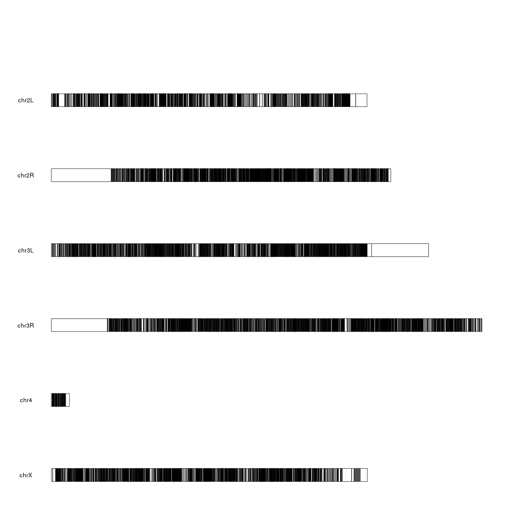
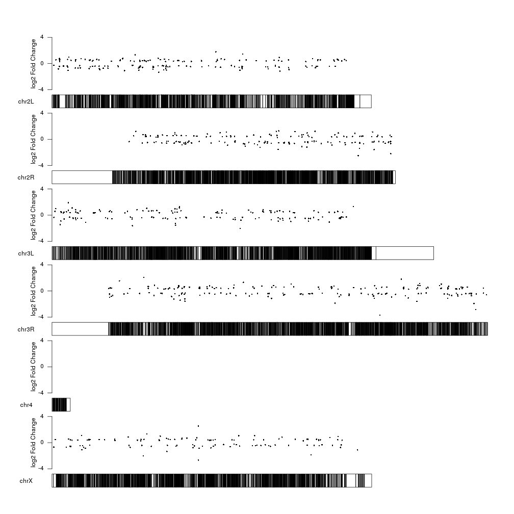
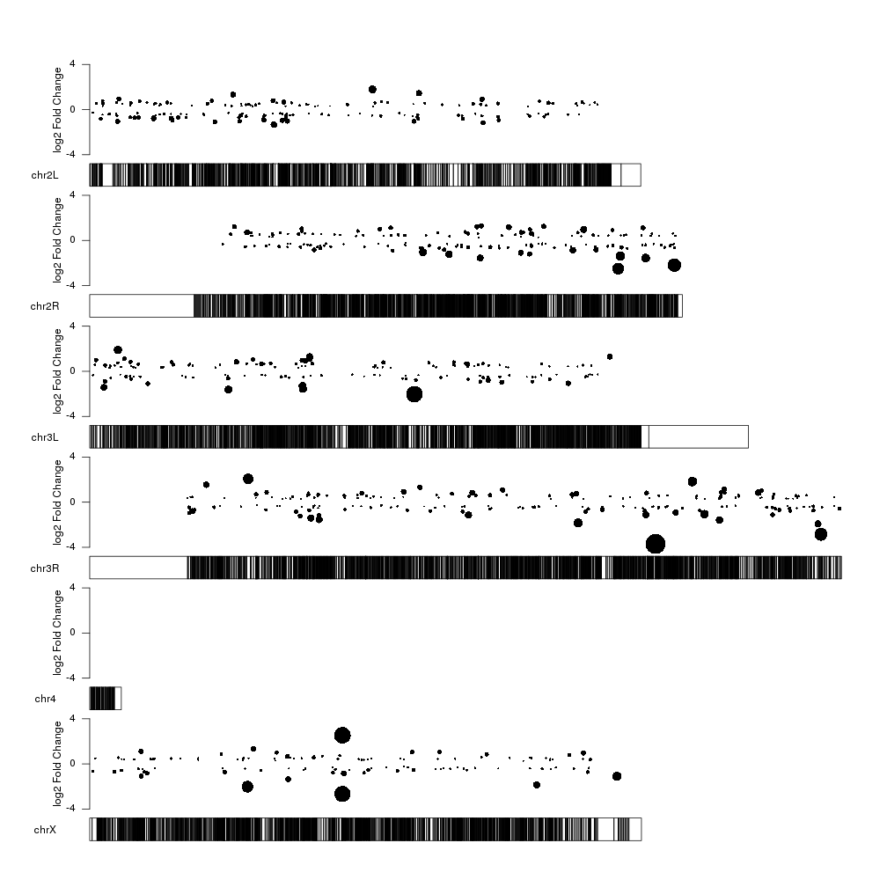
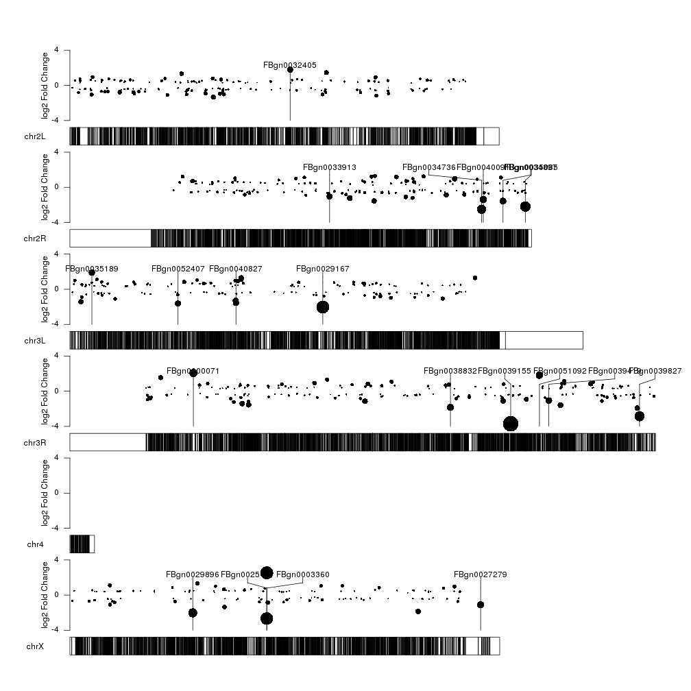
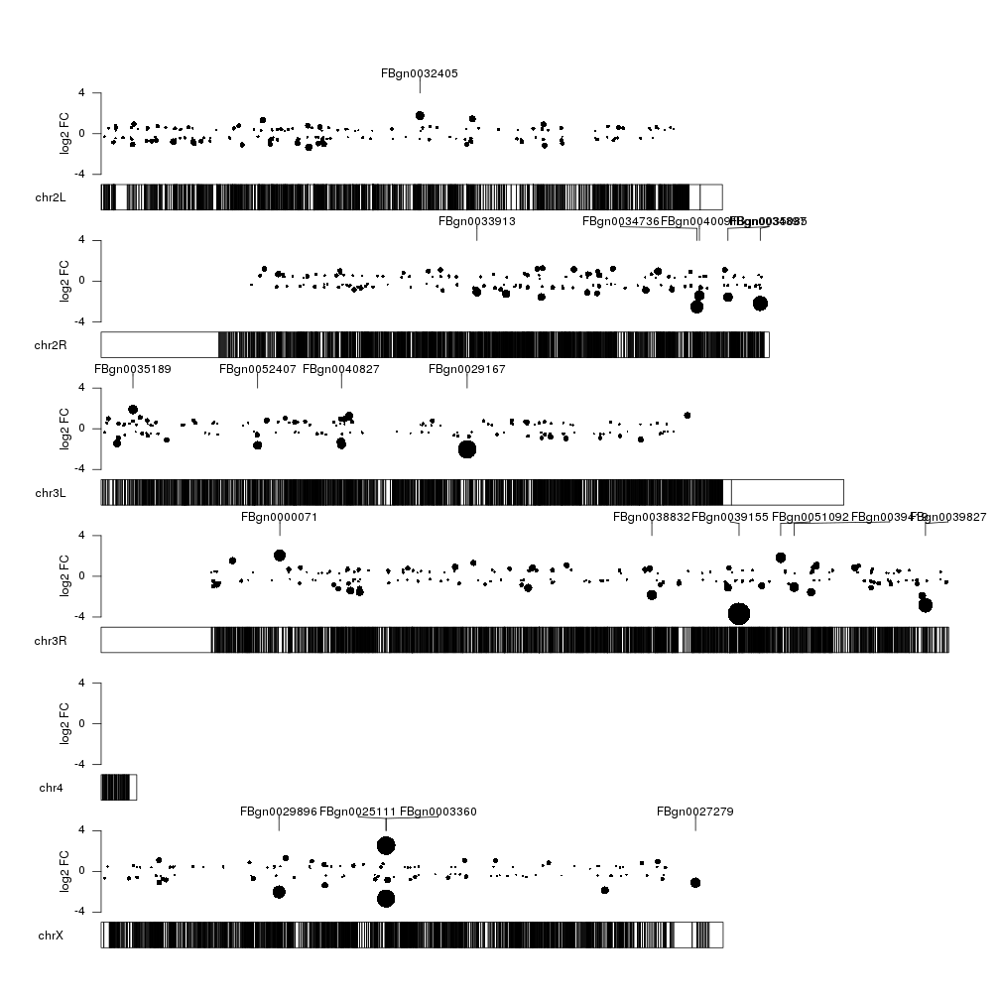
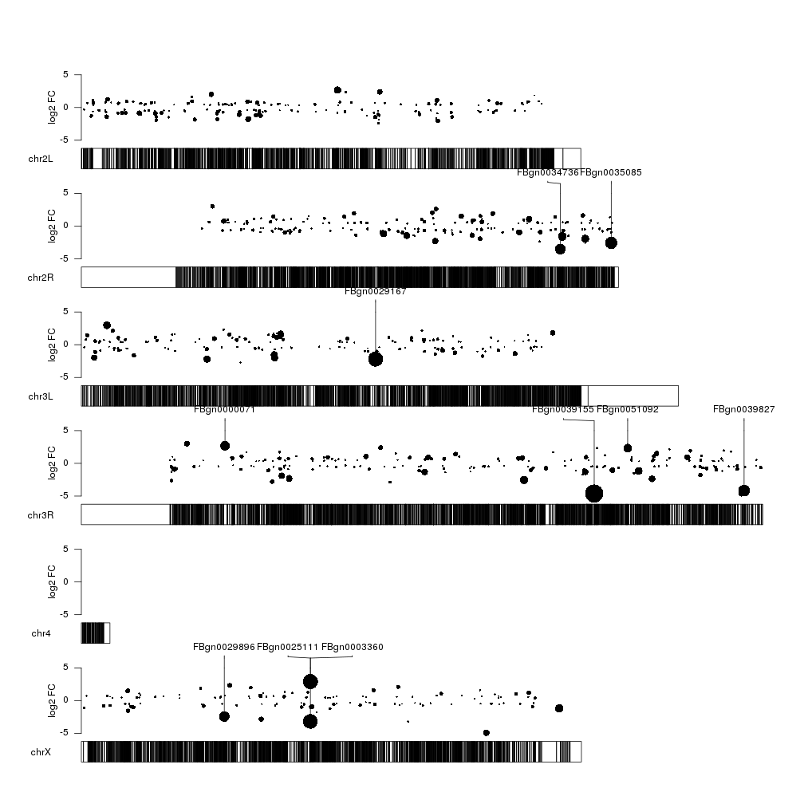
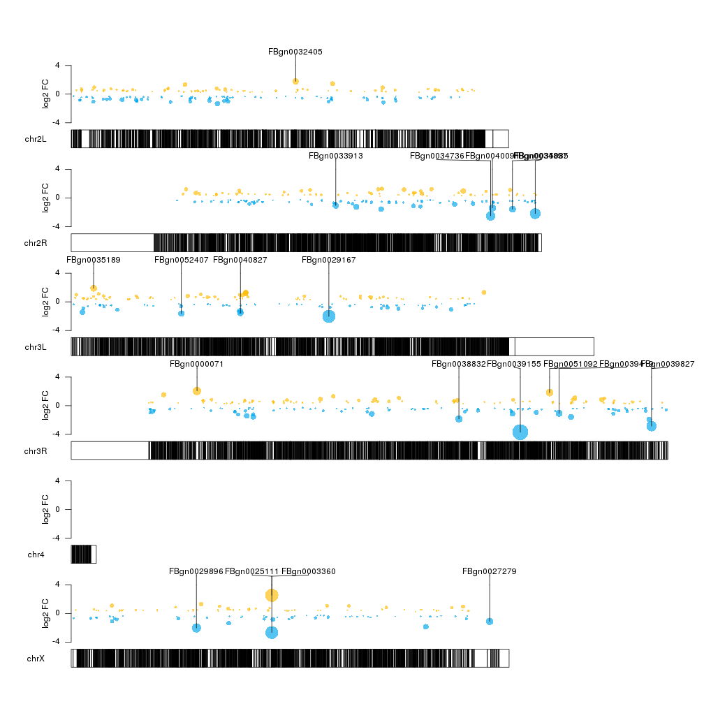
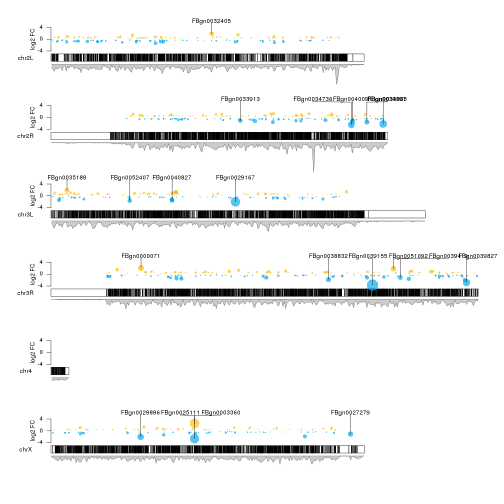
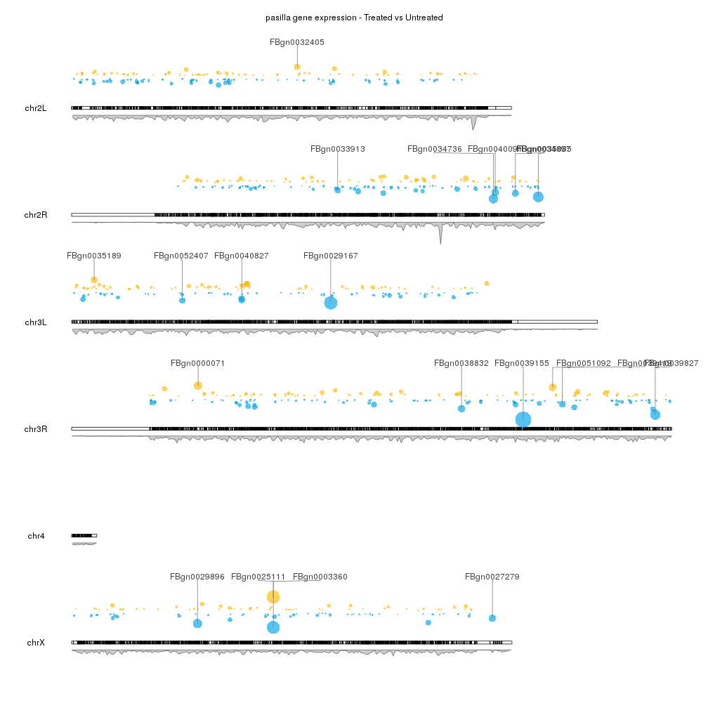

## Gene expression results from DESeq2

Since karyoploteR knows nothing about the data being plotted, it can be used to
plot almost anything on the genome. In this example we'll see how to plot 
the differential expression results obtained with DESeq2. We can plot 
differential expression results in many different ways, but in this case we'll
map the differentially expressed genes onto the genome and plot them with
karyoploteR.

As an example, we'll work with example data available in Bioconductor, but
the steps to produce the final plots should be mostly the same with any other
dataset.

We'll perform the differential expression analysis exactly as described in the 
[DESeq2 vignette](http://bioconductor.org/packages/devel/bioc/vignettes/DESeq2/inst/doc/DESeq2.html#count-matrix-input)
and we will use the data from the 
[pasilla](http://bioconductor.org/packages/pasilla/) 
dataset, which is RNA-seq data from Drosophila and is briefly described in 
[a section of the DESeq2 vignette](http://bioconductor.org/packages/devel/bioc/vignettes/DESeq2/inst/doc/DESeq2.html#about-the-pasilla-dataset).

We'll start with the preparation of the DESeq2 object from the initial gene 
counts and the annotation data.


```r
#Code extracted from the DESeq2 vignette

library("pasilla")
library("DESeq2")

pasCts <- system.file("extdata", "pasilla_gene_counts.tsv", package="pasilla", mustWork=TRUE)
pasAnno <- system.file("extdata", "pasilla_sample_annotation.csv", package="pasilla", mustWork=TRUE)
cts <- as.matrix(read.csv(pasCts,sep="\t",row.names="gene_id"))
coldata <- read.csv(pasAnno, row.names=1)
coldata <- coldata[,c("condition","type")]

rownames(coldata) <- sub("fb", "", rownames(coldata))
cts <- cts[, rownames(coldata)]

dds <- DESeqDataSetFromMatrix(countData = cts,
                              colData = coldata,
                              design = ~ condition)
dds$condition <- relevel(dds$condition, ref = "untreated")
dds
```

```
## class: DESeqDataSet 
## dim: 14599 7 
## metadata(1): version
## assays(1): counts
## rownames(14599): FBgn0000003 FBgn0000008 ... FBgn0261574
##   FBgn0261575
## rowData names(0):
## colnames(7): treated1 treated2 ... untreated3 untreated4
## colData names(2): condition type
```

And run `DESeq` to perfrom the differential analysis


```r
dds <- DESeq(dds)
res <- results(dds)
res <- lfcShrink(dds, coef = 2, res = res)
res
```

```
## log2 fold change (MAP): condition treated vs untreated 
## Wald test p-value: condition treated vs untreated 
## DataFrame with 14599 rows and 5 columns
##                 baseMean log2FoldChange         stat     pvalue      padj
##                <numeric>      <numeric>    <numeric>  <numeric> <numeric>
## FBgn0000003    0.1715687    0.007107268  0.269612549 0.78745835        NA
## FBgn0000008   95.1440790    0.001477986  0.009610592 0.99233197 0.9969288
## FBgn0000014    1.0565722   -0.011978234 -0.229978272 0.81810865        NA
## FBgn0000015    0.8467233   -0.046660666 -0.893853836 0.37140010        NA
## FBgn0000017 4352.5928988   -0.209843240 -1.904439437 0.05685298 0.2823313
## ...                  ...            ...          ...        ...       ...
## FBgn0261571 8.734368e-02    0.007107268   0.23628023  0.8132152        NA
## FBgn0261572 6.197137e+00   -0.147499961  -1.23440151  0.2170533        NA
## FBgn0261573 2.240984e+03    0.011315448   0.11192186  0.9108854 0.9820217
## FBgn0261574 4.857743e+03    0.011412015   0.07900487  0.9370287 0.9881251
## FBgn0261575 1.068355e+01    0.018870638   0.17424573  0.8616723 0.9679181
```

Once we have the differential expression results we'll need to map the genes
to the genome and to do that we'll use the Drosophila TranscriptDb package 
[TxDb.Dmelanogaster.UCSC.dm6.ensGene](http://bioconductor.org/packages/TxDb.Dmelanogaster.UCSC.dm6.ensGene/). 

We'll start by using the `genes` function to create a GRanges object
with all genes.


```r
library(TxDb.Dmelanogaster.UCSC.dm6.ensGene)
txdb <- TxDb.Dmelanogaster.UCSC.dm6.ensGene
dm.genes <- genes(txdb)
dm.genes
```

```
## GRanges object with 17522 ranges and 1 metadata column:
##               seqnames               ranges strand |     gene_id
##                  <Rle>            <IRanges>  <Rle> | <character>
##   FBgn0000003    chr3R [ 6822498,  6822796]      + | FBgn0000003
##   FBgn0000008    chr2R [22136968, 22172834]      + | FBgn0000008
##   FBgn0000014    chr3R [16807214, 16830049]      - | FBgn0000014
##   FBgn0000015    chr3R [16927210, 16972236]      - | FBgn0000015
##   FBgn0000017    chr3L [16615866, 16647882]      - | FBgn0000017
##           ...      ...                  ...    ... .         ...
##   FBgn0267791    chr2R [20587551, 20606854]      + | FBgn0267791
##   FBgn0267792    chr2R [ 8600415,  8612295]      + | FBgn0267792
##   FBgn0267793    chr2R [16297449, 16306695]      - | FBgn0267793
##   FBgn0267794    chr3L [17934032, 17946114]      + | FBgn0267794
##   FBgn0267795    chr3L [14053215, 14071583]      + | FBgn0267795
##   -------
##   seqinfo: 1870 sequences (1 circular) from dm6 genome
```

and we'll add the columns with the differential expression results to it as 
metadata columns (mcols) so we end up with an annotated GRanges.


```r
mcols(dm.genes) <- res[names(dm.genes), c("log2FoldChange", "stat", "pvalue", "padj")]
head(dm.genes, n=4)
```

```
## GRanges object with 4 ranges and 4 metadata columns:
##               seqnames               ranges strand |      log2FoldChange
##                  <Rle>            <IRanges>  <Rle> |           <numeric>
##   FBgn0000003    chr3R [ 6822498,  6822796]      + | 0.00710726767215306
##   FBgn0000008    chr2R [22136968, 22172834]      + | 0.00147798638960888
##   FBgn0000014    chr3R [16807214, 16830049]      - | -0.0119782342640497
##   FBgn0000015    chr3R [16927210, 16972236]      - | -0.0466606658388656
##                              stat            pvalue              padj
##                         <numeric>         <numeric>         <numeric>
##   FBgn0000003   0.269612548895004 0.787458345134478              <NA>
##   FBgn0000008 0.00961059225689427 0.992331974859153 0.996928822874469
##   FBgn0000014  -0.229978271825151 0.818108653792247              <NA>
##   FBgn0000015  -0.893853836045034 0.371400100174894              <NA>
##   -------
##   seqinfo: 1870 sequences (1 circular) from dm6 genome
```

Once we have this object available, the fun begins and we can start plotting.

Since we are working with Drosophila we'll have to specify the genome to 
`plotKaryotype`. We we'll start with an empty karyoplot.


```r
library(karyoploteR)
kp <- plotKaryotype(genome="dm6")
```



And we can start adding data. We can start by plotting the 10 most 
differentially expressed genes. We can use 
[kpPlotMarkers]({{ site.baseurl }}) 
for this.


```r
ordered <- dm.genes[order(dm.genes$padj, na.last = TRUE),]
kp <- plotKaryotype(genome="dm6")
kp <- kpPlotMarkers(kp, ordered[1:10], labels = names(ordered[1:10]), text.orientation = "horizontal")
```


Ok, we can see the position of some of the genes, but that's not very 
informative. What about getting a more general view?

We could create a plot with the p-values of all significant genes, for example.
To do that, we'll need first to transform the adjusted p-value into 
something that we can easily represent. A minus logarithimic transformation 
is the usual trick. We'll also first filter out the genes with _NA_ in the _padj_ 
column.


```r
filtered.dm.genes <- dm.genes[!is.na(dm.genes$padj)]
log.pval <- -log10(filtered.dm.genes$padj)
mcols(filtered.dm.genes)$log.pval <- log.pval
filtered.dm.genes
```

```
## GRanges object with 7797 ranges and 5 metadata columns:
##               seqnames               ranges strand |      log2FoldChange
##                  <Rle>            <IRanges>  <Rle> |           <numeric>
##   FBgn0000008    chr2R [22136968, 22172834]      + | 0.00147798638960888
##   FBgn0000017    chr3L [16615866, 16647882]      - |  -0.209843240203707
##   FBgn0000018    chr2L [10973443, 10975293]      - | -0.0874485266890122
##   FBgn0000032    chr3R [29991144, 29993411]      - | -0.0767711778110992
##   FBgn0000037    chr2R [24378630, 24390294]      - |   0.145641456614477
##           ...      ...                  ...    ... .                 ...
##   FBgn0261565    chr3L [16865295, 16922487]      + |  -0.251231127270061
##   FBgn0261570     chrX [17710144, 17752007]      + |   0.257863512803486
##   FBgn0261573     chrX [19521929, 19530896]      + |  0.0113154478080148
##   FBgn0261574    chr3L [20005301, 20024607]      + |  0.0114120150172215
##   FBgn0261575    chr3R [25344761, 25346921]      - |  0.0188706384196981
##                              stat             pvalue              padj
##                         <numeric>          <numeric>         <numeric>
##   FBgn0000008 0.00961059225689427  0.992331974859153 0.996928822874469
##   FBgn0000017    -1.9044394368462 0.0568529771801926 0.282331341927651
##   FBgn0000018  -0.706712077233004  0.479745422731885 0.823839754508847
##   FBgn0000032  -0.622245912207953  0.533780180624997 0.849780497961333
##   FBgn0000037    0.94234554818184  0.346015755589132  0.74090278717992
##           ...                 ...                ...               ...
##   FBgn0261565   -2.09788685901939 0.0359151411217614 0.209148217059962
##   FBgn0261570    2.32578599182291 0.0200299703113028 0.140801894342038
##   FBgn0261573   0.111921860421078  0.910885363393464 0.982021708033904
##   FBgn0261574   0.079004869938918  0.937028749522689 0.988125068279945
##   FBgn0261575   0.174245727583631  0.861672349754307 0.967918064555174
##                          log.pval
##                         <numeric>
##   FBgn0000008 0.00133584764253325
##   FBgn0000017   0.549240907645918
##   FBgn0000018  0.0841572549296743
##   FBgn0000032  0.0706932399739284
##   FBgn0000037   0.130238771455162
##           ...                 ...
##   FBgn0261565   0.679545833327293
##   FBgn0261570   0.851391502177146
##   FBgn0261573 0.00787891183103898
##   FBgn0261574 0.00518808271374489
##   FBgn0261575  0.0141614046932972
##   -------
##   seqinfo: 1870 sequences (1 circular) from dm6 genome
```

And now we can plot the significant genes (_padj_ < 0.05) represented as 
points on the genome using the 
[kpPoints]({{ site.baseurl }}) function,
with their y position determined by their pvalue.


```r
sign.genes <- filtered.dm.genes[filtered.dm.genes$padj < 0.05,]
kp <- plotKaryotype(genome="dm6")
kpPoints(kp, data=sign.genes, y=sign.genes$log.pval)
```


WOW! What happened here? There are points floating everywhere!

This is due to the fact that `ymin` and `ymax` are 0 and 1 by default but our 
y values are in a much larger range: 


```r
range(sign.genes$log.pval)
```

```
## [1]   1.302926 160.354846
```

So to tame the floating points we simply need to set `ymax` to the maximum value we want to plot.


```r
sign.genes <- filtered.dm.genes[filtered.dm.genes$padj < 0.05,]
kp <- plotKaryotype(genome="dm6")
kpPoints(kp, data=sign.genes, y=sign.genes$log.pval, ymax=max(sign.genes$log.pval))
```


That's better and makes more sense. We can see lots of genes with a relatively
high p-value (and low -log10(pval)) and a few genes with a very small p-pvalue
(and a high -log10(pval)). We cal also see how these points are in the same
positions as the markers in the first plot, as expected. 

The log2 of the fold change is another value we could plot. It has a smaller
range and might be more suitable to be used as the y value in a scatter plot.

We'll start studying it's range:


```r
range(sign.genes$log2FoldChange)
```

```
## [1] -3.697670  2.534268
```

We can see the values are distributted above and below 0, so we'll have to 
adjust both `ymin` and `ymax`. To make it more clear, we'll center the 0. 


```r
fc.ymax <- ceiling(max(abs(range(sign.genes$log2FoldChange))))
fc.ymin <- -fc.ymax

kp <- plotKaryotype(genome="dm6")
kpPoints(kp, data=sign.genes, y=sign.genes$log2FoldChange, ymax=fc.ymax, ymin=fc.ymin)
```


And we can add a y axis and a label to explain what the data represents.


```r
kp <- plotKaryotype(genome="dm6")
kpPoints(kp, data=sign.genes, y=sign.genes$log2FoldChange, ymax=fc.ymax, ymin=fc.ymin)
kpAxis(kp, ymax=fc.ymax, ymin=fc.ymin)
kpAddLabels(kp, labels = "log2 Fold Change", srt=90, pos=1, label.margin = 0.04, ymax=fc.ymax, ymin=fc.ymin)
```



Now we can clearly see the fold changes but the significance level of the
differentially expressed genes is not represented. How can we include it into 
the plot? We can use the size of the points to represent the p-value information
using the `cex` parameter of `kpPoints`. We can apply a square root to the 
log pval so the area of the circle is proportional to the pval, and scale it up
or down with a fixed factor depending on the available space to improve the 
perception of the data.


```r
cex.val <- sqrt(sign.genes$log.pval)/3
kp <- plotKaryotype(genome="dm6")
kpPoints(kp, data=sign.genes, y=sign.genes$log2FoldChange, cex=cex.val, ymax=fc.ymax, ymin=fc.ymin)
kpAxis(kp, ymax=fc.ymax, ymin=fc.ymin)
kpAddLabels(kp, labels = "log2 Fold Change", srt=90, pos=1, label.margin = 0.04, ymax=fc.ymax, ymin=fc.ymin)
```



With this representation we see some interesting things such the fact that the
too very close top 10 significant genes in chrX are in fact regulated in
oposite directions, with one overexpressed and the other one underexpressed.

Can we combine the two plots into a single one so we get the general view plus
the name of the most significant genes? Sure! On option is to plot everything 
together, with markers on top of the data points by simply adding a call to
`kpPlotMarkers` as in the second plot.


```r
top.genes <- ordered[1:10]

kp <- plotKaryotype(genome="dm6")
kpPoints(kp, data=sign.genes, y=sign.genes$log2FoldChange, cex=cex.val, ymax=fc.ymax, ymin=fc.ymin)
kpAxis(kp, ymax=fc.ymax, ymin=fc.ymin)
kpAddLabels(kp, labels = "log2 Fold Change", srt=90, pos=1, label.margin = 0.04, ymax=fc.ymax, ymin=fc.ymin)
kpPlotMarkers(kp, top.genes, labels = names(top.genes), text.orientation = "horizontal")
```



This kind of works... but it's not very aesthetically pleasing. We can easily 
separate the two representations in two different vertical areas with the `r0`
and `r1` arguments. We can set the lower 80% of the area for the data points 
telling them to finish at 0.8 with `r1=0.8` and the top 20% for the markers 
telling them to start at 0.8 with `r0=0.8`. 


```r
points.top <- 0.8
kp <- plotKaryotype(genome="dm6")
kpPoints(kp, data=sign.genes, y=sign.genes$log2FoldChange, cex=cex.val, ymax=fc.ymax, ymin=fc.ymin, r1=points.top)
kpAxis(kp, ymax=fc.ymax, ymin=fc.ymin, r1=points.top)
kpAddLabels(kp, labels = "log2 FC", srt=90, pos=1, label.margin = 0.04, ymax=fc.ymax, ymin=fc.ymin, r1=points.top)
kpPlotMarkers(kp, top.genes, labels = names(top.genes), text.orientation = "horizontal", r0=points.top)
```



Ok, that's better. But could extend the markers to the exact point they are
annotating? So we can visually relate them better? We cannot extend the markers 
down in a non-uniform way, but we can simulate that drawing a few vertical 
segments from the center of the points up to the top of the data part of the 
plot. To do that we'll set `x0` and `x1` to the center of the gene, `y0` to the y 
value as determined by the log fold change and `y1` to the _fc.max_ previously
computed.


```r
kp <- plotKaryotype(genome="dm6")
kpPoints(kp, data=sign.genes, y=sign.genes$log2FoldChange, cex=cex.val, ymax=fc.ymax, ymin=fc.ymin, r1=points.top)
kpAxis(kp, ymax=fc.ymax, ymin=fc.ymin, r1=points.top)
kpAddLabels(kp, labels = "log2 FC", srt=90, pos=1, label.margin = 0.04, ymax=fc.ymax, ymin=fc.ymin, r1=points.top)
kpPlotMarkers(kp, top.genes, labels = names(top.genes), text.orientation = "horizontal", r0=points.top)
gene.mean <- start(top.genes) + (end(top.genes) - start(top.genes))/2
kpSegments(kp, chr=as.character(seqnames(top.genes)), x0=gene.mean, x1=gene.mean, y0=top.genes$log2FoldChange, y1=fc.ymax, ymax=fc.ymax, ymin=fc.ymin, r1=points.top)
```



That's better, but we could add some color to differentiate between over- and 
underexpressed genes. We'll make the color partially transparent so we can see
more clearly when different data points overlap. 


```r
col.over <- "#FFBD07AA"
col.under <- "#00A6EDAA"
sign.col <- rep(col.over, length(sign.genes))
sign.col[sign.genes$log2FoldChange<0] <- col.under

kp <- plotKaryotype(genome="dm6")
kpPoints(kp, data=sign.genes, y=sign.genes$log2FoldChange, cex=cex.val, ymax=fc.ymax, ymin=fc.ymin, r1=points.top, col=sign.col)
kpAxis(kp, ymax=fc.ymax, ymin=fc.ymin, r1=points.top)
kpAddLabels(kp, labels = "log2 FC", srt=90, pos=1, label.margin = 0.04, ymax=fc.ymax, ymin=fc.ymin, r1=points.top)
gene.mean <- start(top.genes) + (end(top.genes) - start(top.genes))/2
kpSegments(kp, chr=as.character(seqnames(top.genes)), x0=gene.mean, x1=gene.mean, y0=top.genes$log2FoldChange, y1=fc.ymax, ymax=fc.ymax, ymin=fc.ymin, r1=points.top)
kpPlotMarkers(kp, top.genes, labels = names(top.genes), text.orientation = "horizontal", r0=points.top)
```



There seems to be some regions of the genome somehow depleted of significant 
genes. Is it because there are just a few genes in those regions or might be 
caused by some other factor? To explore this possibility we can add a second
data panel below the ideograms (setting `plot.type` to 2) and plot there the 
gene density.


```r
kp <- plotKaryotype(genome="dm6", plot.type=2)
#Data panel 1
kpPoints(kp, data=sign.genes, y=sign.genes$log2FoldChange, cex=cex.val, ymax=fc.ymax, ymin=fc.ymin, r1=points.top, col=sign.col)
kpAxis(kp, ymax=fc.ymax, ymin=fc.ymin, r1=points.top)
kpAddLabels(kp, labels = "log2 FC", srt=90, pos=1, label.margin = 0.04, ymax=fc.ymax, ymin=fc.ymin, r1=points.top)
gene.mean <- start(top.genes) + (end(top.genes) - start(top.genes))/2
kpSegments(kp, chr=as.character(seqnames(top.genes)), x0=gene.mean, x1=gene.mean, y0=top.genes$log2FoldChange, y1=fc.ymax, ymax=fc.ymax, ymin=fc.ymin, r1=points.top)
kpPlotMarkers(kp, top.genes, labels = names(top.genes), text.orientation = "horizontal", r0=points.top)

#Data panel 2
kp <- kpPlotDensity(kp, data=dm.genes, window.size = 10e4, data.panel = 2)
```



We can see that this is the case for some regions (for example the end of chrX 
but not for others).

To finish up our plot we can adjust some plotting parameters to make the 
ideograms and the second data panel smaller and to leave some margin between the
marker labels. We can also remove the axis and labels if desired, and adjust 
some of the colors.


```r
pp <- getDefaultPlotParams(plot.type = 2)
pp$data2height <- 75
pp$ideogramheight <- 10
kp <- plotKaryotype(genome="dm6", plot.type=2, plot.params = pp)
kpAddMainTitle(kp, main = "pasilla gene expression - Treated vs Untreated")
#Data panel 1
kpPoints(kp, data=sign.genes, y=sign.genes$log2FoldChange, cex=cex.val, ymax=fc.ymax, ymin=fc.ymin, r1=points.top, col=sign.col)
gene.mean <- start(top.genes) + (end(top.genes) - start(top.genes))/2
kpSegments(kp, chr=as.character(seqnames(top.genes)), x0=gene.mean, x1=gene.mean, y0=top.genes$log2FoldChange, y1=fc.ymax, ymax=fc.ymax, ymin=fc.ymin, r1=points.top, col="#777777")
kpPlotMarkers(kp, top.genes, labels = names(top.genes), text.orientation = "horizontal", r0=points.top, label.dist = 0.008, label.color="#444444", line.color = "#777777")

#Data panel 2
kp <- kpPlotDensity(kp, data=dm.genes, window.size = 10e4, data.panel = 2)
```




