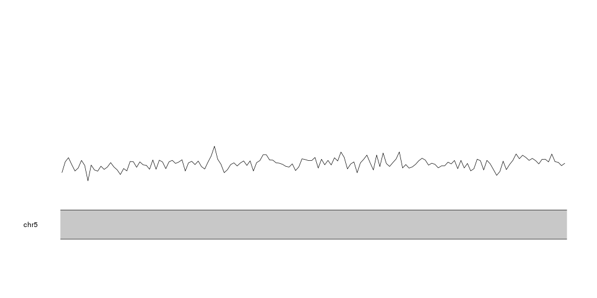
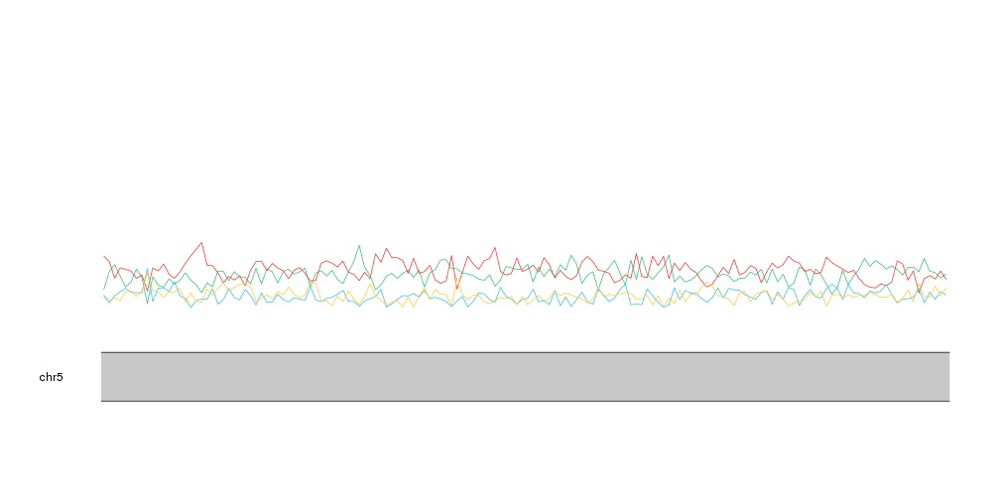
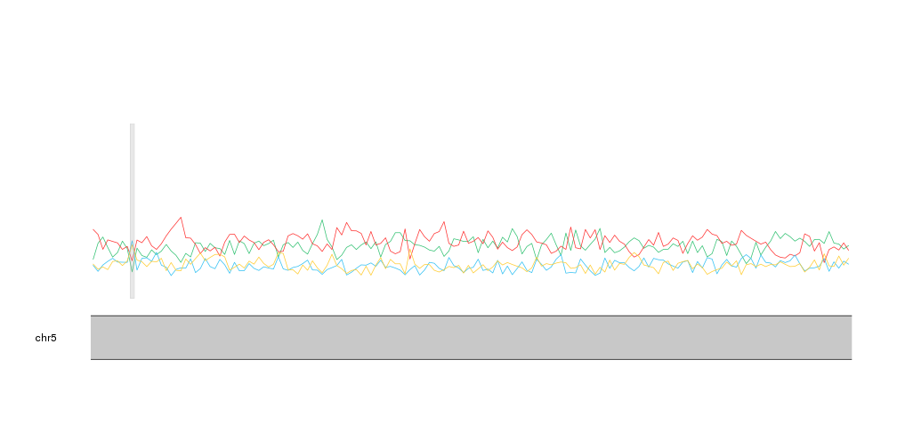
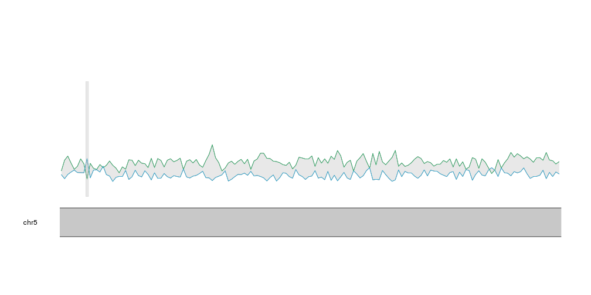
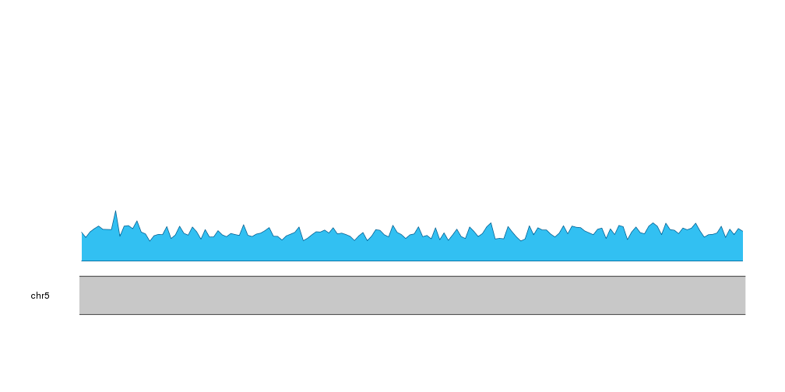
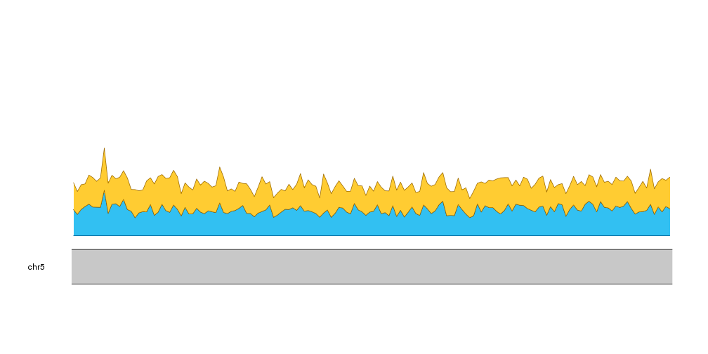
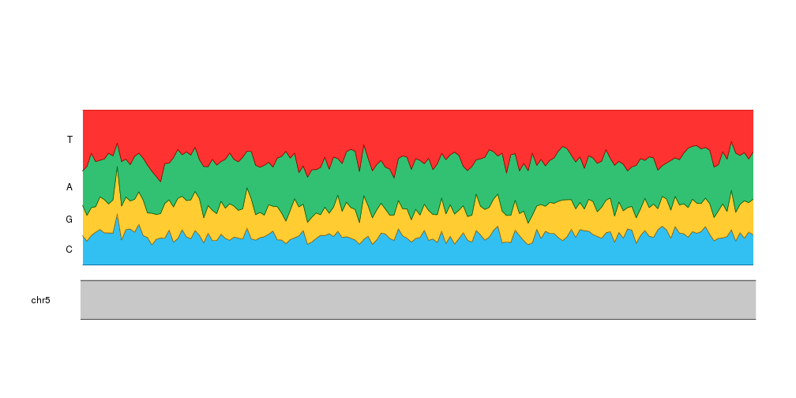
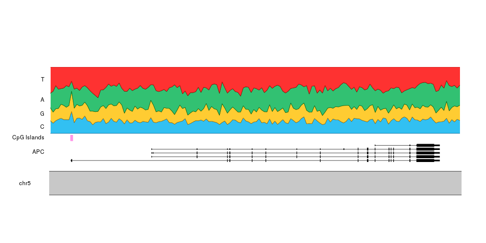
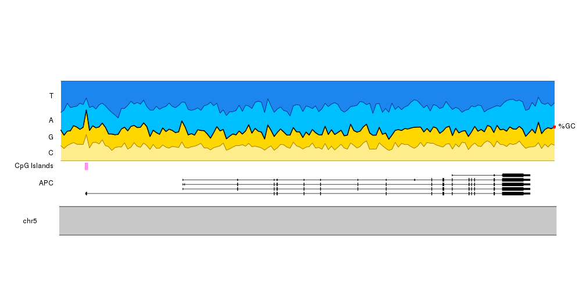
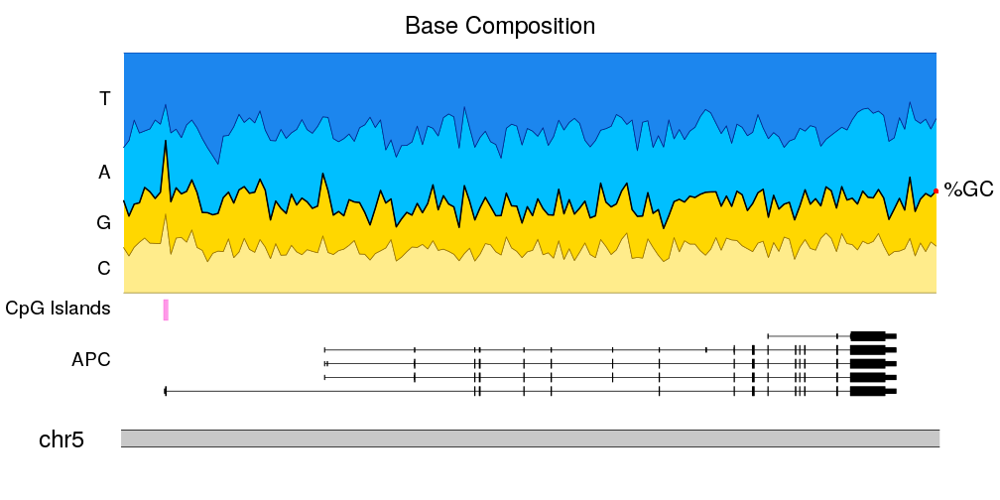

## Plot the nucleotide composition of the genome

In this example we'll create a plot representing the proportion of each
nucleotide along the genome. Plotting this kind of data usually only makes sense
for small regions, so we'll use `zoom` to restrict the plot to a small 
part of the genome (in this case, the APC gene region). We'll also add
CpG islands location in the genome to see how they relate to the CG sequence
content.

# Data

In this examples we'll use data from different sources:

- **Sequence:** To obtain the genomic sequence of the human genome 
  version GRCh37 we'll use the 
  [BSgenome.Hsapiens.UCSC.hg19](http://bioconductor.org/packages/BSgenome.Hsapiens.UCSC.hg19/)
  package, based on data from UCSC
- **Gene Structure:** To plot the APC gene we'll need a `TxDb` object as 
  expected by the `kpPlotGenes` function. In this case we'll use data from 
  UCSC available on the 
  [TxDb.Hsapiens.UCSC.hg19.knownGene](http://bioconductor.org/packages/TxDb.Hsapiens.UCSC.hg19.knownGene/)
  package. 
- **CpG Islands:** To get the CpG Islands we'll use the 
 [AnnotationHub](https://bioconductor.org/packages/AnnotationHub) 
R package. You can find more information on how to search and 
retrieve data with the annotation hub in 
[its vignette](https://bioconductor.org/packages/release/bioc/vignettes/AnnotationHub/inst/doc/AnnotationHub-HOWTO.html) and in the 
[rtracklayer's import documentation](https://kasperdanielhansen.github.io/genbioconductor/html/rtracklayer_Import.html)

# Let's start

We'll start loading the required libraries and loading the CpG islands from 
`AnnotationHub`. The CpG Islands are the source with identifier *AH5086*. 
Refer to the 
[AnnotationHub vignette](https://bioconductor.org/packages/release/bioc/vignettes/AnnotationHub/inst/doc/AnnotationHub-HOWTO.html)
to find out how to explore the available annotation sources.


```r
library(karyoploteR)

library(BSgenome.Hsapiens.UCSC.hg19)
library(TxDb.Hsapiens.UCSC.hg19.knownGene)
library(AnnotationHub)

ahub <- AnnotationHub()
cpg.islands <- ahub[["AH5086"]]
```

And defining some variables we'll need: the bases in the order we'll plot them
and a color for each one of them (we'll use the standrad sanger derived colors).


```r
bases <- c("C", "G", "A", "T")
base.colors <- setNames(c("#32C0F2", "#FFCC32", "#32C172", "#FE3231"), bases)
```

We can now use [regioneR's](http://bioconductor.org/packages/regioneR/) 
`toGRanges` function to create a `GenomicRanges` object with the region we want
to plot (a genomic region containing *APC*), and partition this region into 
multiple non-overlaping tiles with the `tile` function from the `GenomicRanges`
package. We'll set the tile width to 1000 bases. We'll use `unlist` to convert 
`GRangesList` returned by `tile` into a `GRanges`.


```r
APC.loci <- toGRanges("chr5:112035000-112190000", genome = "hg19")

tiles <- tile(x = APC.loci, width = 1000)
tiles <- unlist(tiles)
tiles
```

```
## GRanges object with 156 ranges and 0 metadata columns:
##         seqnames              ranges strand
##            <Rle>           <IRanges>  <Rle>
##     [1]     chr5 112035000-112035992      *
##     [2]     chr5 112035993-112036986      *
##     [3]     chr5 112036987-112037979      *
##     [4]     chr5 112037980-112038973      *
##     [5]     chr5 112038974-112039966      *
##     ...      ...                 ...    ...
##   [152]     chr5 112185033-112186025      *
##   [153]     chr5 112186026-112187019      *
##   [154]     chr5 112187020-112188012      *
##   [155]     chr5 112188013-112189006      *
##   [156]     chr5 112189007-112190000      *
##   -------
##   seqinfo: 93 sequences from an unspecified genome; no seqlengths
```

The next step is to get the genomic sequence of each of these tiles and 
count the number of times we see each nucleotide. We can use 
[`getSeq`](https://www.rdocumentation.org/packages/BSgenome/versions/1.40.1/topics/getSeq-methods)
to extract the sequence for every tile and us the `alphabetFrequency` function
to count the nucleotides. 
Then, to get the frequencies we'll divide each count with the total number of
bases in each tile (we can get that value with `rowSums`) and attach the 
nucleotide frequencies to the tiles GRanges. When doing that we'll select 
the columns explicitly to ensure they are in the order we want.


```r
seqs <- getSeq(BSgenome.Hsapiens.UCSC.hg19, tiles)
counts <- alphabetFrequency(seqs, baseOnly=TRUE)
freqs <- counts/rowSums(counts)

mcols(tiles) <- DataFrame(freqs[,bases])
tiles
```

```
## GRanges object with 156 ranges and 4 metadata columns:
##         seqnames              ranges strand |                 C
##            <Rle>           <IRanges>  <Rle> |         <numeric>
##     [1]     chr5 112035000-112035992      * | 0.188318227593152
##     [2]     chr5 112035993-112036986      * | 0.153923541247485
##     [3]     chr5 112036987-112037979      * | 0.190332326283988
##     [4]     chr5 112037980-112038973      * | 0.211267605633803
##     [5]     chr5 112038974-112039966      * | 0.228600201409869
##     ...      ...                 ...    ... .               ...
##   [152]     chr5 112185033-112186025      * | 0.154078549848943
##   [153]     chr5 112186026-112187019      * | 0.208249496981891
##   [154]     chr5 112187020-112188012      * | 0.172205438066465
##   [155]     chr5 112188013-112189006      * | 0.212273641851107
##   [156]     chr5 112189007-112190000      * | 0.195171026156942
##                         G                 A                 T
##                 <numeric>         <numeric>         <numeric>
##     [1] 0.195367573011078 0.222557905337362 0.393756294058409
##     [2] 0.165995975855131 0.314889336016097 0.365191146881288
##     [3] 0.179254783484391 0.350453172205438 0.279959718026183
##     [4] 0.163983903420523 0.290744466800805 0.334004024144869
##     [5] 0.210473313192346 0.235649546827795  0.32527693856999
##     ...               ...               ...               ...
##   [152] 0.185297079556898 0.381671701913394 0.278952668680765
##   [153] 0.182092555331992   0.3158953722334 0.293762575452716
##   [154] 0.241691842900302 0.310171198388721 0.275931520644512
##   [155] 0.189134808853119  0.28169014084507 0.316901408450704
##   [156] 0.228370221327968 0.301810865191147 0.274647887323944
##   -------
##   seqinfo: 93 sequences from an unspecified genome; no seqlengths
```

With that we can now start plotting! We'll use the `zoom` parameter to 
[create a plot representing a small portion of the genome](https://bernatgel.github.io/karyoploter_tutorial//Tutorial/Zoom/Zoom.html)
and then we can use [`kpLines`](https://bernatgel.github.io/karyoploter_tutorial//Tutorial/Lines/Lines.html) to plot the frequency of a nucleotide along the genome.


```r
kp <- plotKaryotype(zoom=APC.loci)
kpLines(kp, data=tiles, y=tiles$A)
```



And we can use the same strategy to plot the frequency of each nucleotide at the 
same time. To differentiate the lines we'll plot them in the nucleotide colors.


```r
kp <- plotKaryotype(zoom=APC.loci)
kpLines(kp, data=tiles, y=tiles$A, col=base.colors["A"])
kpLines(kp, data=tiles, y=tiles$T, col=base.colors["T"])
kpLines(kp, data=tiles, y=tiles$C, col=base.colors["C"])
kpLines(kp, data=tiles, y=tiles$G, col=base.colors["G"])
```



With that we can see that A and T are mor frequent than C and G, as expected and
we can identify small regions where this relation changes. If we plot the 
CpG islands with [`kpPlotRegions`](https://bernatgel.github.io/karyoploter_tutorial//Tutorial/PlotRegions/PlotRegions.html) using a transparent grey color we can see that the only CpG 
island in this region overlaps the region with highest proportion of C and G.


```r
kp <- plotKaryotype(zoom=APC.loci)
kpLines(kp, data=tiles, y=tiles$A, col=base.colors["A"])
kpLines(kp, data=tiles, y=tiles$T, col=base.colors["T"])
kpLines(kp, data=tiles, y=tiles$C, col=base.colors["C"])
kpLines(kp, data=tiles, y=tiles$G, col=base.colors["G"])

kpPlotRegions(kp, data=cpg.islands, col="#AAAAAA44")
```




This representation, however, might not be the best to represent proportions.
A stacked area graph can represent this kind of data in a slightly different 
way where it's clear that the values represent a proportion over a total.

karyoploteR does not include a stacked area graph, but we can build it with 
a bit of precomputation and using the `kpPlotRibbon` function. A ribbon is
a variable width polygon defined by two lines, y0 and y1.

As an example of ribbon we can plot the distance between the A frequency and the
C frequency.


```r
kp <- plotKaryotype(zoom=APC.loci)
kpPlotRibbon(kp, data=tiles, y0=tiles$C, y1=tiles$A, col="#AAAAAA44")
kpLines(kp, data=tiles, y=tiles$A, col=base.colors["A"])
kpLines(kp, data=tiles, y=tiles$C, col=base.colors["C"])


kpPlotRegions(kp, data=cpg.islands, col="#AAAAAA44")
```



Now, to create a stacked area plot we'll need to stack one ribbon per 
nucleotide, one on top of each other, with the cumulative sum of the frequencies
of the bases below it as y0 and y1. We can use `lapply` and the `cumsum` 
function to compute the cumulative sums for each tile.


```r
cum.sums <- lapply(seq_len(length(tiles)), 
                   function(i) {
                     return(cumsum(as.numeric(data.frame(mcols(tiles))[i,c(1:4)])))
                  })
cum.sums <- do.call(rbind, cum.sums)
cum.sums <- data.frame(cum.sums)
names(cum.sums) <- bases
head(cum.sums)
```

```
##           C         G         A T
## 1 0.1883182 0.3836858 0.6062437 1
## 2 0.1539235 0.3199195 0.6348089 1
## 3 0.1903323 0.3695871 0.7200403 1
## 4 0.2112676 0.3752515 0.6659960 1
## 5 0.2286002 0.4390735 0.6747231 1
## 6 0.2072435 0.4215292 0.6830986 1
```

As expected, the cumulative sum of the frequencies for the last nucleotide, T, 
is 1.

We can now use this data to plot the ribbons. First, we'll start with the C 
frequency. In this case it will go from 0 to the frequency of C.


```r
kp <- plotKaryotype(zoom=APC.loci)
kpPlotRibbon(kp, data=tiles, y0=0, y1=cum.sums$C, col=base.colors["C"])
```



Then, we can add the next nucleotide, G, going from the frequency of C to the
frequency of C plus G.


```r
kp <- plotKaryotype(zoom=APC.loci)
kpPlotRibbon(kp, data=tiles, y0=0, y1=cum.sums$C, col=base.colors["C"])
kpPlotRibbon(kp, data=tiles, y0=cum.sums$C, y1=cum.sums$G, col=base.colors["G"])
```



And we can do the same with A and T


```r
kp <- plotKaryotype(zoom=APC.loci)
kpPlotRibbon(kp, data=tiles, y0=0, y1=cum.sums$C, col=base.colors["C"])
kpPlotRibbon(kp, data=tiles, y0=cum.sums$C, y1=cum.sums$G, col=base.colors["G"])
kpPlotRibbon(kp, data=tiles, y0=cum.sums$G, y1=cum.sums$A, col=base.colors["A"])
kpPlotRibbon(kp, data=tiles, y0=cum.sums$A, y1=cum.sums$T, col=base.colors["T"])
```


And with that we have our stacked area plot representing the frequencies of
the different nucleotides.

To help the reader understand our plot we can add labels to the left of the
plot indicating the nucleotide represented. We'll position the labels 
automatically using the nucleotide frequencies of the first tile.


```r
kp <- plotKaryotype(zoom=APC.loci)

kpPlotRibbon(kp, data=tiles, y0=0, y1=cum.sums$C, col=base.colors["C"])
kpPlotRibbon(kp, data=tiles, y0=cum.sums$C, y1=cum.sums$G, col=base.colors["G"])
kpPlotRibbon(kp, data=tiles, y0=cum.sums$G, y1=cum.sums$A, col=base.colors["A"])
kpPlotRibbon(kp, data=tiles, y0=cum.sums$A, y1=cum.sums$T, col=base.colors["T"])

kpAddLabels(kp, r0 = 0, r1=cum.sums$C[1], labels = "C")
kpAddLabels(kp, r0 = cum.sums$C[1], r1=cum.sums$G[1], labels = "G")
kpAddLabels(kp, r0 = cum.sums$G[1], r1=cum.sums$A[1], labels = "A")
kpAddLabels(kp, r0 = cum.sums$A[1], r1=cum.sums$T[1], labels = "T")
```



And to give it some context, we can add the transcript structure of the
*APC* gene and the location of the CpG islands. To do that we'll set r0
of the ribbons to 0.3 and add the gene and the islands in the space between 
0 and 0.3. We'll have to update the computation of the vertical label position
to reflect this. To add the gene we'll use the `kpPlotGenes` function passing it
the TxDb object loaded at the beginning.


```r
bc.r0 <- 0.30

kp <- plotKaryotype(zoom = APC.loci)

kpPlotGenes(kp, data = TxDb.Hsapiens.UCSC.hg19.knownGene, r0=0, r1=0.2, add.gene.names = FALSE, add.transcript.names = FALSE, add.strand.marks = FALSE)
kpAddLabels(kp, r1=0.2, labels = "APC")

kpPlotRegions(kp, cpg.islands, r0=0.22, r1=0.28, col="#FF66DDAA")
kpAddLabels(kp, r0=0.22, r1=0.28, labels = "CpG Islands")

kpPlotRibbon(kp, data=tiles, y0 = 0, y1=cum.sums$C, col=base.colors["C"], r0=bc.r0)
kpPlotRibbon(kp, data=tiles, y0 = cum.sums$C, y1=cum.sums$G, col=base.colors["G"], r0=bc.r0)
kpPlotRibbon(kp, data=tiles, y0 = cum.sums$G, y1=cum.sums$A, col=base.colors["A"], r0=bc.r0)
kpPlotRibbon(kp, data=tiles, y0 = cum.sums$A, y1=cum.sums$T, col=base.colors["T"], r0=bc.r0)

kpAddLabels(kp, r0 = bc.r0, r1=bc.r0 + cum.sums$C[1]*(1 - bc.r0), labels = "C")
kpAddLabels(kp, r0 = bc.r0 + cum.sums$C[1]*(1 - bc.r0), r1=bc.r0 + cum.sums$G[1]*(1 - bc.r0), labels = "G")
kpAddLabels(kp, r0 = bc.r0 + cum.sums$G[1]*(1 - bc.r0), r1=bc.r0 + cum.sums$A[1]*(1 - bc.r0), labels = "A")
kpAddLabels(kp, r0 = bc.r0 + cum.sums$A[1]*(1 - bc.r0), r1=bc.r0 + cum.sums$T[1]*(1 - bc.r0), labels = "T")
```



If instead of the contribution of each nucleotide to the sequence we want to
stress the GC content, we can add a line delimiting the space between CG and AT 
and a label on the right side using `kpText`. Since the text will be plotted out
of the data panel we'll need to set clipping to false. 
In addition, changing the colors so G and C (and T and A) have similar colors 
will help us on this. 


```r
base.colors <- setNames(c("#FFEC8B", "#FFD700", "#00BFFF", "#1C86EE"), bases)

kp <- plotKaryotype(zoom = APC.loci)

kpPlotGenes(kp, data = TxDb.Hsapiens.UCSC.hg19.knownGene, r0=0, r1=0.2, add.gene.names = FALSE, add.transcript.names = FALSE, add.strand.marks = FALSE)
kpAddLabels(kp, r1=0.2, labels = "APC")

kpPlotRegions(kp, cpg.islands, r0=0.22, r1=0.28, col="#FF66DDAA")
kpAddLabels(kp, r0=0.22, r1=0.28, labels = "CpG Islands")

kpPlotRibbon(kp, data=tiles, y0 = 0, y1=cum.sums$C, col=base.colors["C"], r0=bc.r0)
kpPlotRibbon(kp, data=tiles, y0 = cum.sums$C, y1=cum.sums$G, col=base.colors["G"], r0=bc.r0)
kpPlotRibbon(kp, data=tiles, y0 = cum.sums$G, y1=cum.sums$A, col=base.colors["A"], r0=bc.r0)
kpPlotRibbon(kp, data=tiles, y0 = cum.sums$A, y1=cum.sums$T, col=base.colors["T"], r0=bc.r0)

kpLines(kp, data=tiles, y=cum.sums$G, lwd=2, r0=bc.r0)

kpAddLabels(kp, r0 = bc.r0, r1=bc.r0 + cum.sums$C[1]*(1 - bc.r0), labels = "C")
kpAddLabels(kp, r0 = bc.r0 + cum.sums$C[1]*(1 - bc.r0), r1=bc.r0 + cum.sums$G[1]*(1 - bc.r0), labels = "G")
kpAddLabels(kp, r0 = bc.r0 + cum.sums$G[1]*(1 - bc.r0), r1=bc.r0 + cum.sums$A[1]*(1 - bc.r0), labels = "A")
kpAddLabels(kp, r0 = bc.r0 + cum.sums$A[1]*(1 - bc.r0), r1=bc.r0 + cum.sums$T[1]*(1 - bc.r0), labels = "T")

kpText(kp, data=tiles[length(tiles)], y=cum.sums$G[nrow(cum.sums)], r0=bc.r0, labels = "%GC", pos=4, clipping=FALSE)
kpPoints(kp, cex=1, col="red", data=tiles[length(tiles)], y=cum.sums$G[nrow(cum.sums)], r0=bc.r0, clipping=FALSE)
```



And to finish it up, we will adjust the plot params to reduce the top and bottom
margins and to shrink the ideogram. We'll also add a main title and adjust the 
font sizes.


```r
pp <- getDefaultPlotParams(1)
pp$ideogramheight <- 10
pp$topmargin <- 30
pp$bottommargin <- 30
pp$data1outmargin <- 0
pp$leftmargin <- 0.12
pp$rightmargin <- 0.06

bc.r0 <- 0.30

kp <- plotKaryotype(zoom = APC.loci, main="Base Composition", plot.params = pp, cex=2)


kpPlotGenes(kp, data = TxDb.Hsapiens.UCSC.hg19.knownGene, r0=0, r1=0.2, add.gene.names = FALSE, add.transcript.names = FALSE, add.strand.marks = FALSE)
kpAddLabels(kp, r1=0.2, labels = "APC", cex=1.6)

kpPlotRegions(kp, cpg.islands, r0=0.22, r1=0.28, col="#FF66DDAA")
kpAddLabels(kp, r0=0.22, r1=0.28, labels = "CpG Islands", cex=1.6)

kpPlotRibbon(kp, data=tiles, y0 = 0, y1=cum.sums$C, col=base.colors["C"], r0=bc.r0)
kpPlotRibbon(kp, data=tiles, y0 = cum.sums$C, y1=cum.sums$G, col=base.colors["G"], r0=bc.r0)
kpPlotRibbon(kp, data=tiles, y0 = cum.sums$G, y1=cum.sums$A, col=base.colors["A"], r0=bc.r0)
kpPlotRibbon(kp, data=tiles, y0 = cum.sums$A, y1=cum.sums$T, col=base.colors["T"], r0=bc.r0)

kpLines(kp, data=tiles, y=cum.sums$G, lwd=2, r0=bc.r0)

kpAddLabels(kp, r0 = bc.r0, r1=bc.r0 + cum.sums$C[1]*(1 - bc.r0), labels = "C", cex=1.6)
kpAddLabels(kp, r0 = bc.r0 + cum.sums$C[1]*(1 - bc.r0), r1=bc.r0 + cum.sums$G[1]*(1 - bc.r0), labels = "G", cex=1.6)
kpAddLabels(kp, r0 = bc.r0 + cum.sums$G[1]*(1 - bc.r0), r1=bc.r0 + cum.sums$A[1]*(1 - bc.r0), labels = "A", cex=1.6)
kpAddLabels(kp, r0 = bc.r0 + cum.sums$A[1]*(1 - bc.r0), r1=bc.r0 + cum.sums$T[1]*(1 - bc.r0), labels = "T", cex=1.6)

kpText(kp, data=tiles[length(tiles)], y=cum.sums$G[nrow(cum.sums)], r0=bc.r0, labels = "%GC", pos=4, clipping=FALSE, cex=1.8)
kpPoints(kp, cex=1, col="red", data=tiles[length(tiles)], y=cum.sums$G[nrow(cum.sums)], r0=bc.r0,  clipping=FALSE)
```


