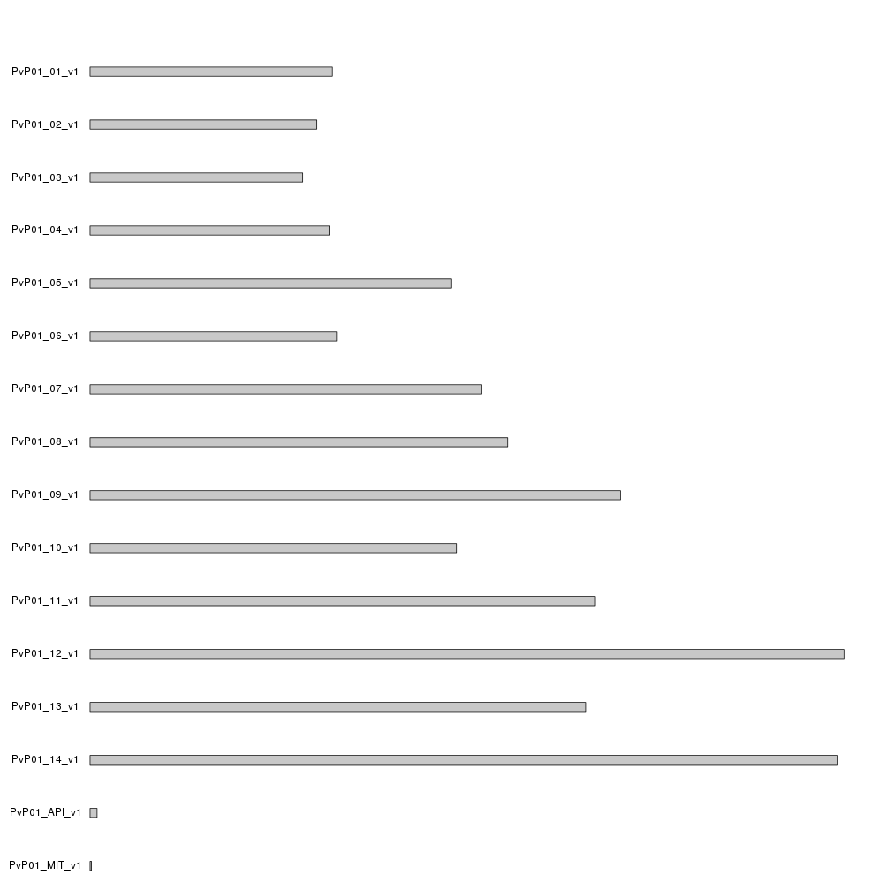
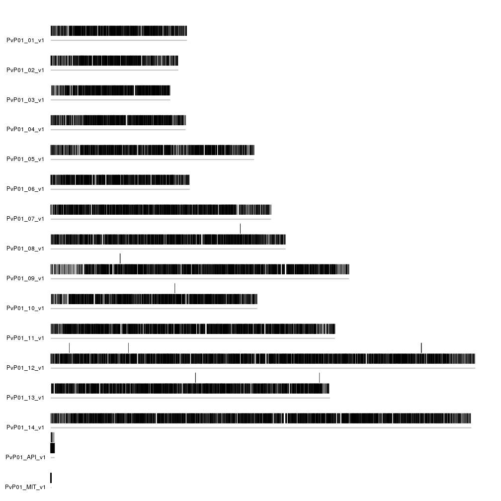
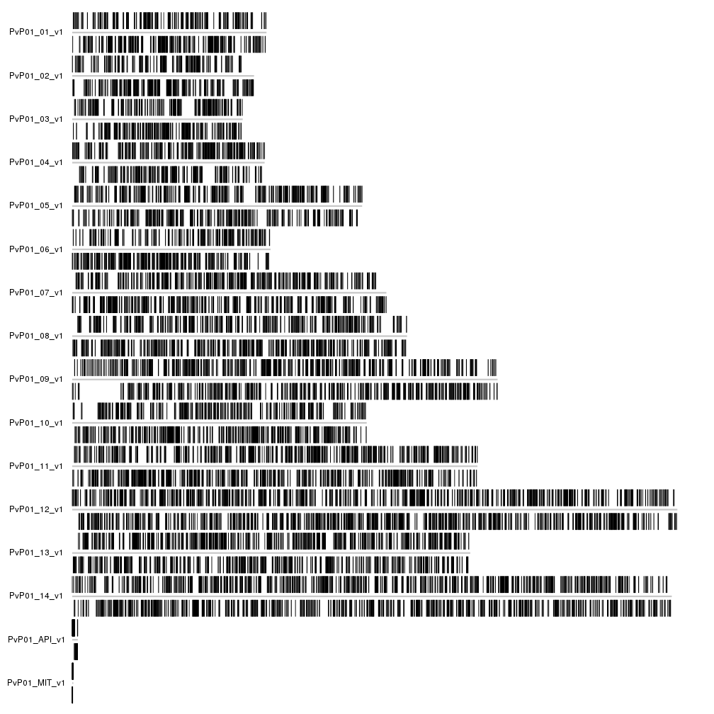
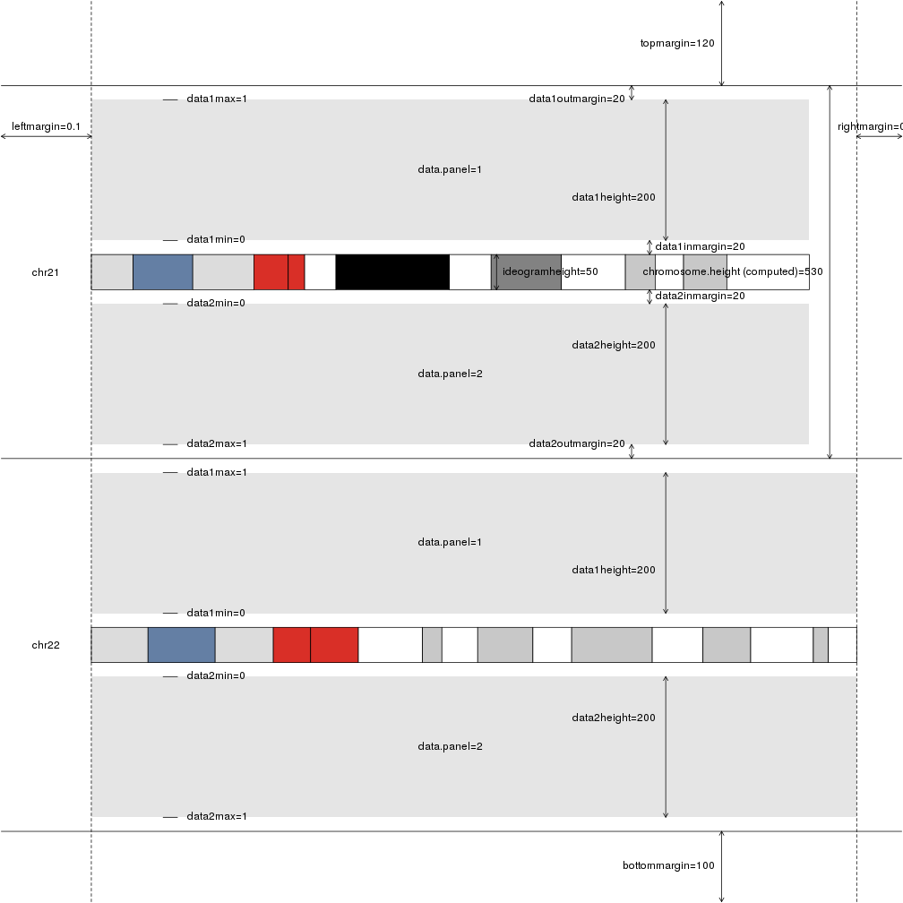
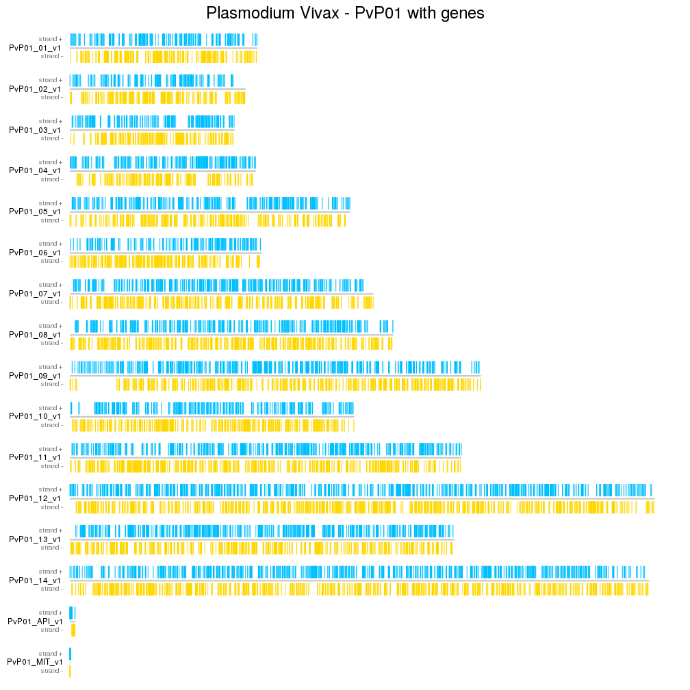

## Plot Genes in Plasmodium Vivax Genome

In this example we'll get the genome of Plasmodium Vivax and it's genes from 
a _gff_ file downloaded from [PlasmoDB](http://plasmodb.org). In this case,
the _gff_ file contains the lengths of the chromosomes, but it could be
extracted from any other source.

Since we want to use the chromosome lengths contained in the gff file header, 
we'll use `readLines` to read part of the header (30 lines), where we 
know that the genome information is located (you have to take a look at the file
first to know this and take into account that most gff's do not have this 
information). After that, we'll extract the information by splitting the lines
and selecting the appropiate parts. This is not the most elegant solution to 
this problem, but it works.


```r
library(karyoploteR)

gff.file <- "http://plasmodb.org/common/downloads/Current_Release/PvivaxP01/gff/data/PlasmoDB-32_PvivaxP01.gff"

header.lines <- readLines(gff.file, n = 30)

#The lines with the standard chromosomes start with "##sequence-region PvP01".
#Select them.
ll <- header.lines[grepl(header.lines, pattern = "##sequence-region PvP01")]

#split them by space, and create a data.frame
gg <- data.frame(do.call(rbind, strsplit(ll, split = " ")))
gg[,3] <- as.numeric(as.character(gg[,3]))
gg[,4] <- as.numeric(as.character(gg[,4]))

#and create a GRanges with the information
PvP01.genome <- toGRanges(gg[,c(2,3,4)])

PvP01.genome
```

```
## GRanges object with 16 ranges and 0 metadata columns:
##            seqnames       ranges strand
##               <Rle>    <IRanges>  <Rle>
##    [1]  PvP01_01_v1 [1, 1021664]      *
##    [2]  PvP01_02_v1 [1,  956327]      *
##    [3]  PvP01_03_v1 [1,  896704]      *
##    [4]  PvP01_04_v1 [1, 1012024]      *
##    [5]  PvP01_05_v1 [1, 1524814]      *
##    ...          ...          ...    ...
##   [12]  PvP01_12_v1 [1, 3182763]      *
##   [13]  PvP01_13_v1 [1, 2093556]      *
##   [14]  PvP01_14_v1 [1, 3153402]      *
##   [15] PvP01_API_v1 [1,   29582]      *
##   [16] PvP01_MIT_v1 [1,    5989]      *
##   -------
##   seqinfo: 16 sequences from an unspecified genome; no seqlengths
```

With this, we can already plot the genome of Plasmodium Vivax using the function
`plotKaryotype`.


```r
kp <- plotKaryotype(genome=PvP01.genome)
```



Since we used a custom genome and provided no cytobands information, 
`plotKaryotype` created a representation of the genome with gray cromosomes. 
Actually, we could substitute the gray boxe by gray lines to simplify them a bit
calling `kpAddCytobandsAsLine` instead of the default `kpAddCytobands` by setting
`ideogram.plotter=NULL`.


```r
kp <- plotKaryotype(genome=PvP01.genome, ideogram.plotter = NULL)
kpAddCytobandsAsLine(kp)
```


Now, to plot the genes on the genome, we need to download them. We'll use the 
same _gff_ file, but now we'll use the `import` function from 
[rtracklayer](http://bioconductor.org/packages/rtracklayer/) to download and 
read the file content into a GRanges object. The function is automatically 
imported when loading karyoploteR. 

Since the gff file contains featues of many different typesm we'll filter it and
keep only the genes, since this is what we want to plot.


```r
features <- import(gff.file)
table(features$type)
```

```
## 
##            gene            mRNA            exon             CDS 
##            6823            6670           17737           17584 
##            tRNA three_prime_UTR          snoRNA            rRNA 
##              68              57              25              50 
##           snRNA           ncRNA 
##               4               6
```

```r
genes <- features[features$type=="gene"]
```

With that, we can plot the genes in the chromosomes. In this case, since we'll 
plot more than 6800 genes, we'll plot them as regions, with no indication of the
gene name or id.


```r
kp <- plotKaryotype(genome=PvP01.genome, ideogram.plotter = NULL)
kpAddCytobandsAsLine(kp)
kpPlotRegions(kp, data=genes)
```



We can not see a lot in the plot, but we can see that some of the genes are 
above the rest, because they overlap another gene. Since in this case we'd prefer
all genes to be in a single line, we can add `avoid.overlapping = FALSE` to
the call to `kpPlotRegions`. In addition, we can add a second data panel below
the choromosomes (using `plot.type=2`) and plot the forward strand genes above 
the ideogram and the reverse strand genes below the ideogram. To do that we'll 
need to filter the genes by _strand_ and explicitly ask for the genes in the 
negative strand to be plotted in the second data panel (below the ideogram) 
with `data.panel=2`.


```r
kp <- plotKaryotype(genome=PvP01.genome, ideogram.plotter = NULL, plot.type=2)
kpAddCytobandsAsLine(kp)
kpPlotRegions(kp, data=genes[strand(genes)=="+"], avoid.overlapping = FALSE)
kpPlotRegions(kp, data=genes[strand(genes)=="-"], avoid.overlapping = FALSE, data.panel=2)
```



With that we can see some more interesting things, such as stetches of the
genome with only forward or only reverse genes, but the plot is still difficult 
to read. We'd like to separate the chromosomes between them and to do that, we 
know we'll have to modify the `plot.params`, but what plot param exactly? 
We can plot them all and see what we want to change.


```r
plotDefaultPlotParams(plot.type=2)
```



Looking at the figure, we can see that the parameters affecting the distance 
between chromosomes are _data1outmargin_ and _data2outmargin_ and that they have
a default value of 20. We'll increase them to 100 to get a good separation 
between chromosomes and we'll also add a main title (and some more margin for it)
and colors to differentiate the plus and minus genes.


```r
pp <- getDefaultPlotParams(plot.type=2)
pp$data1outmargin <- 100
pp$data2outmargin <- 100
pp$topmargin <- 450
kp <- plotKaryotype(genome=PvP01.genome, ideogram.plotter = NULL, plot.type=2, plot.params = pp)
kpAddCytobandsAsLine(kp)
kpAddMainTitle(kp, "Plasmodium Vivax - PvP01 with genes", cex=2)
kpPlotRegions(kp, data=genes[strand(genes)=="+"], avoid.overlapping = FALSE, col="deepskyblue")
kpPlotRegions(kp, data=genes[strand(genes)=="-"], avoid.overlapping = FALSE, col="gold", data.panel=2)
kpAddLabels(kp, "strand +", cex=0.8, col="#888888")
kpAddLabels(kp, "strand -", data.panel=2, cex=0.8, col="#888888")
```


