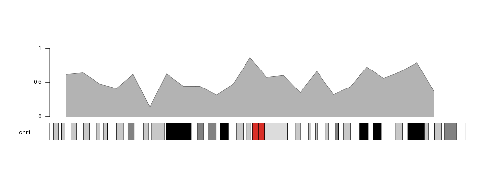
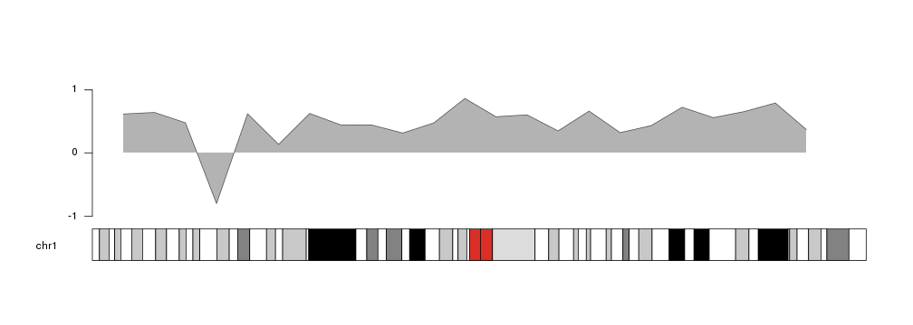
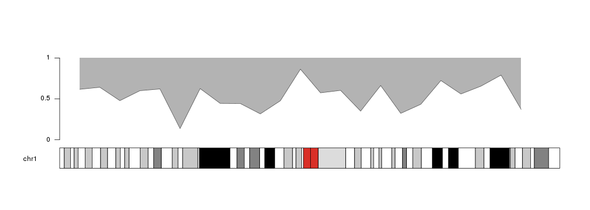
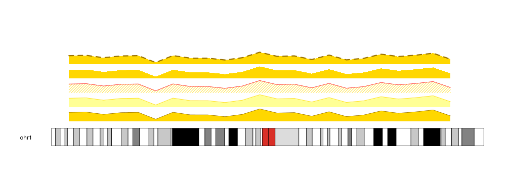
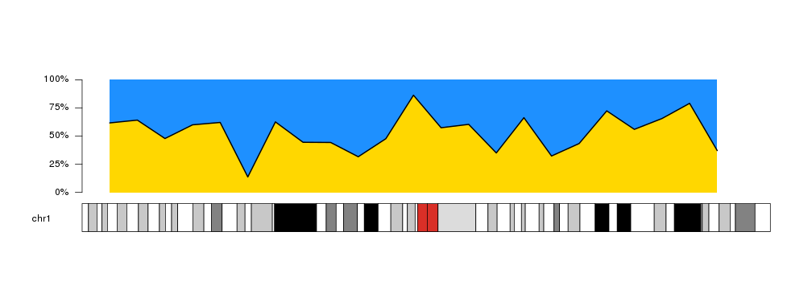

## Plotting Areas

`kpArea` is similar to [`kpLines`]({{ site.baseurl }})
but in addition to plotting the defined line, it fills the area below the line 
with the specified color. It might be a useful representation for coverage, 
or for continuous values such as methylation levels, etc. 


```r
library(karyoploteR)

x <- 1:23*10e6
y <- rnorm(23, mean=0.5, sd=0.2)

kp <- plotKaryotype(chromosomes="chr1")
kpArea(kp, chr="chr1", x=x, y=y)
kpAxis(kp, ymin = 0, ymax=1)
```



`kpArea`has an additional parameter, `base.y=0`, that specifies the y level at 
which the area ends. Its default value is 0, so the area will be shaded between
the outer line and 0. That means that if part of the line is below 0, the 
shading will be above the outer line.


```r
y[4] <- -0.8

kp <- plotKaryotype(chromosomes="chr1")
kpArea(kp, chr="chr1", x=x, y=y, ymin=-1, ymax=1)
kpAxis(kp, ymin = -1, ymax=1)
```



Following the same principle, we can change the value of `base.y` to shade the
area above the outer line.


```r
y[4] <- 0.6

kp <- plotKaryotype(chromosomes="chr1")
kpArea(kp, chr="chr1", x=x, y=y, base.y=1)
kpAxis(kp, ymin=0, ymax=1)
```



It is possible to specify different colors for the outer line and the shaded
area, as well as other standard 
[graphical parameters](https://www.rdocumentation.org/packages/graphics/topics/par)
used in the R base graphics: _lwd_, _lty_... In addition, _density_ and _angle_
can be used to fill the area with shading lines as in the 
[`polygon` function](http://stat.ethz.ch/R-manual/R-devel/library/graphics/html/polygon.html).

For colors, `col` specifies the color of the shaded area. If no color is given 
(`col=NULL`) it will be filled with a lighter version of the line color. 
Similarly, `border` defines the color of the outer line and it will take a 
darker shade of of the area color if `border=NULL`. If any of these parameters
is `NA` the element (area or line) will not be drawn.


```r
kp <- plotKaryotype(chromosomes="chr1")
kpArea(kp, chr="chr1", x=x, y=y, col="gold", r0=0, r1=0.2)
kpArea(kp, chr="chr1", x=x, y=y, border="gold", r0=0.2, r1=0.4)
kpArea(kp, chr="chr1", x=x, y=y, col="gold", border="red", density=20, r0=0.4, r1=0.6)
kpArea(kp, chr="chr1", x=x, y=y, col="gold", border=NA, r0=0.6, r1=0.8)
kpArea(kp, chr="chr1", x=x, y=y, col="gold", lty=2, lwd=3, r0=0.8, r1=1)
```




Combining this options we can create other variants of the plot, and 
for example use it to represent proportions over the genome.


```r
kp <- plotKaryotype(chromosomes="chr1")
kpArea(kp, chr="chr1", x=x, y=y, border=NA, col="#FFD700")
kpArea(kp, chr="chr1", x=x, y=y, col="#1E90FF", border="black", lwd=2, base.y=1)
kpAxis(kp, ymin=0, ymax=100, numticks = 5, labels = c("0%", "25%", "50%", "75%", "100%"))
```




