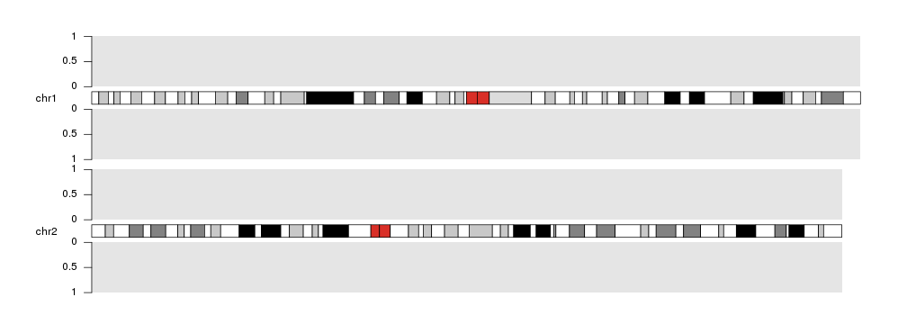
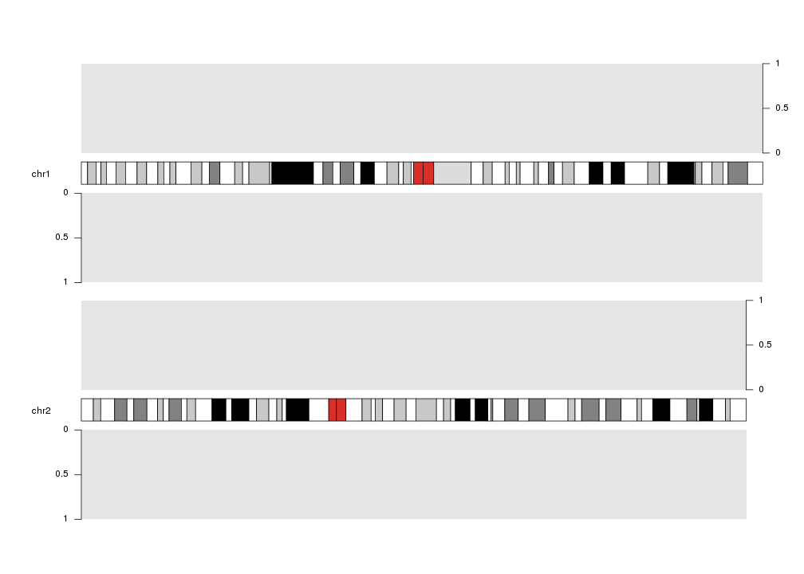
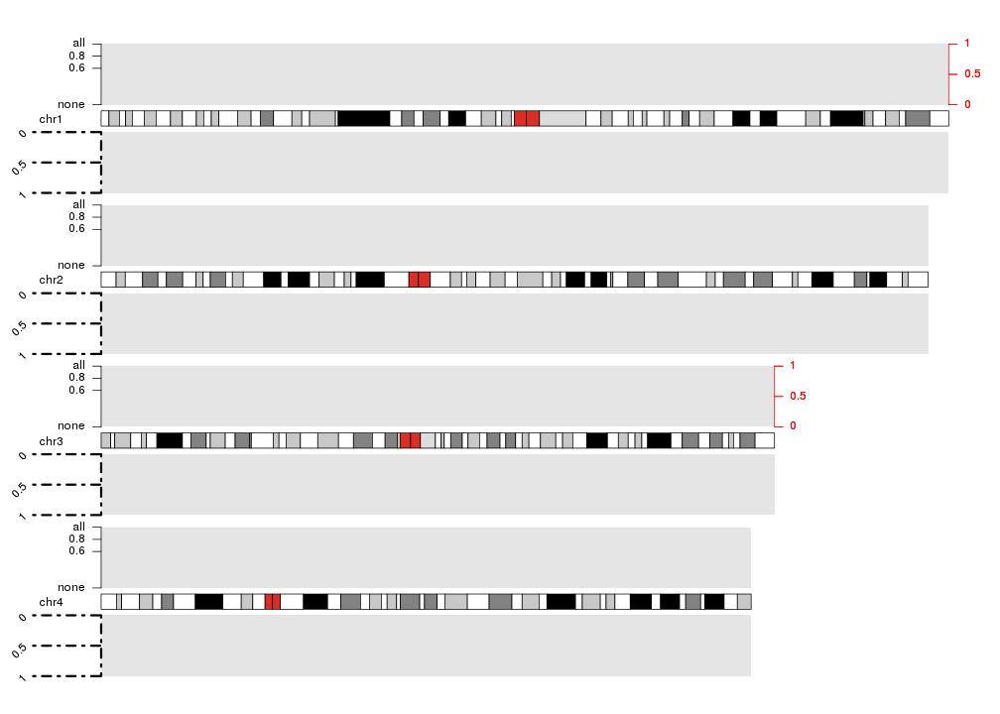
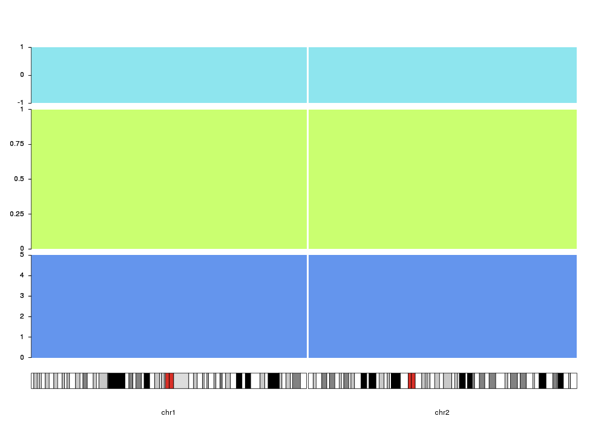

## Axis

Adding Y axis to our plots may help interpreting the magnitudes of plotted data
and identifying the space dedicated to each plot. To do that we can use
the `kpAxis` function.


```r
kp <- plotKaryotype(plot.type=2, chromosomes=c("chr1", "chr2"))
kpDataBackground(kp)
kpDataBackground(kp, data.panel = 2)
kpAxis(kp, data.panel=1)
kpAxis(kp, data.panel=2)
```



Axis can be plotted at either left or right side of any on the data plots using
the `side` parameter: 1 for left, 2 for right.


```r
kp <- plotKaryotype(plot.type=2, chromosomes=c("chr1", "chr2"))
kpDataBackground(kp)
kpDataBackground(kp, data.panel = 2)
kpAxis(kp, data.panel=1, side = 2)
kpAxis(kp, data.panel=2)
```



And they can be customized in many ways: 

  * number of ticks and their positions and labels (with `numticks`, `tick.pos` and `labels`)
  * colors of the lines and text (with `col`)
  * length of ticks (with `tick.len` Attention! the length is in number of bases!)
  * on which chromosomes the axis has to be drawn (with `chromosomes` (can be `first`, `last`, `all` or a vector of chromosome names)). By default in plot types 1, 2 and 6 (vertically stacked chromosomes)
  the axis will be plotted in all chromosomes and in plot types 3, 4, 5 and 7 
  (all chromosomes in a single line) only in the first (or last if `side=2`) 
  chromosome
  * all standard [graphical parameters](https://www.statmethods.net/advgraphs/parameters.html)


```r
kp <- plotKaryotype(plot.type=2, chromosomes=c("chr1", "chr2", "chr3", "chr4"))
kpDataBackground(kp)
kpDataBackground(kp, data.panel = 2)
kpAxis(kp, data.panel=1, side = 1, numticks = 4, tick.pos = c(0, 0.6, 0.8, 1), labels = c("none", 0.6, 0.8, "all") )
kpAxis(kp, data.panel=1, side = 2, col="red", chromosomes = c("chr1", "chr3"))
kpAxis(kp, data.panel=2, tick.len = 20e6, srt=45, lwd=3, lty=4)
```


  
  
Finally, the vertical positioning of the axis can be controlled with 
[r0 and r1]({{ site.baseurl }}) 
as with most plotting functions. With this, we can use axis to mark different 
track like regions in the data panels. In addition, `ymin` and `ymax` can be 
used to set the extrem values for the axis.


```r
kp <- plotKaryotype(plot.type=4, chromosomes=c("chr1", "chr2"))
kpDataBackground(kp, r0=0, r1=0.33, color = "cornflowerblue")
kpAxis(kp, numticks = 6, r0=0, r1=0.33, ymin=0, ymax=5 )
kpDataBackground(kp, r0=0.35, r1=0.8, color = "darkolivegreen1")
kpAxis(kp, numticks = 5, r0=0.35, r1=0.8, ymin=0, ymax=1 )
kpDataBackground(kp, r0=0.82, r1=1, color = "cadetblue2")
kpAxis(kp,  numticks = 3, r0=0.82, r1=1, ymin=-1, ymax=1 )
```


  

