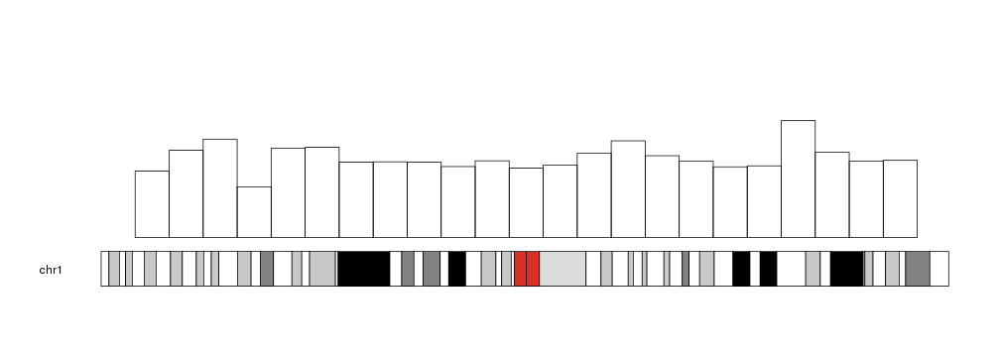
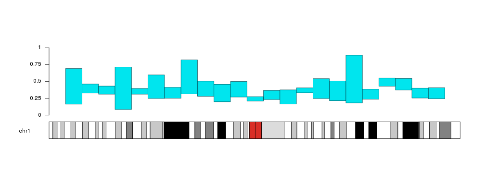

## Plotting Bars

The `kpBars` function is based on and very similar to `kpRect`. It's used to 
represent values as bars of a given height. By default, the bars will start at
_y=0_, but it's possible to change that and make them start at a 
different value.


```r
x0 <- 1:23*10e6
x1 <- 2:24*10e6
y1 <- rnorm(23, mean=0.6, sd=0.1)

kp <- plotKaryotype(chromosomes="chr1")
kpBars(kp, chr="chr1", x0=x0, x1=x1, y1=y1)
```



The bars can be customized with the same 
[graphical parameters](https://www.rdocumentation.org/packages/graphics/topics/par)
as in the R base graphics `rect` function: _border_, _lty_, _col_... Taking into
account that to produce bars without border we need `border=NA` (and not
`border=NULL`).


```r
kp <- plotKaryotype(chromosomes="chr1")
kpBars(kp, chr="chr1", x0=x0, x1=x1, y1=y1, col=rainbow(23), border=NA)
```


With _r0_ and _r1_ we can change their plotting region and even invert the 
bars, wich might be usefull to compare two distributions.


```r
a.y1 <- rnorm(23, mean=0.6, sd=0.2)
b.y1 <- rnorm(23, mean=0.4, sd=0.05)

kp <- plotKaryotype(chromosomes="chr1")
kpAxis(kp, r0=0.5, r1=1, tick.pos = c(0, 0.25, 0.5, 0.75, 1))
kpAxis(kp, r0=0.5, r1=0,  tick.pos = c(0.25, 0.5, 0.75, 1))
kpBars(kp, chr="chr1", x0=x0, x1=x1, y1=a.y1, col="#00E5EE", border=darker("#00E5EE"), r0=0.5, r1=1)
kpBars(kp, chr="chr1", x0=x0, x1=x1, y1=b.y1, col="#FFA54F", border=darker("#FFA54F"), r0=0.5, r1=0)
```


Bars can start at a different value than 0. We can use _y0_ to set the starting
point.


```r
y0 <- y1 - rnorm(23, mean=0.3, sd=0.05)

kp <- plotKaryotype(chromosomes="chr1")
kpAxis(kp, tick.pos = c(0, 0.25, 0.5, 0.75, 1))
kpBars(kp, chr="chr1", x0=x0, x1=x1, y1=a.y1, y0=y0, col="#00E5EE", border=darker("#00E5EE"))
```




