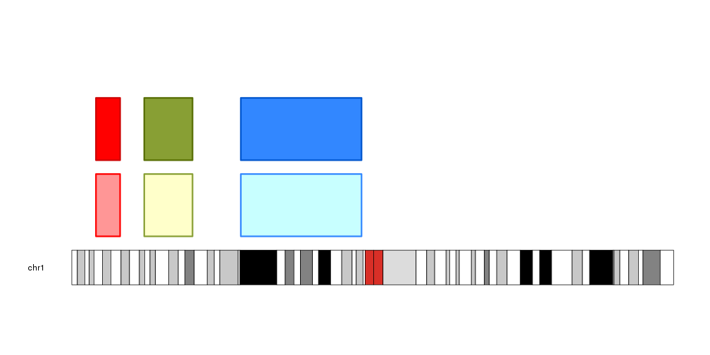
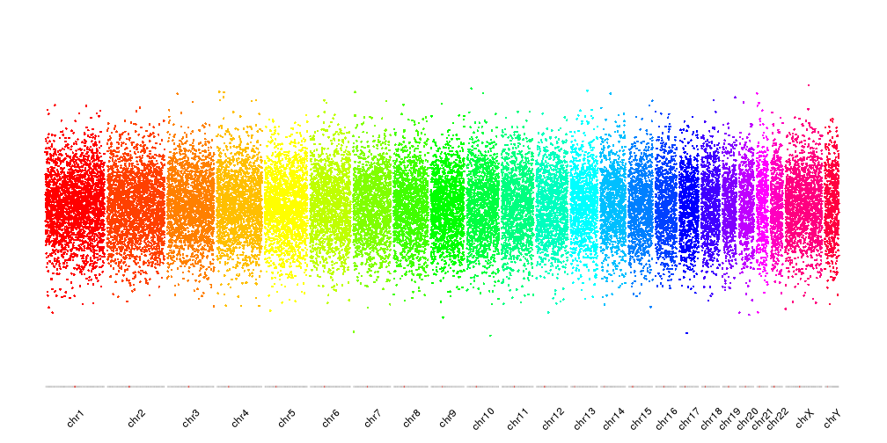
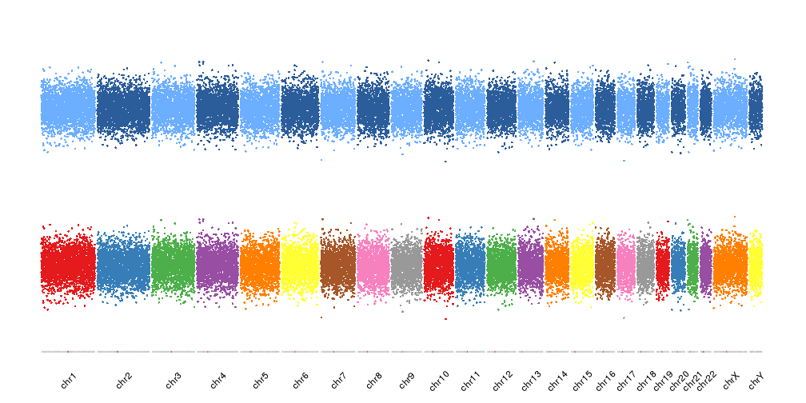
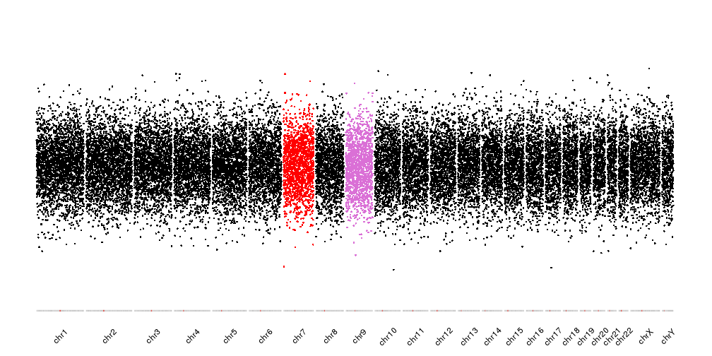

## Functions to manage colors in karyoploteR

Many functions in karyoploteR accept colors as parameters, either to plot data 
elements (
[`kpPoints`]({{ site.baseurl }}), 
[`kpLines`]({{ site.baseurl }}), 
[`kpText`]({{ site.baseurl }}), 
[`kpPlotRegions`]({{ site.baseurl }})
...) or accompaining non-data elements (
[axis]({{ site.baseurl }}), 
[labels]({{ site.baseurl }}),
[base numbers]({{ site.baseurl }})
...). karyoploteR includes a few functions to help managing and manipulating
colors.

### Darker and Lighter colors

The functions `darker` and `lighter` recieve a color and return a darker or 
lighter color, changed in a specific amount. These functions are used 
extensively in the functions creating polygon delimited by lines (
[`kpArea`]({{ site.baseurl }}), 
`kpPlotRibbon`...). 


```r
library(karyoploteR)

regs <- toGRanges(c("chr1:10000000-20000000",
                  "chr1:30000000-50000000",
                  "chr1:70000000-120000000"))

colors <- c("red", "#889F34", lighter(rainbow(n = 18)[12], 50))

kp <- plotKaryotype(chromosomes = "chr1")
kpPlotRegions(kp, data=regs, r0=0, r1=0.45, col = lighter(colors), border=colors, lwd=3)
kpPlotRegions(kp, data=regs, r0=0.55, r1=1, col = colors, border=darker(colors, 50), lwd=3)
```




### Assign colors to data points

Another type of color functions in karyoploteR is function to assign a color to
the data points depending on their features. This is a group of functions that
will be probably expanded in the future.

#### Color per chromosome

The `colByChr` function will assign a color to each data point depending on its 
chromosome. It is possible to specify the exact colors for each chromosome 
using a named vector, to specify the colors of the chomosomes using a non-named
vector (that will be recycled if needed) or to specify any of the predefined 
color schemes.

These are the available color schemes:


The rainbow palette will adjust itself to the total number of chromosomes in
visualized


```r
kp <- plotKaryotype(plot.type = 4, ideogram.plotter = NULL, labels.plotter = NULL)
kpAddCytobandsAsLine(kp)
kpAddChromosomeNames(kp, srt=45)

points <- unlist(tileGenome(kp$chromosome.lengths, tilewidth = 100e3))
points$y <- rnorm(n = length(points), mean = 0.5, sd = 0.1)

kpPoints(kp, data = points, col=colByChr(points, colors = "rainbow"))
```



While the other palettes will be recycled 


```r
kp <- plotKaryotype(plot.type = 4, ideogram.plotter = NULL, labels.plotter = NULL)
kpAddCytobandsAsLine(kp)
kpAddChromosomeNames(kp, srt=45)

kpPoints(kp, data = points, col=colByChr(points, colors = "brewer.set1"), r1=0.45)
kpPoints(kp, data = points, col=colByChr(points, colors = "2blues"), r0=0.55)
```



In addition to the predefined color schemes, we can specify the chromosome
colors by name. For example, to plot chr7 in red and chr9 in purple we can give 
a named color vector with two elements and all other chromosomes will take the 
default color.


```r
cols <- c(chr7="red", chr9="orchid")

kp <- plotKaryotype(plot.type = 4, ideogram.plotter = NULL, labels.plotter = NULL)
kpAddCytobandsAsLine(kp)
kpAddChromosomeNames(kp, srt=45)

kpPoints(kp, data = points, col=colByChr(points, colors = cols))
```




