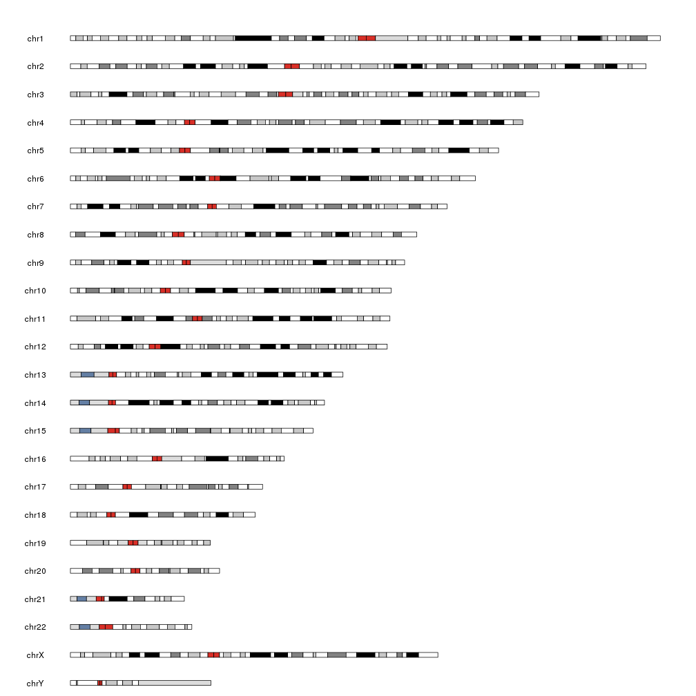

## Plot an ideogram

The first step when creating a karyoplot is to create the empty ideogram plot where 
data will later be added.

The **plotKaryotype** function does just that and returns the
*karyoplot* object. We will need this object later on when 
we need to add data to the plot.

By default it will create a karyoplot of the human genome hg19


```r
library(karyoploteR)

kp <- plotKaryotype()
```




It is possible to specify other genomes. If it's one of the few included in the 
package it will be plotted from cache and if it's not, karyoploteR will try to load the 
corresponding BSGenome library and connect to UCSC to download the the cytobands. The 
BSGenome needs to be installed in the system. Use **installed.genomes()** from package 
**BSGenome** to list them.


```r
#Drosophila
kp <- plotKaryotype(genome = "dm6")
```


