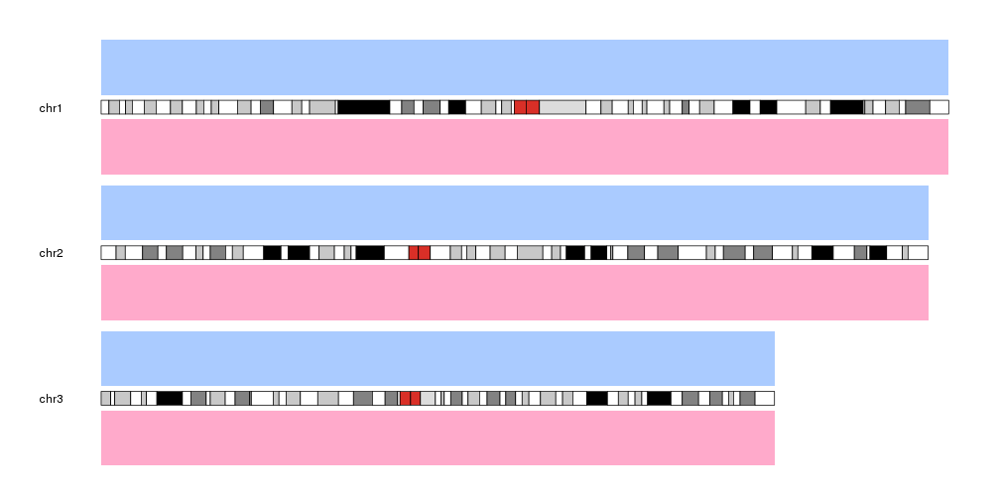

## Data Panels

In karyoploteR, data is plotted in data panels. Depending on the plot type, a 
karyoplot might have one or more data panels. It is easy to visualise them using 
_kpDataBackground_. 

As an example, plot type 2 has two data panels, one above the ideograms and one
below. We can decide on which data panel we want to act by specifying the
_data.panel_ parameter. For example, we can create a blue background for data 
panel 1 (above the ideograms) and a red one for data panel 2 (below the ideograms).


```r
library(karyoploteR)

kp <- plotKaryotype(plot.type=2)
kpDataBackground(kp, data.panel = 1, col="blue")
kpDataBackground(kp, data.panel = 2, col="red")
```




