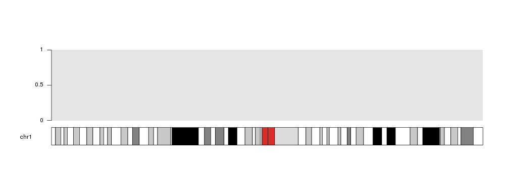
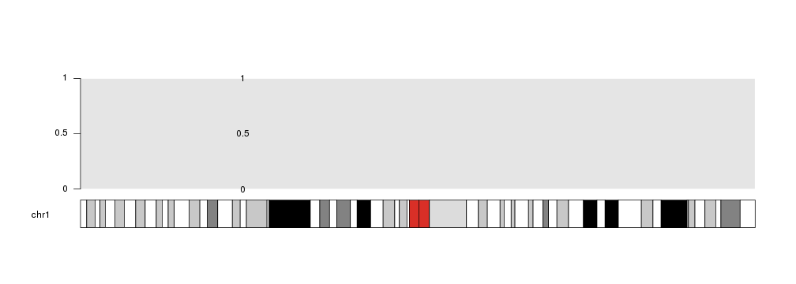
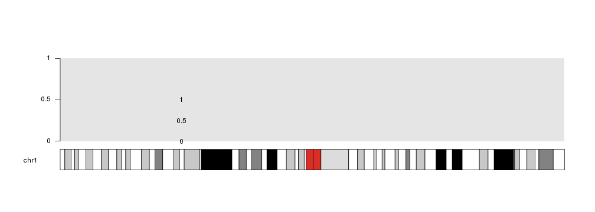
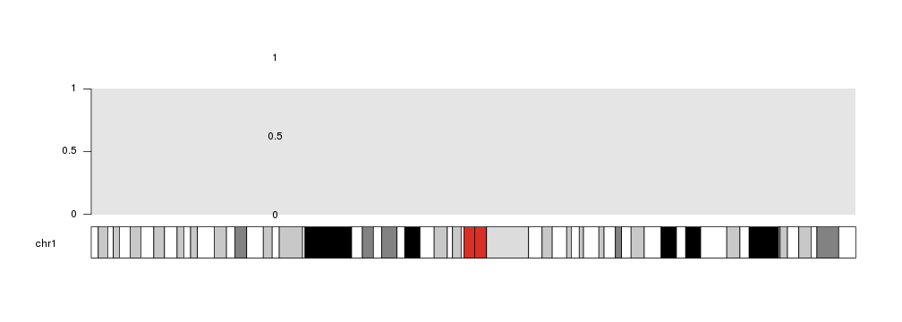
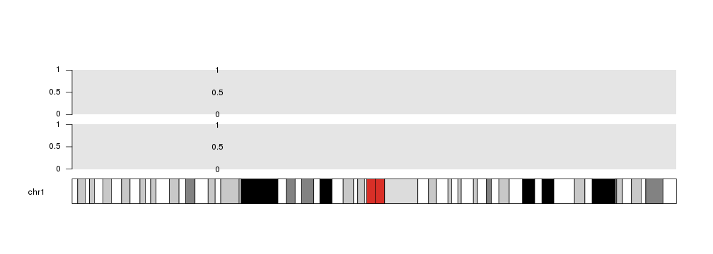
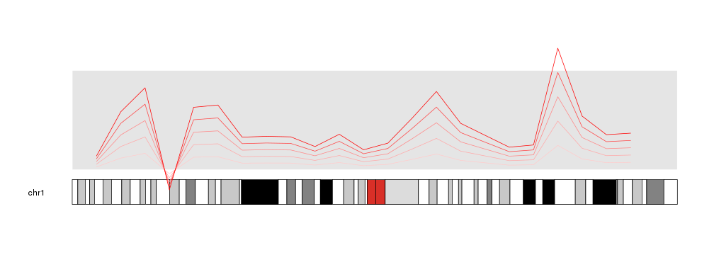
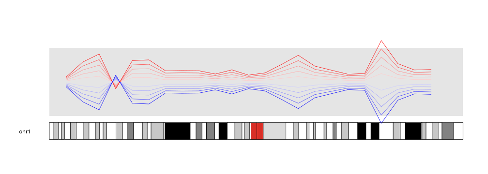

## Data Positioning in karyoploteR

In karyoploteR, data is plotted in 
[data panels]({{ site.baseurl }}).
By default, the y axis of a data panels spans from 0 to 1, although this can 
be changed when creating the karyoplot with _plot.params_.


```r
library(karyoploteR)

kp <- plotKaryotype(chromosomes="chr1")
kpDataBackground(kp)
kpAxis(kp)
```



Therefore, if no additional parameters are specified when plotting data on a
panel, 0 will be the bottom (actually, the closest to the ideogram), 1 the 
furthest and 0.5 the midpoint.


```r
mydata <- toGRanges(data.frame(chr=rep("chr1", 3), start=rep(60e6, 3), end=rep(60e6, 3), y=c(0, 0.5, 1)))

kp <- plotKaryotype(chromosomes="chr1")
kpDataBackground(kp)
kpAxis(kp)

kpText(kp, data=mydata,  labels=c(0, 0.5, 1))
```



## _ymin_ and _ymax_

With _ymin_ and _ymax_ we can set a different minimum and maximum value for 
the current plotting call. Using these parameters WILL NOT change the default
values of the data panel. That adds flexibility to the process and allows to 
accomodate for different scenarios, but it can create inconsitencies in the 
data representation if used without care. For those with experience with Circos,
these parameters are equivalent to _min_ and _max_ in it.

For example, if we specify _ymax=2_, the midpoint will then be 1.


```r
kp <- plotKaryotype(chromosomes="chr1")
kpDataBackground(kp)
kpAxis(kp)

kpText(kp, data=mydata,  labels=c(0, 0.5, 1), ymax=2)
```



Take into account that plotting is NOT restricted to the data panels, and
might happen out of them depending on the data and the data positioning 
parameters. 

For example, if we set _ymax_ to 0.8, the point at 1 will fall out of the data
panel. This might be useful in some situation, but it is generally not recommended.


```r
kp <- plotKaryotype(chromosomes="chr1")
kpDataBackground(kp)
kpAxis(kp)

kpText(kp, data=mydata,  labels=c(0, 0.5, 1), ymax=0.8)
```




## _r0_ and _r1_

_r0_ and _r1_ are two key parameters for data positioning. They are inspired in 
the Circos parameters with the same name specifying the radius where a plot 
takes place. In this case, they specify the vertical part of the data panel where 
the plotting should take place. They can be used to plot different data in 
different positions as if there were tracks.

For example, we can plot 2 backgrounds in different vertical regions: one from 
0 to 0.45 and one from 0.55 to 1 and plot the points in both of them.


```r
kp <- plotKaryotype(chromosomes="chr1")
kpDataBackground(kp, r0=0, r1=0.45)
kpAxis(kp, r0=0, r1=0.45)
kpText(kp, data=mydata,  labels=c(0, 0.5, 1), r0=0, r1=0.45)

kpDataBackground(kp, r0=0.55, r1=1)
kpAxis(kp, r0=0.55, r1=1)
kpText(kp, data=mydata,  labels=c(0, 0.5, 1), r0=0.55, r1=1)
```



All plotting functions in karyoploteR accept these parameters and they make 
the plotting process very flexible.


```r
x <- c(1:23*10e6)
y <- rnorm(n = 23, mean = 0.5, sd=0.3)

kp <- plotKaryotype(chromosomes="chr1")
kpDataBackground(kp)

kpLines(kp, chr="chr1", x=x, y=y, r1=0.2, col="#FFCCCC")
kpLines(kp, chr="chr1", x=x, y=y, r1=0.4, col="#FFAAAA")
kpLines(kp, chr="chr1", x=x, y=y, r1=0.6, col="#FF8888")
kpLines(kp, chr="chr1", x=x, y=y, r1=0.8, col="#FF4444")
kpLines(kp, chr="chr1", x=x, y=y, r1=1, col="#FF0000")
```



## Inverting plots

An interesting usage of these parameters is to invert (flip upside down) a plot.
With it is possible to create effects that would need to modify the data 
otherwise. To achieve that, one simply needs to specify an r0 higher than r1.


```r
kp <- plotKaryotype(chromosomes="chr1")
kpDataBackground(kp)

kpLines(kp, chr="chr1", x=x, y=y, r0=0.5, r1=0.6, col="#FFCCCC")
kpLines(kp, chr="chr1", x=x, y=y, r0=0.5, r1=0.7, col="#FFAAAA")
kpLines(kp, chr="chr1", x=x, y=y, r0=0.5, r1=0.8, col="#FF8888")
kpLines(kp, chr="chr1", x=x, y=y, r0=0.5, r1=0.9, col="#FF4444")
kpLines(kp, chr="chr1", x=x, y=y, r0=0.5, r1=1, col="#FF0000")

kpLines(kp, chr="chr1", x=x, y=y, r0=0.5, r1=0.4, col="#CCCCFF")
kpLines(kp, chr="chr1", x=x, y=y, r0=0.5, r1=0.3, col="#AAAAFF")
kpLines(kp, chr="chr1", x=x, y=y, r0=0.5, r1=0.2, col="#8888FF")
kpLines(kp, chr="chr1", x=x, y=y, r0=0.5, r1=0.1, col="#4444FF")
kpLines(kp, chr="chr1", x=x, y=y, r0=0.5, r1=0, col="#0000FF")
```



