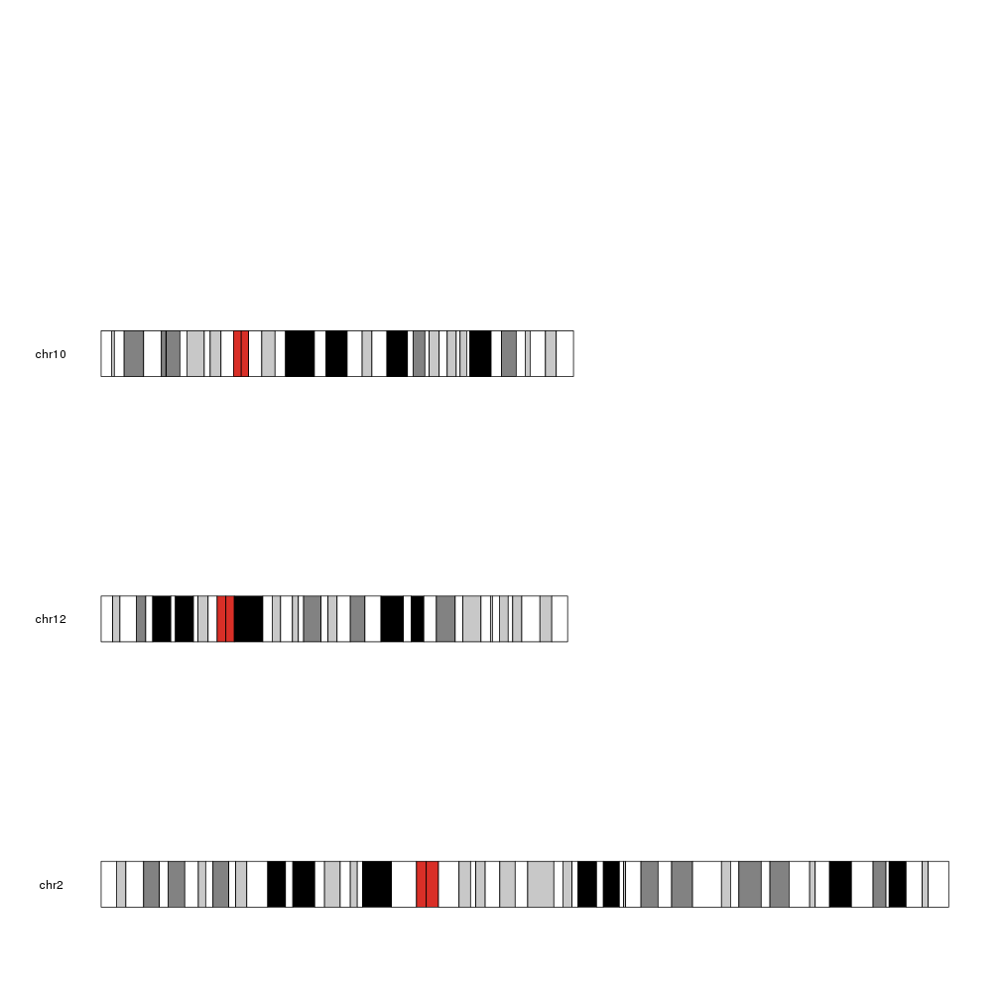
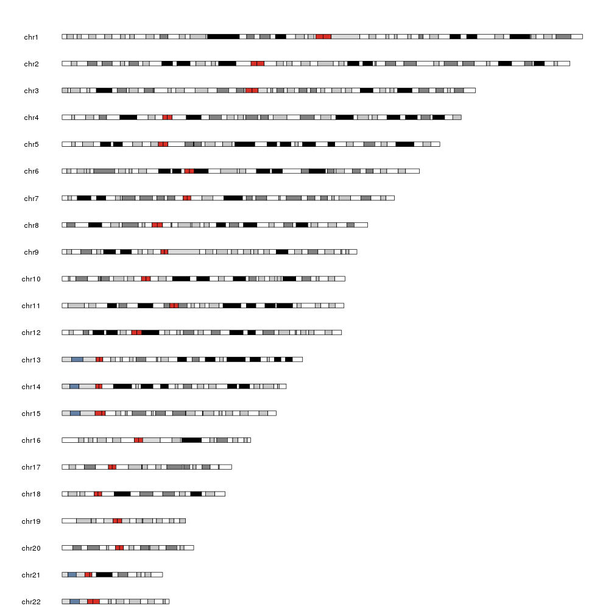
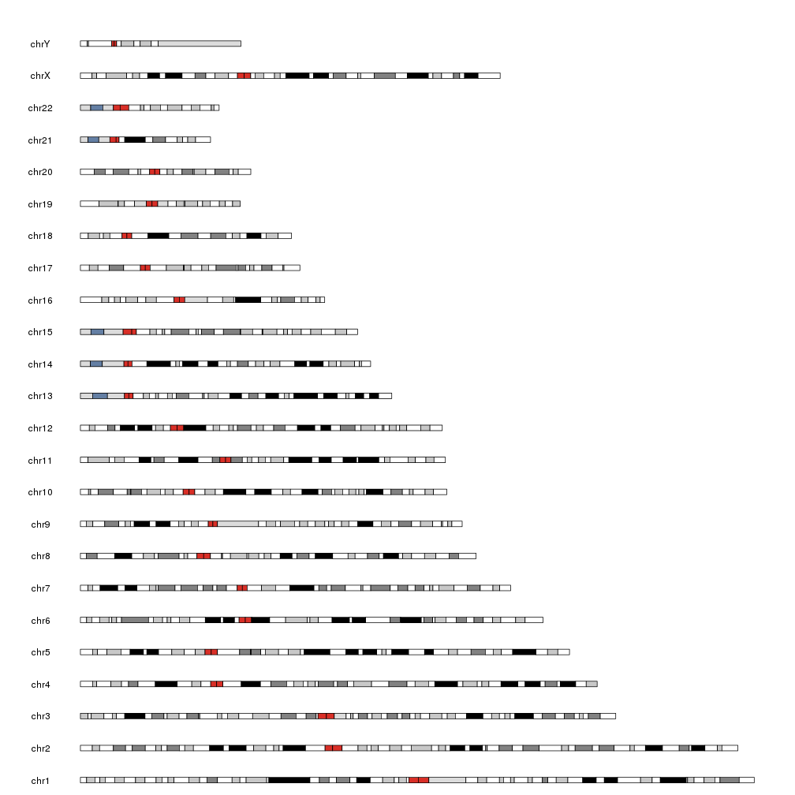

## Filter and Reorder Chromosomes

When plotting a karyoplot it is possible to plot only a subset of chromosomes. The 
selected chromosomes are specified using the **chromosomes** parameter.

We can specify a vector of chromosome names (note that the chromosomes will be plotted in the
                                             spcified order):
  

```r
kp <- plotKaryotype(genome = "hg19", chromosomes=c("chr10", "chr12", "chr2"))
```



Since internally plotKaryotype uses regioneR's **filterChromosomes**, we can specify predefined
sets of chromosomes in many genomes. By default it only plots canonical chromosomes.

For example, we can plot only autosomal chromosomes in hg19


```r
kp <- plotKaryotype(genome = "hg19", chromosomes="autosomal")
```



Chromosome specification can also be used to reorder the chromosomes, so for example,
to plot the canonical in reverse order, we can simply specify them as:


```r
kp <- plotKaryotype(genome = "hg19", chromosomes=rev(paste0("chr", c(1:22, "X", "Y"))))
```


