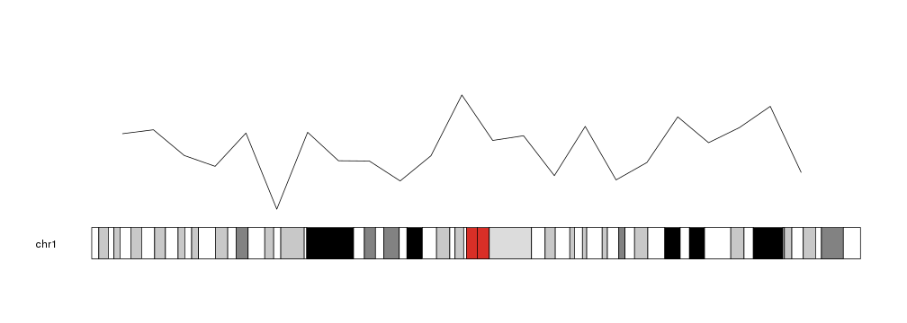
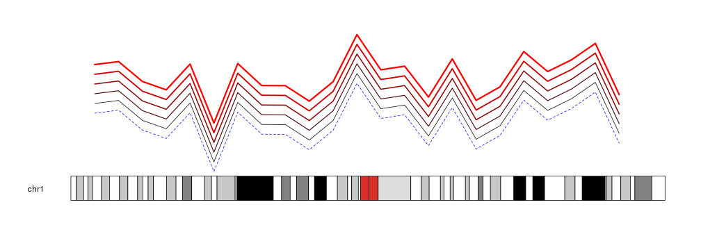

## Plotting Lines

To plot lines in a karyoplot we need to use the `kpLines` function. Given a
character vector _chr_ and two integer vectors _x_ and _y_ it will plot a single
line joining the points specified.


```r
library(karyoploteR)

x <- 1:23*10e6
y <- rnorm(23, mean=0.5, sd=0.25)

kp <- plotKaryotype(chromosomes="chr1")
kpLines(kp, chr="chr1", x=x, y=y)
```



Lines are cutomizable with the same graphical parameters as in the R base 
graphics `lines` function: _lwd_, _lty_, _col_...


```r
kp <- plotKaryotype(chromosomes="chr1")
kpLines(kp, chr="chr1", x=x, y=y)
kpLines(kp, chr="chr1", x=x, y=y+0.1, col="#440000", lwd=1.5)
kpLines(kp, chr="chr1", x=x, y=y+0.2, col="#880000", lwd=2)
kpLines(kp, chr="chr1", x=x, y=y+0.3, col="#CC0000", lwd=2.5)
kpLines(kp, chr="chr1", x=x, y=y+0.4, col="#FF0000", lwd=3)
kpLines(kp, chr="chr1", x=x, y=y-0.1, col="blue", lty=2)
```




