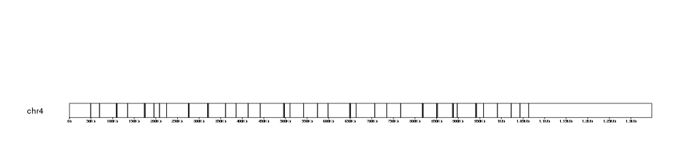
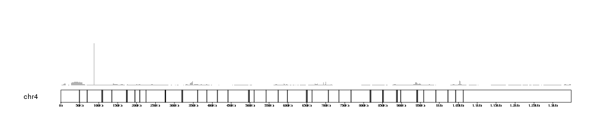
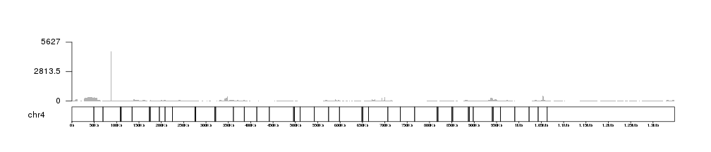
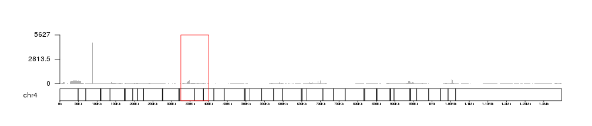
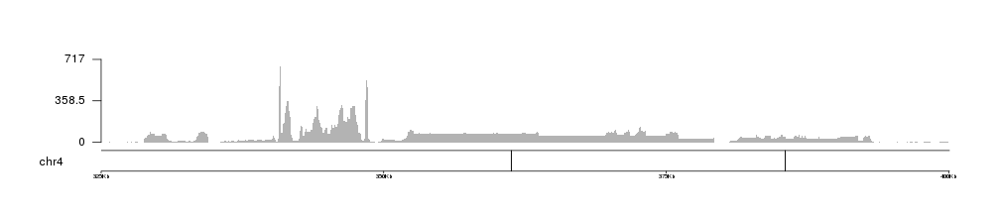
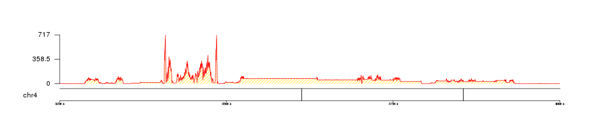
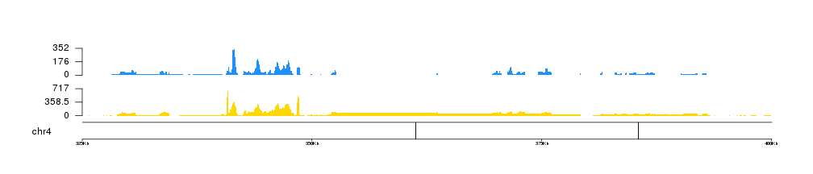
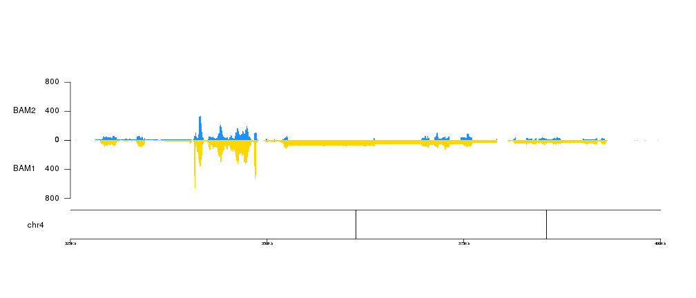
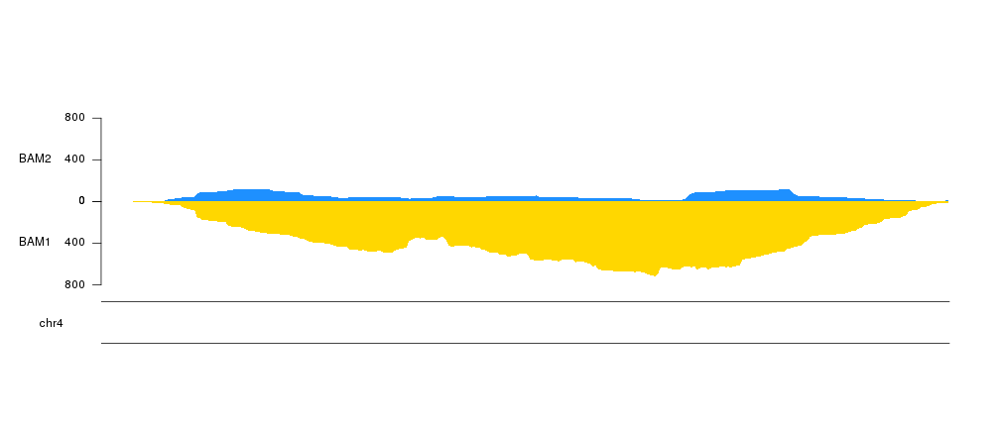

## Plotting the per base coverage of genomic features

The **kpPlotBAMCoverage** function is similar to 
[kpPlotCoverage]({{ site.baseurl }})
but instead of plotting the coverage of genomic regions stored in as an R
object it will plot the coverage of a BAM file. This function plots the actual 
base-level coverage and so it's use is limited to relatively small regions. 
By default it will error if we try to plot a region larger than 1Mb, but 
this is configurable and with sufficient time and memory there should be no
hard limit the size of the plot region, we simply should change the 
`max.valid.region.size` to the size of the region we want to plot.
However, if we want to plot a global view of coverage along the whole genome,
for example, we should consider using 
`kpPlotBAMDensity`
instead, which is much faster. **kpPlotBAMCoverage** can be used to plot the
coverage of BAM files for any experiment on any genome.

As an example, we'll use the BAM files for an RNA-seq experiment in flies
contained in the Bioconductor package 
[pasillaBamSubset](http://bioconductor.org/packages/pasillaBamSubset/). This 
package contains 2 BAM files with RNA-seq data from 2 differents samples
restricted to only data in chromosome *chr4*, the shortest one in Drosophila's 
genome. The package defines two functions that return the paths to the BAM 
files.


```r
library(pasillaBamSubset)

bam1 <- untreated1_chr4()
bam2 <- untreated3_chr4()
```

To plot them we will create a karyoplot of the chr4 of the Drosophila's genome
version `dm6`.


```r
library(karyoploteR)

kp <- plotKaryotype(genome = "dm6", chromosomes = "chr4")
kpAddBaseNumbers(kp, tick.dist = 50000, add.units = TRUE)
```


And plot it simply using giving the name of the file to the function


```r
kp <- plotKaryotype(genome = "dm6", chromosomes = "chr4")
kpAddBaseNumbers(kp, tick.dist = 50000, add.units = TRUE)
```



```r
kp <- kpPlotBAMCoverage(kp, data=bam1)
```

```
## Warning in kpPlotBAMCoverage(kp, data = bam1): In kpPlotBAMCoverage: Skipping BAM coverage plot. 
## The genomic region in your plot is larger than the maximum
## valid size. Plotting coverage in a very large region would 
## probably result in very large memory usage and potentially 
## crash your R session while creating not very informative 
## plots. For larger regions, kpPlotBAMDensity is recommended.
## If you want to plot the coverage in a large region,
## please supply a larger value for 'max.valid.region.size'
## parameter.
```

We get a warning and the BAM coverage is not plotted. This is because the 
chr4 is larger than the maximum default size allowed. To plot we can increase
it, for example to 2Mb, and we should get our plot. 


```r
kp <- plotKaryotype(genome = "dm6", chromosomes = "chr4")
kpAddBaseNumbers(kp, tick.dist = 50000, add.units = TRUE)
kp <- kpPlotBAMCoverage(kp, data=bam1, max.valid.region.size = 2e6)
```



If no `ymax` is given, the plot will adjust itself to the height of the highest
coverage peak. We can retrieve this value using the `latest.plot` info 
stored in `kp` by some plotting functions. 


```r
   kp$latest.plot$computed.values$max.coverage
```

```
## [1] 5627
```

And this value might be very useful to create automatic axis to our 
BAM coverage plots.


```r
kp <- plotKaryotype(genome = "dm6", chromosomes = "chr4")
kpAddBaseNumbers(kp, tick.dist = 50000, add.units = TRUE)
kp <- kpPlotBAMCoverage(kp, data=bam1, max.valid.region.size = 2e6)
kpAxis(kp, ymax=kp$latest.plot$computed.values$max.coverage)
```



We can see that there is a single veeeery high peak that dominates the plot. 
If we zoom in into other parts of the chromosome the `ymax` value will 
autoadjust. For example, we can concentrate on the region between 325Kb and
400Kb.


```r
kp <- plotKaryotype(genome = "dm6", chromosomes = "chr4")
kpAddBaseNumbers(kp, tick.dist = 50000, add.units = TRUE)
kp <- kpPlotBAMCoverage(kp, data=bam1, max.valid.region.size = 2e6)
kpAxis(kp, ymax=kp$latest.plot$computed.values$max.coverage)
kpRect(kp, chr="chr4", x0=325000, x1=400000, y0=0, y1=1, border="red", col=NA, data.panel = "all")
```



and zoom in using [zoom]({{ site.baseurl }}),
we can see how the coverage and the axis adjust themselves to the new 
maximum coverage in the region.


```r
kp <- plotKaryotype(genome = "dm6", chromosomes = "chr4", zoom=toGRanges("chr4:325000-400000"))
kpAddBaseNumbers(kp, tick.dist = 25000, add.units = TRUE)
kp <- kpPlotBAMCoverage(kp, data=bam1)
kpAxis(kp, ymax=kp$latest.plot$computed.values$max.coverage)
```



We can apply the standard customization options such as 
[colors]({{ site.baseurl }}) using 
the same parameters we use for other potting functions. In particular, 
**kpPlotBAMCoverage** uses 
[kpArea]({{ site.baseurl }}) behind the
scenes, so it can be customized using the any parameter accepted by it. 


```r
kp <- plotKaryotype(genome = "dm6", chromosomes = "chr4", zoom=toGRanges("chr4:325000-400000"))
kpAddBaseNumbers(kp, tick.dist = 25000, add.units = TRUE)
kp <- kpPlotBAMCoverage(kp, data=bam1, col="gold", border="red", density=20)
kpAxis(kp, ymax=kp$latest.plot$computed.values$max.coverage)
```



In addition, we can use 
[r0 and r1]({{ site.baseurl }})
to control the vertical positioning of the data, so we can plot multiple file 
in a single plot.

**IMPORTANT:** If you are modifying the data positioning parameters in any way, 
the [kpAxis]({{ site.baseurl }})
statements should be changed accordingly!


```r
kp <- plotKaryotype(genome = "dm6", chromosomes = "chr4", zoom=toGRanges("chr4:325000-400000"))
kpAddBaseNumbers(kp, tick.dist = 25000, add.units = TRUE)
kp <- kpPlotBAMCoverage(kp, data=bam1, col="#FFD700", border=NA, r1=0.4)
kpAxis(kp, ymax=kp$latest.plot$computed.values$max.coverage, r1=0.4)
kp <- kpPlotBAMCoverage(kp, data=bam2, col="#1E90FF", border=NA, r0=0.6)
kpAxis(kp, ymax=kp$latest.plot$computed.values$max.coverage, r0=0.6)
```



Or even us them to invert one of the plots


```r
kp <- plotKaryotype(genome = "dm6", chromosomes = "chr4", zoom=toGRanges("chr4:325000-400000"))
kpAddBaseNumbers(kp, tick.dist = 25000, add.units = TRUE)
kp <- kpPlotBAMCoverage(kp, data=bam1, col="#FFD700", border=NA, r0=0.5, r1=0, ymax=800)
kpAxis(kp, r0=0.5, r1=0, ymax=800)
kpAddLabels(kp, "BAM1", r0=0, r1=0.5, label.margin = 0.05)
kp <- kpPlotBAMCoverage(kp, data=bam2, col="#1E90FF", border=NA, r0=0.5, r1=1, ymax=800)
kpAxis(kp, r0=0.5, r1=1, ymax=800)
kpAddLabels(kp, "BAM2", r0=0.5, r1=1, label.margin = 0.05)
```



Since the data plotted is the actual per-base coverage we can zoom in into a 
very small region and still see the actual coverage. For example showing only
300 base pairs we can see the actual coverage of each sample


```r
kp <- plotKaryotype(genome = "dm6", chromosomes = "chr4", zoom=toGRanges("chr4:340650-340950"))
kpAddBaseNumbers(kp, tick.dist = 25000, add.units = TRUE)
kp <- kpPlotBAMCoverage(kp, data=bam1, col="#FFD700", border=NA, r0=0.5, r1=0, ymax=800)
kpAxis(kp, r0=0.5, r1=0, ymax=800)
kpAddLabels(kp, "BAM1", r0=0, r1=0.5, label.margin = 0.05)
kp <- kpPlotBAMCoverage(kp, data=bam2, col="#1E90FF", border=NA, r0=0.5, r1=1, ymax=800)
kpAxis(kp, r0=0.5, r1=1, ymax=800)
kpAddLabels(kp, "BAM2", r0=0.5, r1=1, label.margin = 0.05)
```


