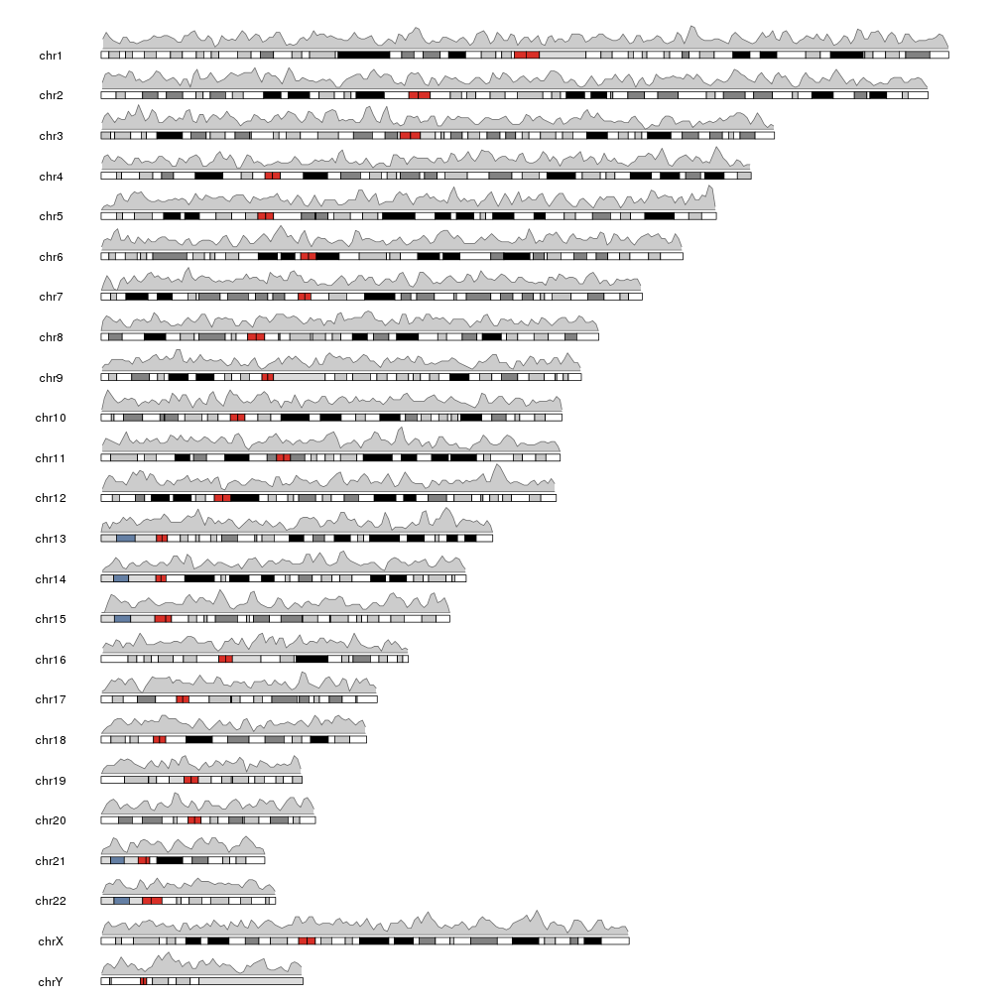
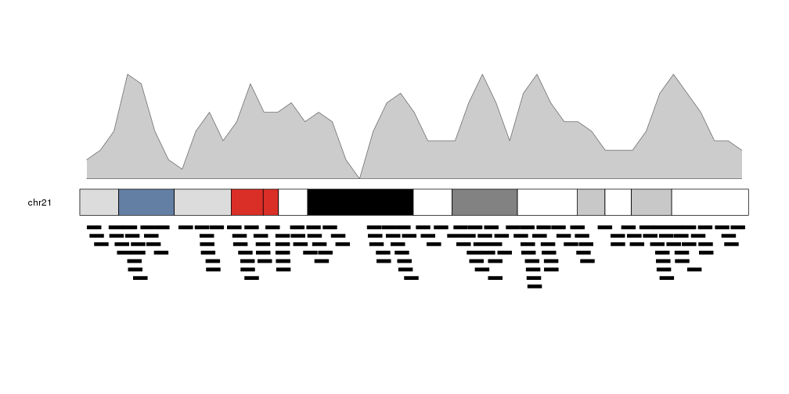
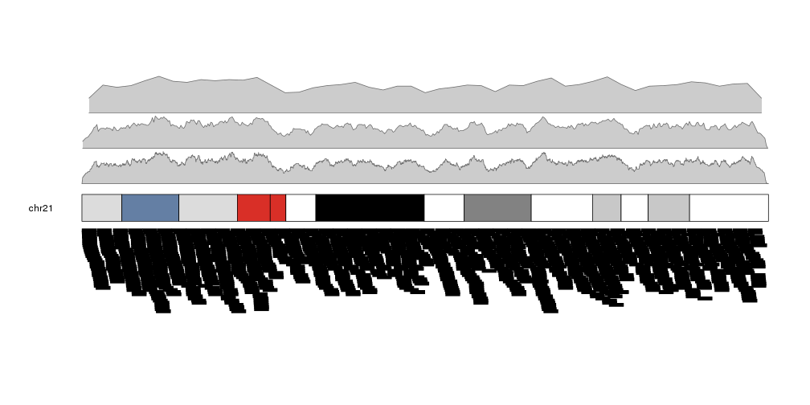
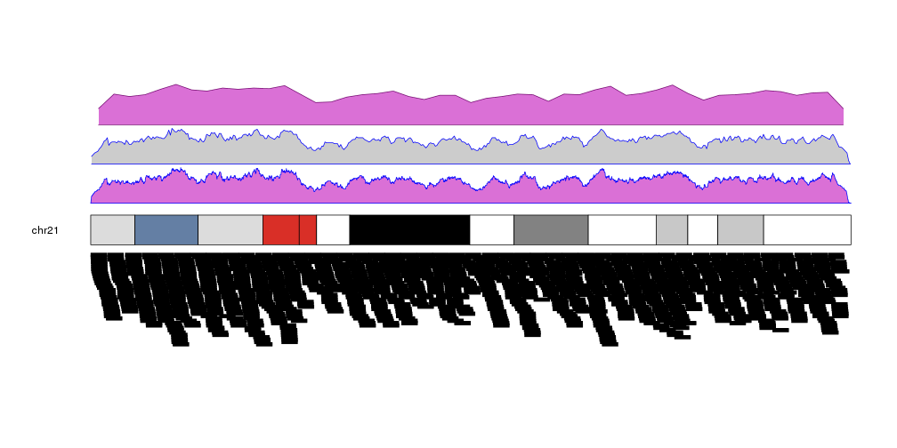

## Plotting the density of genomic features

Another high level function included in karyolpoteR is **kpPlotDensity**. Given 
a set of genomic features (snps, mutation, genes or any other feature that can
be positioned along the genome) it will compute and plot its density using 
windows. To do that it will divide the genome in a equal sized windows and 
will count the number of feature overlapping each of the windows.


```r
library(karyoploteR)
regions <- createRandomRegions(nregions=10000, length.mean = 1e6, mask=NA)
kp <- plotKaryotype()
kpPlotDensity(kp, data=regions)
```



We can plot the actual regions in data panel 2 to see how they relate


```r
kp <- plotKaryotype(plot.type=2, chromosomes = "chr21")
kpPlotDensity(kp, data=regions)
kpPlotRegions(kp, data=regions, data.panel=2)
```



It is possible to adjust the window size with the _window.size_ parameter, to 
get different "smoothing" levels of the data. The default is partitioning the
genome in 1Mb wide windows. Take into account that much smaller windows might slow
down the density computation.


```r
more.regions <- createRandomRegions(nregions=80000, length.mean = 1e6, mask=NA)
kp <- plotKaryotype(plot.type=2, chromosomes = "chr21")
kpPlotDensity(kp, data=more.regions, r0=0, r1=0.3, window.size = 10000)
kpPlotDensity(kp, data=more.regions, r0=0.33, r1=0.63, window.size = 100000)
kpPlotDensity(kp, data=more.regions, r0=0.66, r1=1, window.size = 1000000)
kpPlotRegions(kp, data=more.regions, data.panel=2)
```



It is possible to customize the appearance of the density plot using the same 
parameters used for 
[kpPolygon]({{ site.baseurl }}).
It is possible to specify different colors for the border (_border_) and the 
background (_col_). By default, if only _col_ is given, _border_ will be set to 
a darker version of _col_.


```r
kp <- plotKaryotype(plot.type=2, chromosomes = "chr21")
kpPlotDensity(kp, data=more.regions, r0=0, r1=0.3, window.size = 10000, border="blue", col="orchid")
kpPlotDensity(kp, data=more.regions, r0=0.33, r1=0.63, window.size = 100000, border="blue")
kpPlotDensity(kp, data=more.regions, r0=0.66, r1=1, window.size = 1000000, col="orchid")
kpPlotRegions(kp, data=more.regions, data.panel=2)
```



### Retrieving data computed by kpPlotDensity

As other high level functions, **kpPlotDensity** performs some computations
and stores their results in the KaryoPlot object it invisibly returns. In
particular it returns the windows, the density value in each window and the
maximum density. This values can be accessed via 
`karyoplot$latest.plot$computed.values` and might be useful for things such as 
setting correct axes or marking mean values.


```r
kp <- plotKaryotype(plot.type=2, chromosomes = "chr21")
kp <- kpPlotDensity(kp, data=more.regions, r0=0, r1=0.27, window.size = 10000, border="blue", col="orchid")
kpAxis(kp, ymax=kp$latest.plot$computed.values$max.density, r0=0, r1=0.27, cex=0.8)
kpAbline(kp, h=mean(kp$latest.plot$computed.values$density), lty=2, ymax=kp$latest.plot$computed.values$max.density, r0=0, r1=0.27)
kp <- kpPlotDensity(kp, data=more.regions, r0=0.34, r1=0.61, window.size = 100000, border="blue")
kpAxis(kp, ymax=kp$latest.plot$computed.values$max.density, r0=0.34, r1=0.61, cex=0.8)
kpAbline(kp, h=mean(kp$latest.plot$computed.values$density), lty=2, ymax=kp$latest.plot$computed.values$max.density, r0=0.34, r1=0.61)
kp <- kpPlotDensity(kp, data=more.regions, r0=0.68, r1=1, window.size = 1000000, col="orchid")
kpAxis(kp, ymax=kp$latest.plot$computed.values$max.density, r0=0.68, r1=1, cex=0.8)
kpAbline(kp, h=mean(kp$latest.plot$computed.values$density), lty=2, ymax=kp$latest.plot$computed.values$max.density, r0=0.68, r1=1)
kpPlotRegions(kp, data=more.regions, data.panel=2)
```


