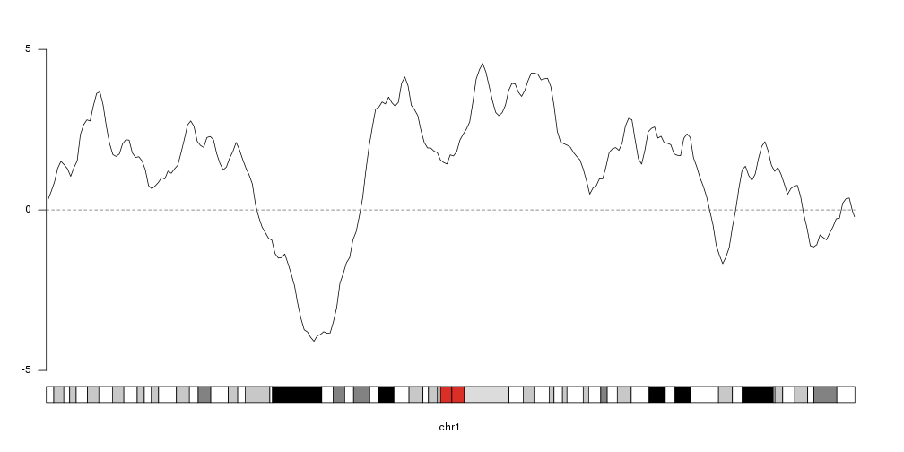
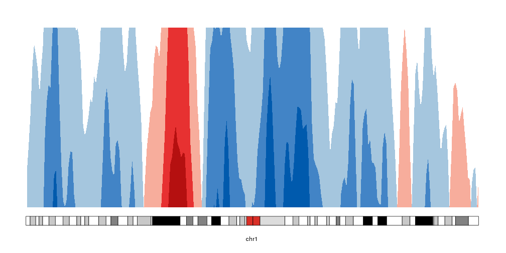
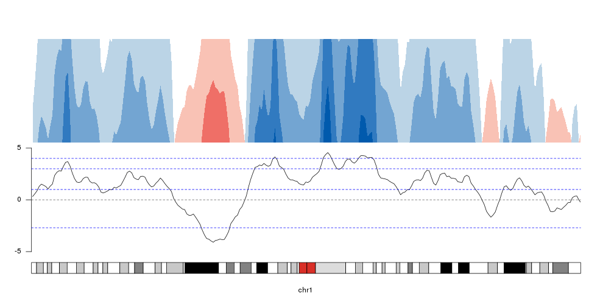
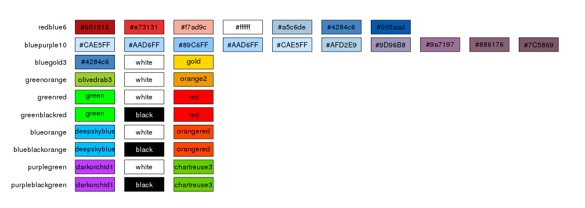
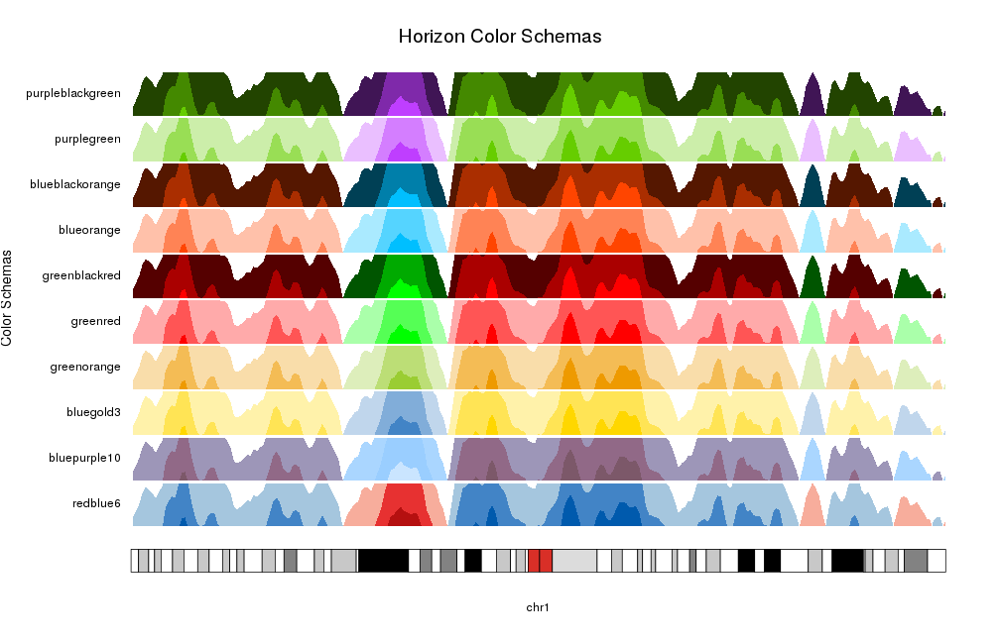
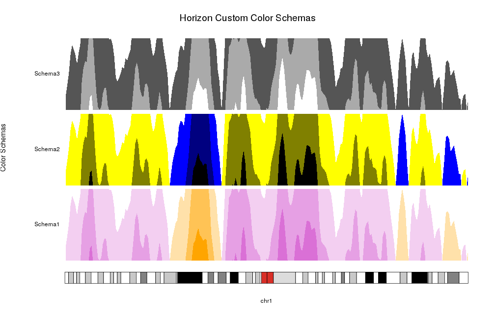
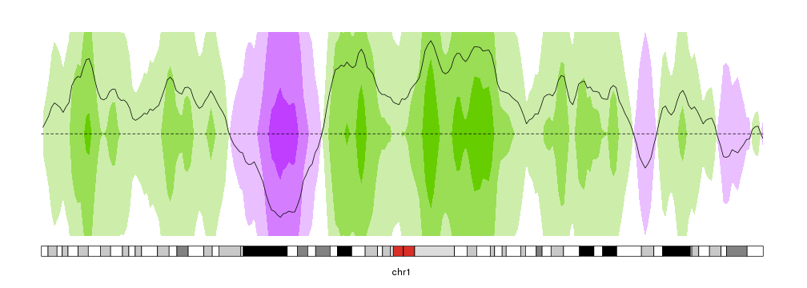

## Plotting Horizon Plots

Horizon plots (usually called horizon graphs) are a type or plots frequently 
used in time-series data to represent a moving value in a fraction of the 
vertical space required by a standard line or area plots. This is most 
useful when plotting and comparing different moving values. A good example 
and explanation can be found here [at flowingdata](https://flowingdata.com/2015/07/02/changing-price-of-food-items-and-horizon-graphs/).

In short, it cuts the data in different bands on the y axis and assigns a 
different color to each band, giving a more intense color to the values 
farther from 0. Positive and negative values are given different colors. After 
that, negative values are mirrored on 0 and finally all bands are plotted on top
of each other, so the more intense bands representing hiher values are drawn 
above the lower values.

This animation shows how they are built in karyoploteR


To show how to use the function, we'll first create a somewhat nice-looking 
input data based on smoothed random data. To do that we'll use 
[regioneR's](https://bioconductor.org/packages/regioneR/) 
`getGenome` and `filterChromosomes` to get the lengths of the chromosomes in the
chromosome 1 of the GRCh37/hg19 genome assembly. Then we'll tile the chromosome
with 1 megabase regions using 
[GenomicRanges'](http://bioconductor.org/packages/GenomicRanges/) `tileGenome` 
and create a random smoothed line with `cumsum` and the `rollmean` function
from [zoo](https://CRAN.R-project.org/package=zoo).


```r
library(karyoploteR)
library(zoo)
set.seed(345666666)

gg <- seqlengths(filterChromosomes(getGenome("hg19"), keep.chr="chr1"))

rand.data <- tileGenome(gg, tilewidth = 1e6, cut.last.tile.in.chrom = TRUE)
rand.vals <- cumsum(runif(length(rand.data)+2, min = -1, max=1))
rand.data$y <- rollmean(rand.vals, k=3)
 
rand.data
```

```
## GRanges object with 250 ranges and 1 metadata column:
##         seqnames              ranges strand |                   y
##            <Rle>           <IRanges>  <Rle> |           <numeric>
##     [1]     chr1           1-1000000      * |   0.317952626540015
##     [2]     chr1     1000001-2000000      * |   0.577162382037689
##     [3]     chr1     2000001-3000000      * |   0.868442350377639
##     [4]     chr1     3000001-4000000      * |    1.30062273905302
##     [5]     chr1     4000001-5000000      * |    1.51477882809316
##     ...      ...                 ...    ... .                 ...
##   [246]     chr1 245000001-246000000      * |   0.211586338312676
##   [247]     chr1 246000001-247000000      * |   0.347693199136605
##   [248]     chr1 247000001-248000000      * |   0.371487227268517
##   [249]     chr1 248000001-249000000      * | -0.0337751372717321
##   [250]     chr1 249000001-249250621      * |  -0.210613104669998
##   -------
##   seqinfo: 1 sequence from an unspecified genome
```

To get an idea of our random data we can plot it using 
[`kpLines`]({{ site.baseurl }}).


```r
ymin <- floor(min(rand.data$y))
ymax <- ceiling(max(rand.data$y))
kp <- plotKaryotype(chromosomes="chr1", plot.type=4)
kpLines(kp, data=rand.data, ymin=ymin, ymax=ymax)
kpAxis(kp, ymin = ymin, ymax=ymax)
kpAbline(kp, h=0, ymin=ymin, ymax=ymax, lty=2, col="#666666")
```



## Creating the horizons

To convert that into an horizon plot, we'll call `kpPlotHorizon`.


```r
kp <- plotKaryotype(chromosomes="chr1", plot.type=4)
kpPlotHorizon(kp, data=rand.data, ymin=ymin, ymax=ymax)
```



## Number of parts

By default, the data is cut into 3 parts in the positive range and 3 parts in 
the negative one. We can change that with the `num.parts` parameter. When adding
more parts, the colors will be updated accordingly.

*Note:* We'll use 
[`autotrack`]({{ site.baseurl }}) 
to automatically position the different horizons one on top of the other.


```r
kp <- plotKaryotype(chromosomes="chr1", plot.type=4)
kpAddLabels(kp, labels = "Number of parts", label.margin = 0.03, srt=90, pos=3)
nparts <- c(1,2,3,5,10,15)
for(i in seq_along(nparts)) {
  at <- autotrack(i, length(nparts))
  kpAddLabels(kp, labels = nparts[i], r0=at$r0, r1=at$r1)
  kpPlotHorizon(kp, data=rand.data, num.parts = nparts[i],
                ymin=ymin, ymax=ymax, r0=at$r0, r1=at$r1)
}
```


In addition to setting the number of parts, we can explicitely specify the 
break points with the parameter `breaks`.


```r
breaks <- c(-2.7, 1,3,4)

kp <- plotKaryotype(chromosomes="chr1", plot.type=4)
at <- autotrack(1,2)
kpLines(kp, data=rand.data, ymin=ymin, ymax=ymax, r0=at$r0, r1=at$r1)
kpAxis(kp, ymin = ymin, ymax=ymax, r0=at$r0, r1=at$r1)
kpAbline(kp, h=0, ymin=ymin, ymax=ymax, lty=2, col="#666666", r0=at$r0, r1=at$r1)
kpAbline(kp, h=breaks, ymin=ymin, ymax=ymax, lty=2, col="blue", r0=at$r0, r1=at$r1)

at <- autotrack(2,2)
kpPlotHorizon(kp, data=rand.data, breaks = breaks,
                ymin=ymin, ymax=ymax, r0=at$r0, r1=at$r1)
```



## Changing colors


The simplest way to select to color scheme for an horizon plot it to use one of 
the predefined color schemes: redblue6, bluepurple10, bluegold3, greenorange, greenred, greenblackred, blueorange, blueblackorange, purplegreen, purpleblackgreen




By default `kpPlotHorizon` will use `redblue6` but it's possible to specify any 
of the available schemas.


```r
pp <- getDefaultPlotParams(plot.type = 4)
pp$leftmargin <- 0.13
kp <- plotKaryotype(chromosomes="chr1", plot.type=4, plot.params = pp)
kpAddMainTitle(kp, "Horizon Color Schemas", cex=1.6)
kpAddLabels(kp, labels = "Color Schemas", label.margin = 0.12, srt=90, pos=3, cex=1.2)
schemas <- names(getColorSchemas()$horizon$schemas)
for(i in seq_along(schemas)) {
  at <- autotrack(i, length(schemas))
  kpAddLabels(kp, labels = schemas[i], r0=at$r0, r1=at$r1)
  kpPlotHorizon(kp, data=rand.data, col = schemas[i],
                ymin=ymin, ymax=ymax, r0=at$r0, r1=at$r1)
}
```



Or you can specify your own colors as a color vector. Internally it will use
`horizonColors` to expand (or collapse) it to the required number of colors, 
one per positive part, one per negative part and a central one corresponding 
to 0 and never used.


```r
pp <- getDefaultPlotParams(plot.type = 4)
pp$leftmargin <- 0.13
kp <- plotKaryotype(chromosomes="chr1", plot.type=4, plot.params = pp)
kpAddMainTitle(kp, "Horizon Custom Color Schemas", cex=1.6)
kpAddLabels(kp, labels = "Color Schemas", label.margin = 0.12, srt=90, pos=3, cex=1.2)
schemas <- list("Schema1"=c("orange", "white", "orchid"),
                "Schema2"=c("black", "blue", "yellow", "black"),
                "Schema3"=c("white", "black", "white"))
for(i in seq_along(schemas)) {
  at <- autotrack(i, length(schemas))
  kpAddLabels(kp, labels = names(schemas)[i], r0=at$r0, r1=at$r1)
  kpPlotHorizon(kp, data=rand.data, col = schemas[[i]],
                ymin=ymin, ymax=ymax, r0=at$r0, r1=at$r1)
}
```



## Extending horizon plots

As with all other karyoploteR plot types, it's possible to manipulate them with
the standard parameters (i.e. flipping r0 and r1 to invert them) and we can 
combine them with other plot types


```r
kp <- plotKaryotype(chromosomes="chr1", plot.type=4)

kpPlotHorizon(kp, data=rand.data, col="purplegreen", 
              ymin=ymin, ymax=ymax, r0=0.5, r1=1)
kpPlotHorizon(kp, data=rand.data, col="purplegreen", 
              ymin=ymin, ymax=ymax, r0=0.5, r1=0)
kpLines(kp, data=rand.data, ymin=ymin, ymax=ymax)
kpAbline(kp, h=0, ymin=ymin, ymax=ymax, lty=2)
```




