## Creating Manhattan Plots

Manhattan plots are widely used in genome-wide association studies (GWAS).  The
idea is to represent many non-significant data points with variable low values
and a few clusters of significant data points that will appear as towers in 
the plot. In its most frequent use, they are used plot p-values, but they
are transformed using the -log10(pval) so smaller pvalues have a higher
transformed value.

To show how to use the function, we'll need some data. We'll simulate it using
[regioneR's](http://bioconductor.org/packages/regioneR/) randomization 
functions. As input, kpPlotManhattan needs a GRanges with the SNP positions 
and the p-values of each SNP (either as a column of the GRanges or as an
independent numeric vector). We'll create a small function to create these
random datasets that will return the SNPs and their p-values and the regions
of the significant peaks.


```r
library(regioneR)
set.seed(123456)

createDataset <- function(num.snps=20000, max.peaks=5) {
  hg19.genome <- filterChromosomes(getGenome("hg19"))
  snps <- sort(createRandomRegions(nregions=num.snps, length.mean=1, 
                    length.sd=0, genome=filterChromosomes(getGenome("hg19"))))
  names(snps) <- paste0("rs", seq_len(num.snps))
  snps$pval <- rnorm(n = num.snps, mean = 0.5, sd = 1)
  snps$pval[snps$pval<0] <- -1*snps$pval[snps$pval<0]
  #define the "significant peaks"
  peaks <- createRandomRegions(runif(1, 1, max.peaks), 8e6, 4e6)
  peaks
  for(npeak in seq_along(peaks)) {
    snps.in.peak <- which(overlapsAny(snps, peaks[npeak]))
    snps$pval[snps.in.peak] <- runif(n = length(snps.in.peak), 
                                     min=0.1, max=runif(1,6,8))
  }
  snps$pval <- 10^(-1*snps$pval)
  return(list(peaks=peaks, snps=snps))
}


ds <- createDataset()
ds$snps
```

```
## GRanges object with 20000 ranges and 1 metadata column:
##           seqnames    ranges strand |                pval
##              <Rle> <IRanges>  <Rle> |           <numeric>
##       rs1     chr1     33753      * |  0.0576031683136819
##       rs2     chr1    256934      * | 0.00521722682220469
##       rs3     chr1    445708      * |  0.0922603436466368
##       rs4     chr1   1234457      * |   0.314262550893573
##       rs5     chr1   1372353      * |   0.155409533816409
##       ...      ...       ...    ... .                 ...
##   rs19996     chrY  58818937      * |   0.720261578148758
##   rs19997     chrY  58872186      * |     0.1691916874758
##   rs19998     chrY  58919437      * |  0.0337314514773338
##   rs19999     chrY  58947874      * |   0.466216488097275
##   rs20000     chrY  59084938      * |  0.0155918514588025
##   -------
##   seqinfo: 24 sequences from an unspecified genome; no seqlengths
```

And the we can start plotting. First we'll call 
[`plotKaryotype`]({{ site.baseurl }}) 
to create a karyoplot with 
[`plot.type=4`]({{ site.baseurl }})
(so all chromosomes are in a single line) and then `kpPlotManhattan` to plot 
the SNPs.


```r
library(karyoploteR)

kp <- plotKaryotype(plot.type=4)
kp <- kpPlotManhattan(kp, data=ds$snps)
```


These are the transformed p-values (-log10(pval)) and the two horizontal lines 
are the genom-wide significance threshold (top one) and the "suggestive" line 
(bottom one). Both lines can be disabled if needed.

## Highlights

We can highlight regions of the genome or specific SNPs using the 
`highlight` parameter. This is usually used to highlight the significant
peaks, but it's not restructed to this. For example, if we want to highlight
the first 30Mb of chromosome 3 we can do something like this:


```r
kp <- plotKaryotype(plot.type=4)
kp <- kpPlotManhattan(kp, data=ds$snps, highlight = "chr3:1-30000000")
```

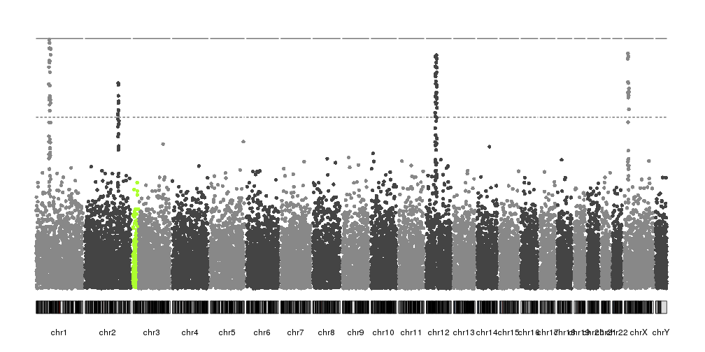

In our case, since we have artificially built the dataset, we know the position
of the peaks and we can use it to highlight them. In a real case, another
technique would be needed to identify them.


```r
kp <- plotKaryotype(plot.type=4)
kp <- kpPlotManhattan(kp, data=ds$snps, highlight = ds$peaks, points.cex = 0.8)
```

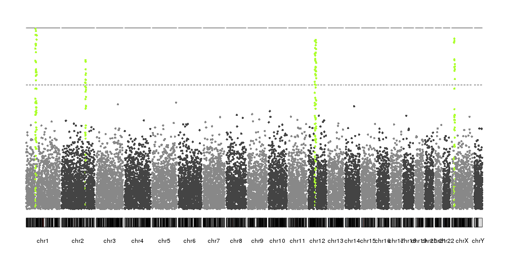

Or we can use `highlight` to highlight SNPs by name or by position in the 
dataset. For example, we can highlight the top snp in chromsome 1. First we'll 
select the SNP with the lowest p-value in chromosome 1


```r
chr1.snps <- ds$snps[seqnames(ds$snps)=="chr1"]
chr1.top.snp <- which.min(chr1.snps$pval)
chr1.top.snp
```

```
## [1] 416
```

And with that number we can highlight it.


```r
kp <- plotKaryotype(plot.type=4)
kp <- kpPlotManhattan(kp, data=ds$snps, highlight = chr1.top.snp)
```

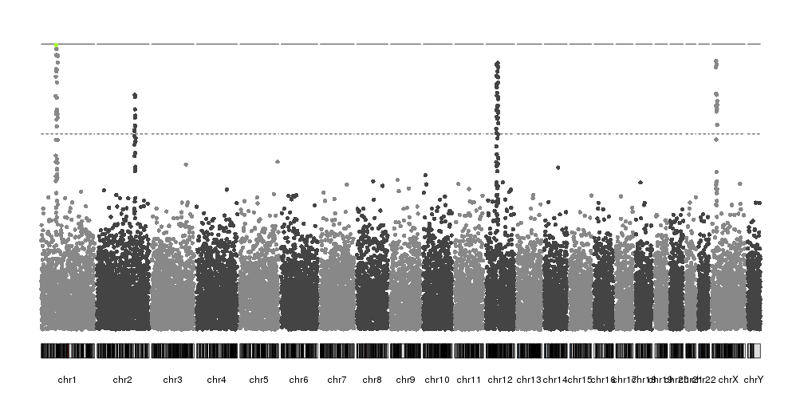

## Changing colors

By default `kpPlotManhattan` will select the SNP colors based on their 
chromosomes. Internally it uses 
[`colByChr`]({{ site.baseurl }})
and any color definition accepted by this function is a valid color 
specification. By defaults `points.col` is "2grays" but other color
schemas are available


```r
kp <- plotKaryotype(plot.type=4)
kp <- kpPlotManhattan(kp, data=ds$snps, points.col = "brewer.set1", r0=autotrack(1,5))
kp <- kpPlotManhattan(kp, data=ds$snps, points.col = "2blues", r0=autotrack(2,5))
kp <- kpPlotManhattan(kp, data=ds$snps, points.col = "greengray", r0=autotrack(3,5))
kp <- kpPlotManhattan(kp, data=ds$snps, points.col = "rainbow", r0=autotrack(4,5))
kp <- kpPlotManhattan(kp, data=ds$snps, points.col = c("orchid", "gold", "orange"), r0=autotrack(5,5))
```

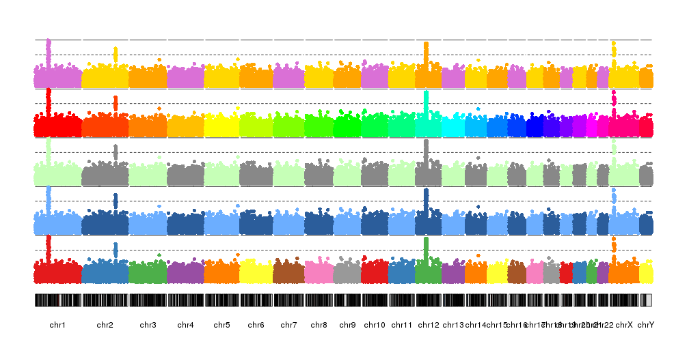

In addition, it's possible to specify the color of each data point individually
base in any other criteria. For example, we can select a color based on their 
transformed p-value, with those with the lowest number plotted as transparent
gray points and the top ones in bright orange.


```r
transf.pval <- -log10(ds$snps$pval)
points.col <- colByValue(transf.pval, colors=c("#BBBBBB00", "orange"))
kp <- plotKaryotype(plot.type=4)
kp <- kpPlotManhattan(kp, data=ds$snps, points.col = points.col)
```

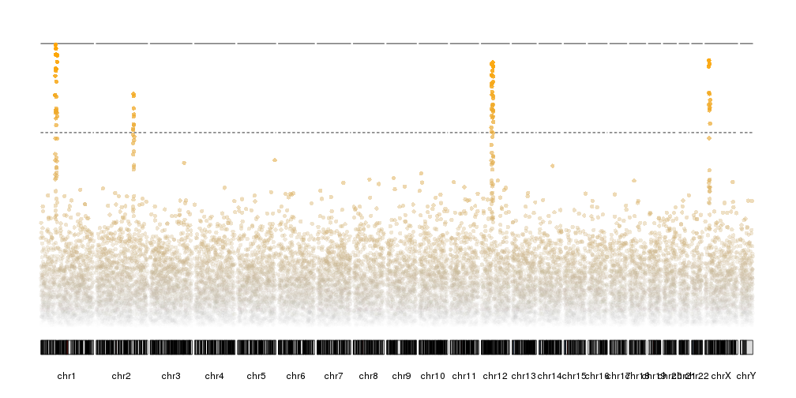


In addition to the colors of the points, it's possible to change the colors 
(and styles) of the significance threshold lines and the highlights with 
the different ".col" parameters


```r
kp <- plotKaryotype(plot.type=4)
kp <- kpPlotManhattan(kp, data=ds$snps, 
                      highlight = ds$peaks, highlight.col = "orchid",
                      suggestive.col="orange", suggestive.lwd = 3,
                      genomewide.col = "red", genomewide.lwd = 6)
```

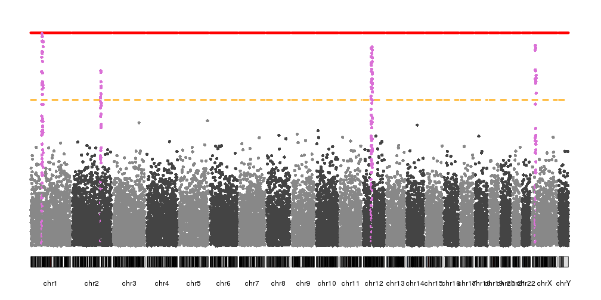


## Non-transformed values

By default `kpPlotManhattan` will transform the p-values before plotting. 
However, in some cases we might want to transform the p-values ourselves
or we may want to plot other data types with no transformation. To 
achieve that we only need to set `logp=FALSE` and the data won't be transformed
before plotting.

For example, we can transform the p-values outside of the function and we'll
get the same plot as before.


```r
transf.pval <- -log10(ds$snps$pval)
kp <- plotKaryotype(plot.type=4)
kp <- kpPlotManhattan(kp, data=ds$snps, pval = transf.pval, logp = FALSE )
```

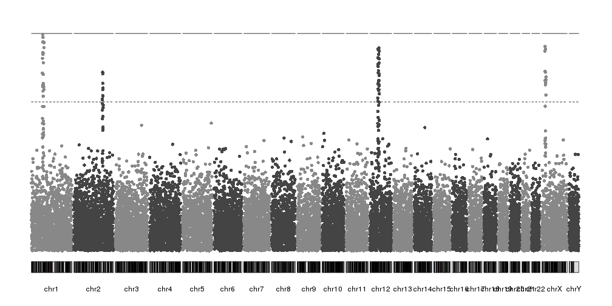

## Adding axis

So far our plots have had no y axis, and this is a serious flaw. Fortunately,
`kpPlotManhattan` is part of karyoploteR and so it will play nice with all other
features and functions, such as 
[`kpAxis`]({{ site.baseurl }}).

Since `kpPlotManhattan` will automatically adjust the y range based on the data,
we'll need to get the `ymax` value from the object it returns using
`kp$latest.plot$computed.values$ymax` and use it to add an axis.


```r
kp <- plotKaryotype(plot.type=4)
kp <- kpPlotManhattan(kp, data=ds$snps)
kpAxis(kp, ymin=0, ymax=kp$latest.plot$computed.values$ymax)
```

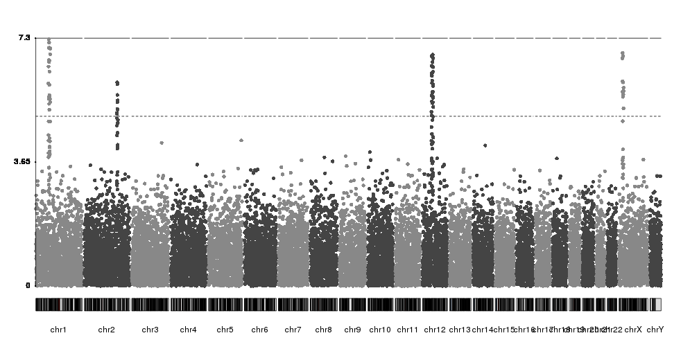

While technically correct, the axis labels could be better positioned and 
mark whole numbers. We can simply adjust the `ticks` parameter of `kpAxis`
and we'll get a much better y axis.


```r
kp <- plotKaryotype(plot.type=4)
kp <- kpPlotManhattan(kp, data=ds$snps)
ymax <- kp$latest.plot$computed.values$ymax
ticks <- c(0, seq_len(floor(ymax)))
kpAxis(kp, ymin=0, ymax=ymax, tick.pos = ticks)
```

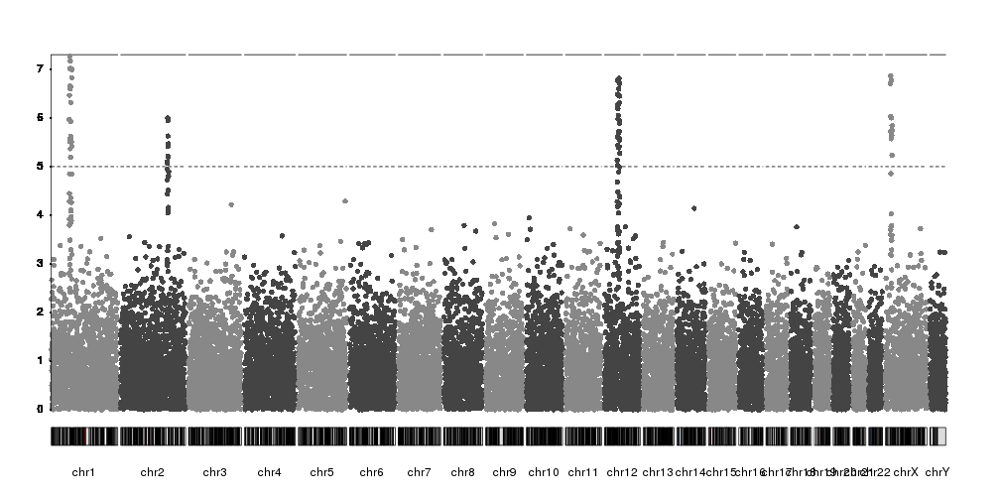

Or we can disable the automatic y axis adjustment and set it to a fixed value
with `ymax`.


```r
kp <- plotKaryotype(plot.type=4)
kp <- kpPlotManhattan(kp, data=ds$snps, ymax=10)
kpAxis(kp, ymin = 0, ymax=10, numticks = 11)
```


## Labeling SNPs

As with the axis, to label SNPs we have the full flexibility of karyoploteR
functions. There is no automatic labelling of top SNPs in place, but you can 
label any SNP in multiple ways.

For example, we can select the top SNP per chromosome over the suggestive 
threshold with code like this.


```r
kp <- plotKaryotype(plot.type=4)
kp <- kpPlotManhattan(kp, data=ds$snps, ymax=10)
kpAxis(kp, ymin = 0, ymax=10, numticks = 11)
```

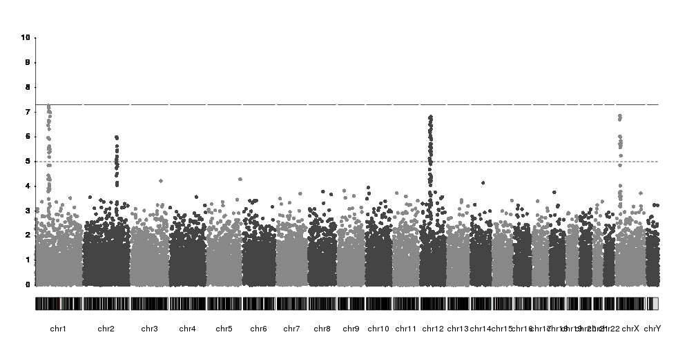

```r
snps <- kp$latest.plot$computed.values$data
suggestive.thr <- kp$latest.plot$computed.values$suggestiveline
#Get the names of the top SNP per chr
top.snps <- tapply(seq_along(snps), seqnames(snps), function(x) {
  in.chr <- snps[x]
  top.snp <- in.chr[which.max(in.chr$y)]
  return(names(top.snp))
})
#Filter by suggestive line
top.snps <- top.snps[snps[top.snps]$y>suggestive.thr]
#And select all snp information based on the names
top.snps <- snps[top.snps]

top.snps
```

```
## GRanges object with 4 ranges and 3 metadata columns:
##           seqnames    ranges strand |                 pval
##              <Rle> <IRanges>  <Rle> |            <numeric>
##     rs416     chr1  69473807      * | 5.41911614318114e-08
##    rs2730     chr2 175760500      * | 1.00410151516858e-06
##   rs12879    chr12  54968140      * | 1.52142234676721e-07
##   rs18728     chrX  19636430      * |  1.3648719792674e-07
##                          y       color
##                  <numeric> <character>
##     rs416 7.26607154103371     #888888
##    rs2730  5.9982223775806     #444444
##   rs12879 6.81775020908375     #444444
##   rs18728 6.86490808218011     #888888
##   -------
##   seqinfo: 24 sequences from an unspecified genome; no seqlengths
```

And now we can plot the names on top of the manhattan plot. We can use 
[`kpText`]({{ site.baseurl }}) to plot
the labels next to the SNP dots. `kpText` will automatically use the content
of the `data$y` if such a column is present.


```r
kp <- plotKaryotype(plot.type=4)
kp <- kpPlotManhattan(kp, data=ds$snps, ymax=10)
kpAxis(kp, ymin = 0, ymax=10, numticks = 11)

kpText(kp, data = top.snps, labels = names(top.snps), ymax=10, pos=3)
```

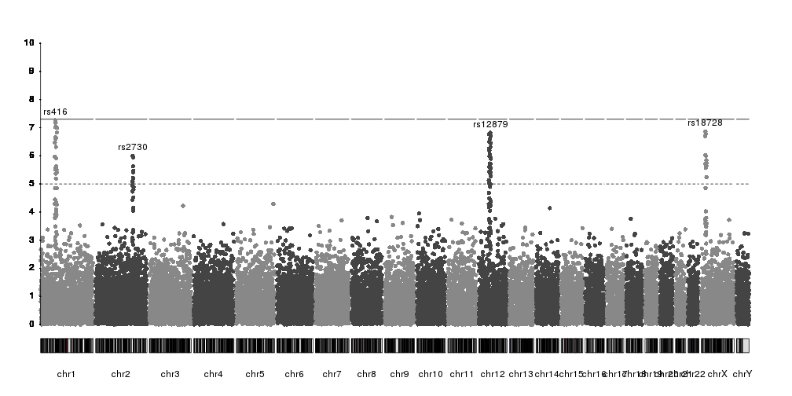

And we can use additional visual elements to highlight them


```r
kp <- plotKaryotype(plot.type=4)
kp <- kpPlotManhattan(kp, data=ds$snps, ymax=10)
kpAxis(kp, ymin = 0, ymax=10, numticks = 11)

kpText(kp, data = top.snps, labels = names(top.snps), ymax=10, pos=4, cex=1.6, col="red")
kpPoints(kp, data = top.snps, pch=1, cex=1.6, col="red", lwd=2, ymax=10)
```

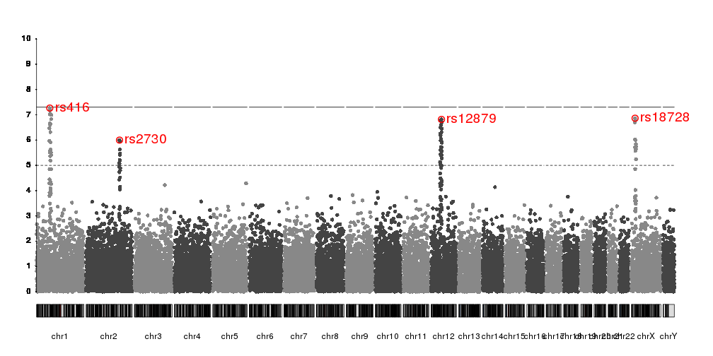

Or we can use 
[`kpPlotMarkers`]({{ site.baseurl }})
to annotate them


```r
kp <- plotKaryotype(plot.type=4)
kp <- kpPlotManhattan(kp, data=ds$snps, ymax=10)
kpAxis(kp, ymin = 0, ymax=10, numticks = 11)

kpPlotMarkers(kp, data=top.snps, labels=names(top.snps), srt=45, y=0.9, 
              ymax=10, r0=0.8, line.color="red")
kpSegments(kp, data=top.snps, y0=top.snps$y, y1=8, ymax=10, col="red")
```

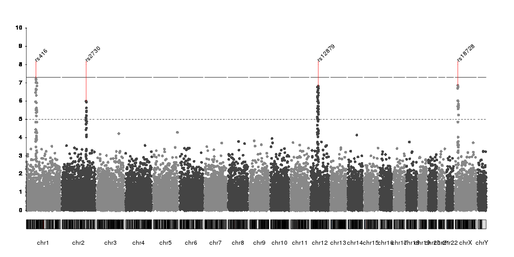


## Combining plots

In addidtion to adding axis, it's possible to combine `kpPlotManhattan` with
any other karyoploteR functions and plots. For example, with r0 and r1 (with
help from 
[`autotrack`]({{ site.baseurl }})
we can plot a manhattan plot in a fraction of the vertical space and combine
different manhattan plots of different datasets and use `kpRect` to highlight a 
specific region.


```r
reg <- extendRegions(ds$peaks, 15e6, 15e6)
kp <- plotKaryotype(plot.type=4)
kpAddLabels(kp, labels = "Trait 1", srt=90, pos=3, r0=autotrack(1,4))
kp <- kpPlotManhattan(kp, data=ds$snps, highlight = ds$peaks, r0=autotrack(1,4))
kpAddLabels(kp, labels = "Trait 2", srt=90, pos=3, r0=autotrack(2,4))
kp <- kpPlotManhattan(kp, data=createDataset()$snps,  r0=autotrack(2,4))
kpAddLabels(kp, labels = "Trait 3", srt=90, pos=3, r0=autotrack(3,4))
kp <- kpPlotManhattan(kp, data=createDataset()$snps,  r0=autotrack(3,4))
kpAddLabels(kp, labels = "Trait 4", srt=90, pos=3, r0=autotrack(4,4))
kp <- kpPlotManhattan(kp, data=createDataset()$snps,  r0=autotrack(4,4))

kpRect(kp, data=reg, y0=0, y1=1, col=NA, border="red", lwd=3)
```

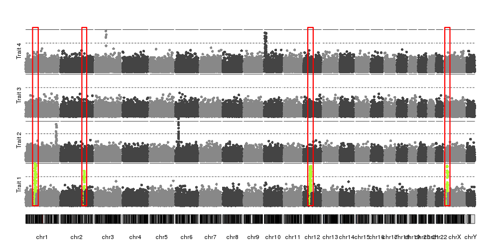


```r
kp <- plotKaryotype(plot.type=4)
kpAddLabels(kp, labels = "Trait 1", srt=90, pos=3, r0=0.5, r1=1, cex=1.8, label.margin = 0.025)
kpAxis(kp, ymin=0, ymax=10, r0=0.5)
kp <- kpPlotManhattan(kp, data=ds$snps, highlight = ds$peaks, r0=0.5, r1=1, ymax=10)
kpAddLabels(kp, labels = "Trait 2", srt=90, pos=3, r0=0, r1=0.5, cex=1.8, label.margin = 0.025)
kpAxis(kp, ymin=0, ymax=10, r0=0.5, r1=0, tick.pos = c(5,10))
kp <- kpPlotManhattan(kp, data=createDataset()$snps, r0=0.5, r1=0, ymax=10, points.col = "2blues")
```

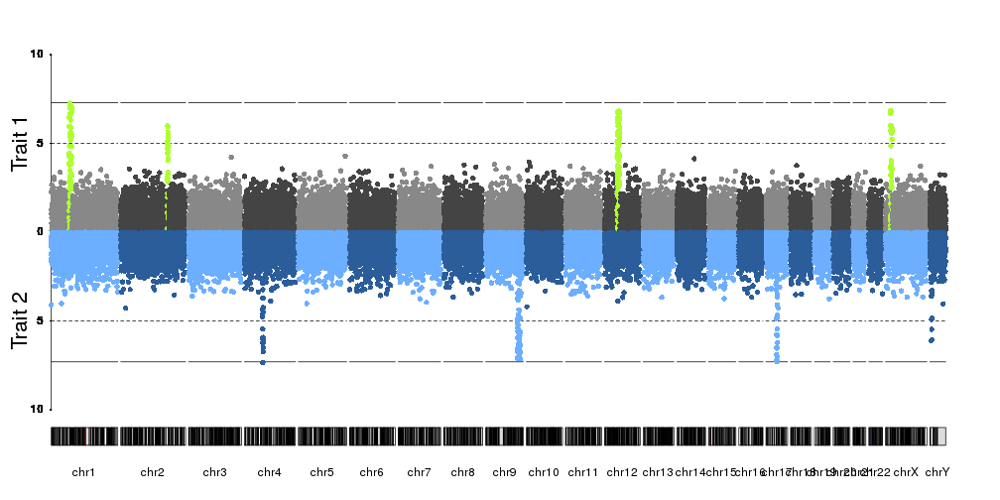

Or we can add positional markers for genes, for examples, using 
[`kpPlotMarkers`]({{ site.baseurl }})


```r
genes <- createRandomRegions(nregions = 5, genome = hg19.genome)
kp <- plotKaryotype(plot.type=4)
kpAddLabels(kp, labels = "Trait 1", srt=90, pos=3, cex=1.8, label.margin = 0.025)
kpAxis(kp, ymin=0, ymax=10)
kp <- kpPlotManhattan(kp, data=ds$snps, points.col = "brewer.set3", ymax=10)

kpPlotMarkers(kp, data = genes, labels = paste0("Gene", seq_along(genes)), cex=1.8, y=0.85)
```


Or in general, combine them with any other plot. Fo example, we can plotthe SNP
density  together with the manhattan plot.


```r
kp <- plotKaryotype(plot.type=4)
kpAddLabels(kp, labels = "Trait 1", srt=90, pos=3, cex=1.8, label.margin = 0.025)
kpAxis(kp, ymin=0, ymax=10, r1=0.8)
kp <- kpPlotManhattan(kp, data=ds$snps, points.col = "brewer.set3", ymax=10, r1=0.8)

kpPlotDensity(kp, data=snps, col="lightskyblue1", r0=0.82, window.size = 10e6)
kpAddLabels(kp, labels = "Density", srt=90, pos=3, cex=1.2, label.margin = 0.025, r0=0.82)
```

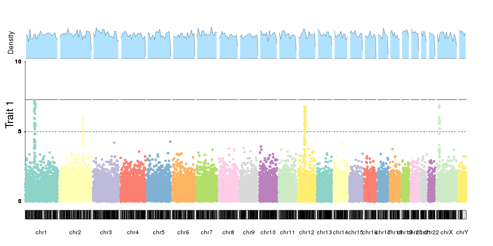

And you can plot them with different chromosome distributions simply changing
`plot.type` to get a completely different visual effect.


```r
kp <- plotKaryotype(plot.type=1)
kpAxis(kp, ymin=0, ymax=10)
kp <- kpPlotManhattan(kp, data=ds$snps, points.col = "brewer.set3", ymax=10)
kpPlotMarkers(kp, data = genes, labels = paste0("Gene", seq_along(genes)), 
              text.orientation = "horizontal", cex=1.2, y=0.85, pos=4)
```

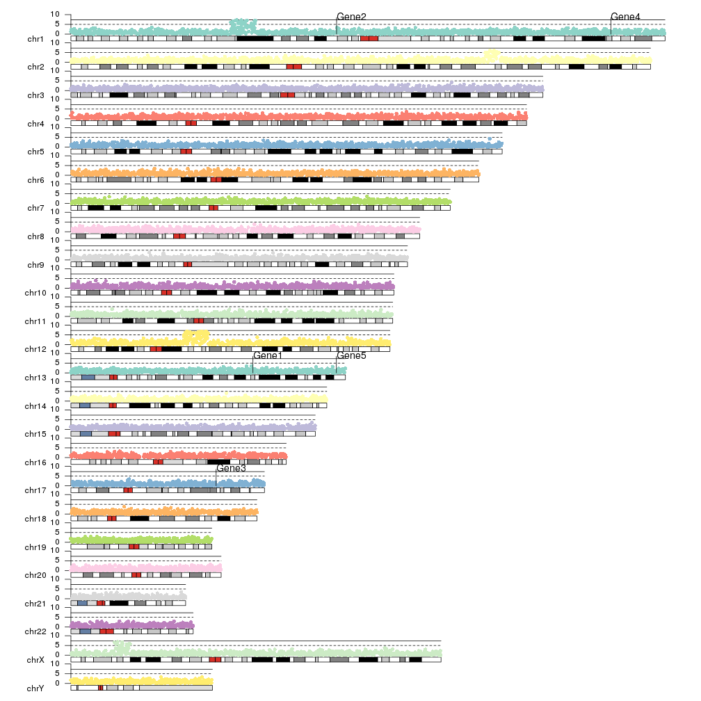


## Zooming

As with any other karyoploteR plot, it's possible to zoom in using 
[`zoom`]({{ site.baseurl }})


```r
kp <- plotKaryotype(plot.type=4, zoom="chr1:50e6-90e6")
kpAddBaseNumbers(kp, add.units = TRUE, cex=1)
kpAddLabels(kp, labels = "Trait 1", srt=90, pos=3, cex=1.8, label.margin = 0.025)
kpAxis(kp, ymin=0, ymax=10, r1=0.8)
kp <- kpPlotManhattan(kp, data=ds$snps, points.col = "brewer.set3", ymax=10, r1=0.8)

kpText(kp, data = top.snps, labels = names(top.snps), ymax=10, pos=3, cex=1.6, col="red", r1=0.8)
kpPoints(kp, data = top.snps, pch=1, cex=1.6, col="red", lwd=2, ymax=10, r1=0.8)

kpPlotDensity(kp, data=snps, col="lightskyblue1", r0=0.82, window.size = 10e6)
kpAddLabels(kp, labels = "Density", srt=90, pos=3, cex=1.2, label.margin = 0.025, r0=0.82)
```

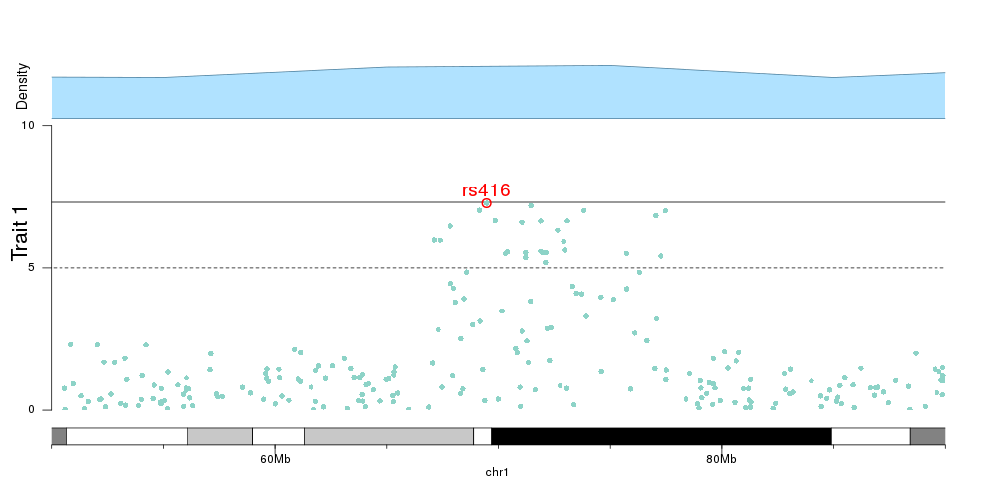

And we can then add the genes in the zoomed region to the plot, to investigate
the relation between top SNPs and genes.


```r
library(TxDb.Hsapiens.UCSC.hg19.knownGene)

kp <- plotKaryotype(plot.type=4, zoom="chr1:68e6-73e6")
kpAddBaseNumbers(kp, add.units = TRUE, cex=1, tick.dist = 1e6)
kpAddLabels(kp, labels = "Trait 1", srt=90, pos=3, cex=1.8, label.margin = 0.025)
kpAxis(kp, ymin=0, ymax=10, r0=0.2)
kp <- kpPlotManhattan(kp, data=ds$snps, points.col = "brewer.set3", ymax=10, r0=0.2)

kpText(kp, data = top.snps, labels = names(top.snps), ymax=10, pos=3, cex=1.6, col="red", r0=0.2)
kpPoints(kp, data = top.snps, pch=1, cex=1.6, col="red", lwd=2, ymax=10, r0=0.2)

genes.data <- makeGenesDataFromTxDb(txdb = TxDb.Hsapiens.UCSC.hg19.knownGene, karyoplot = kp)
genes.data <- addGeneNames(genes.data)
genes.data <- mergeTranscripts(genes.data)
kpPlotGenes(kp, data=genes.data, add.transcript.names = FALSE, r1=0.2, cex=0.8, gene.name.position = "left")
```

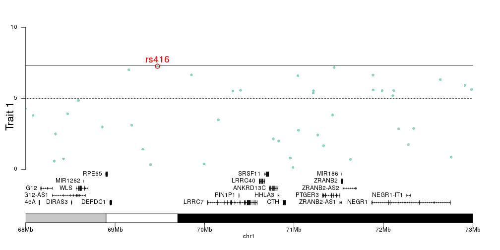


