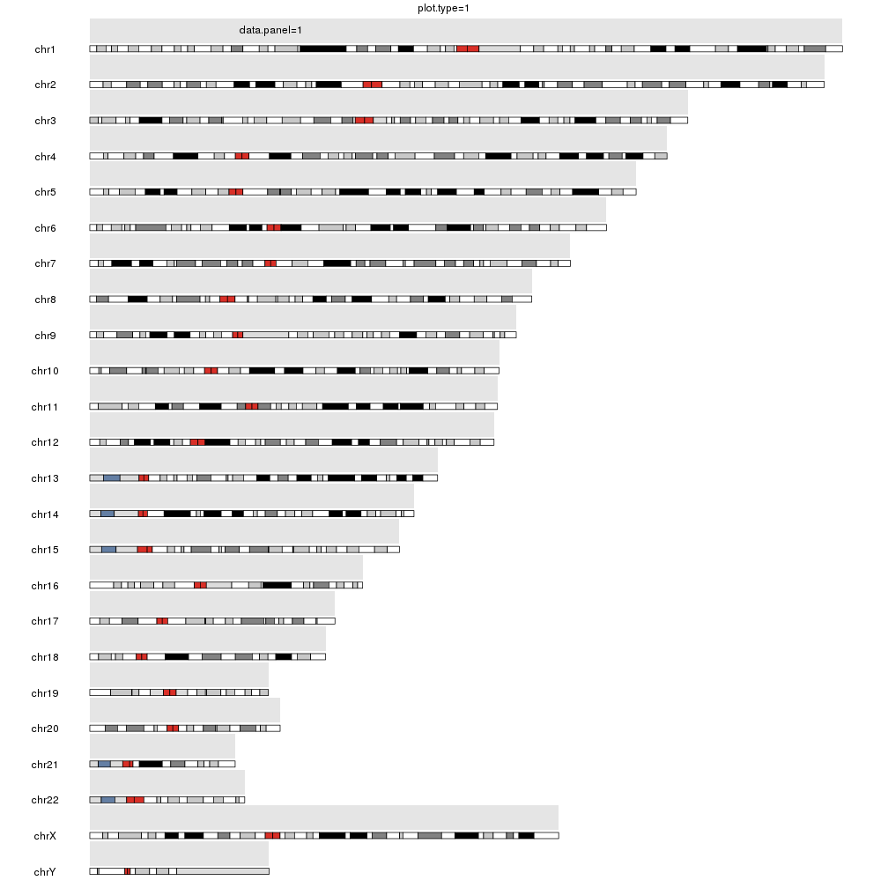
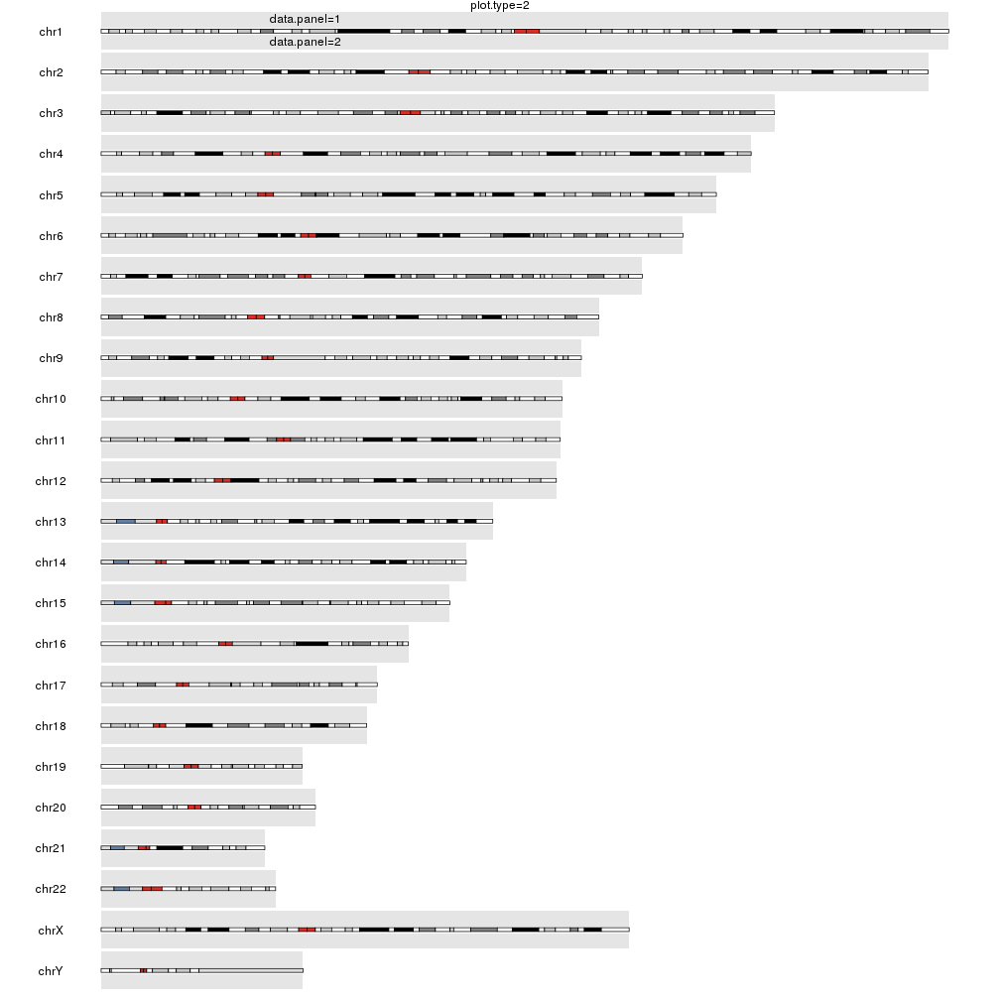
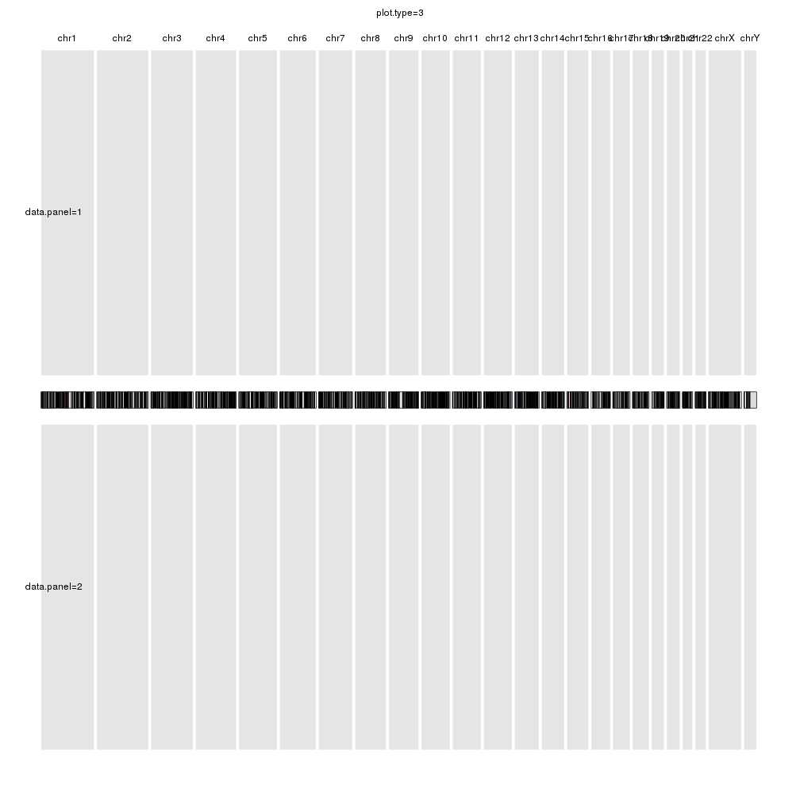
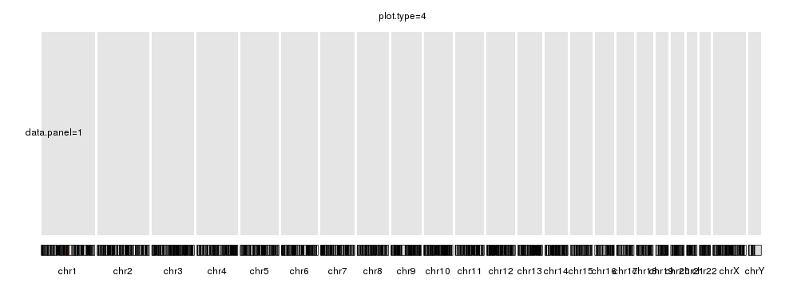
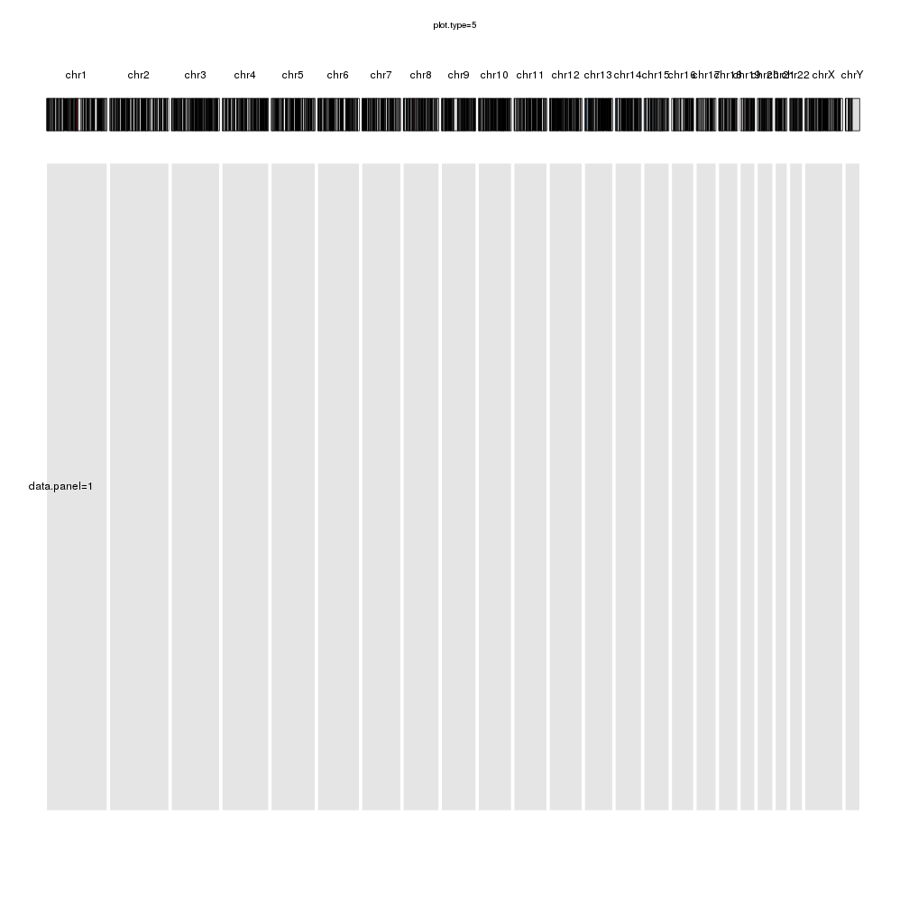

## Plot Types

karyoploteR has different plot types available, each one defining a global
layout of ideograms and one or more data panel around them. Plot types are 
specified at plot creation time in _plotKaryotype_ with the _plot.type_ 
parameter and are identified by integers.

The simplest (and default) plot type is 1, wich represents the ideograms 
as horizontal bars vertically stacked with a single data panel above them. Plot 
type 2 adds a second data panel below the ideograms and plot types 3 to 5 
represent the chromosomes as a single line of horizontal ideograms (think a 
manhattan plot) with variation in the number and position of the data panels.

These are the available data types.


```r
library(karyoploteR)

kp <- plotKaryotype(plot.type=1, main="plot.type=1")
kpDataBackground(kp, data.panel = 1)
kpText(kp, chr="chr1", x=60e6, y=0.5, labels="data.panel=1", data.panel = 1)
```




```r
kp <- plotKaryotype(plot.type=2, main="plot.type=2")
kpDataBackground(kp, data.panel = 1)
kpText(kp, chr="chr1", x=60e6, y=0.5, labels="data.panel=1", data.panel = 1)
kpDataBackground(kp, data.panel = 2)
kpText(kp, chr="chr1", x=60e6, y=0.5, labels="data.panel=2", data.panel = 2)
```




```r
kp <- plotKaryotype(plot.type=3, main="plot.type=3")
kpDataBackground(kp, data.panel = 1)
kpText(kp, chr="chr1", x=60e6, y=0.5, labels="data.panel=1", data.panel = 1)
kpDataBackground(kp, data.panel = 2)
kpText(kp, chr="chr1", x=60e6, y=0.5, labels="data.panel=2", data.panel = 2)
```




```r
kp <- plotKaryotype(plot.type=4, main="plot.type=4")
kpDataBackground(kp, data.panel = 1)
kpText(kp, chr="chr1", x=60e6, y=0.5, labels="data.panel=1", data.panel = 1)
```




```r
kp <- plotKaryotype(plot.type=5, main="plot.type=5")
kpDataBackground(kp, data.panel = 1)
kpText(kp, chr="chr1", x=60e6, y=0.5, labels="data.panel=1", data.panel = 1)
```



