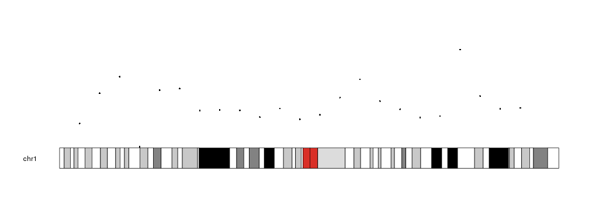
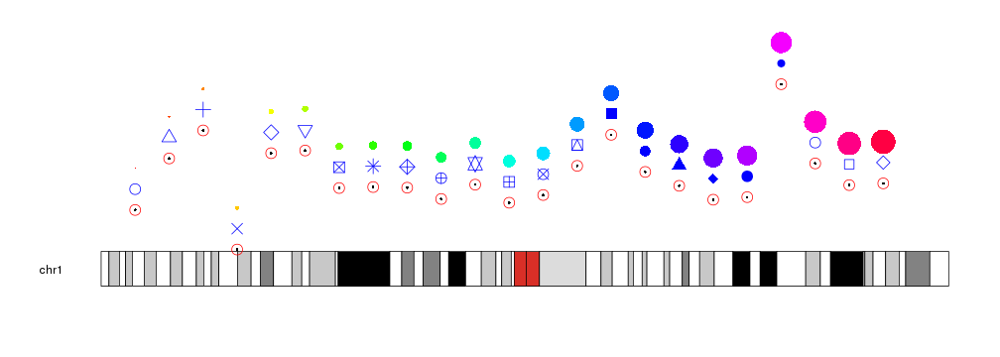

## Plotting Points

To plot points in a karyoplot we need to use the _kpPoints_ function. Given a
character vector _chr_ two integer vectors _x_ and _y_ it will plot points 
in the specifid positions. 


```r
library(karyoploteR)

x <- 1:23*10e6
y <- rnorm(23, mean=0.5, sd=0.25)

kp <- plotKaryotype(chromosomes="chr1")
kpPoints(kp, chr="chr1", x=x, y=y)
```




The glyphs used to represent the points can be customized with the same 
graphical parameters as in the R base graphics _points_ function: pch, cex, col...


```r
kp <- plotKaryotype(chromosomes="chr1")
kpPoints(kp, chr="chr1", x=x, y=y)
kpPoints(kp, chr="chr1", x=x, y=y, pch=1, cex=2, col="red")
kpPoints(kp, chr="chr1", x=x, y=y+0.15, cex=2, pch=1:23, col="blue")
kpPoints(kp, chr="chr1", x=x, y=y+0.3, cex=(1:23)/5, col=rainbow(23))
```




