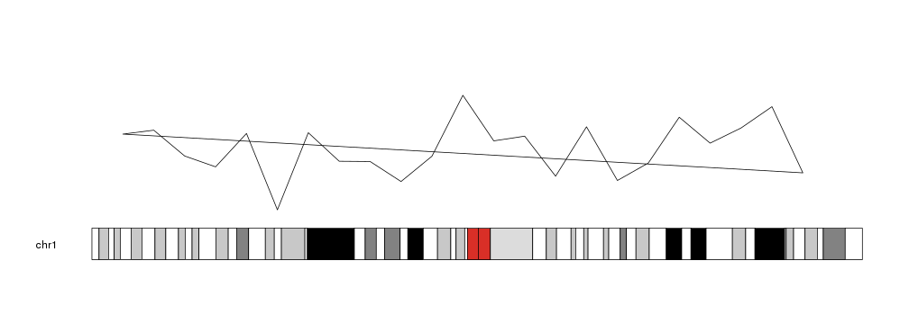
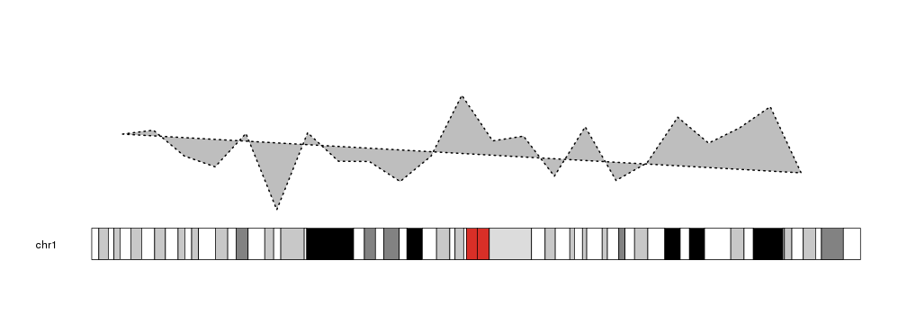
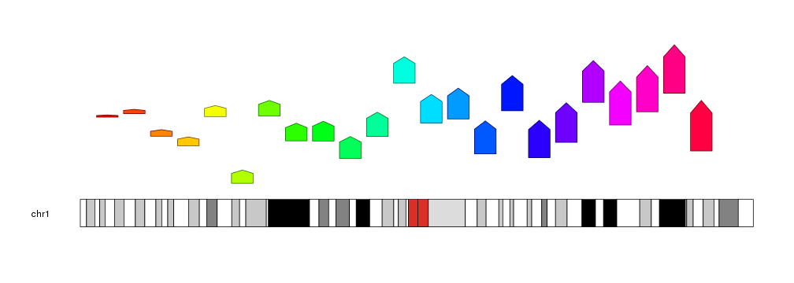

## Plotting Polygon

We can add polygons to a karyoplot with the `kpPolygon` function. Given a
character vector _chr_ and two integer vectors _x_ and _y_, it will draw a 
closed polygon joining all specified points in the given order. And since it's 
a clodes polygon, it will draw a line between the first and last point. 


```r
library(karyoploteR)

x <- 1:23*10e6
y <- rnorm(23, mean=0.5, sd=0.25)

kp <- plotKaryotype(chromosomes="chr1")
kpPolygon(kp, chr="chr1", x=x, y=y)
```



Polygons can be customized with the standard 
[graphical parameters](https://www.rdocumentation.org/packages/graphics/topics/par)
used in the `polygon` R base graphics function. As most closed shapes, they can
be filled. _col_ is used to specifys the filling color and _border_ the border color.


```r
kp <- plotKaryotype(chromosomes="chr1")
kpPolygon(kp, chr="chr1", x=x, y=y, col="grey", border="black", lwd=2, lty=3)
```



`kpPolygon` might not be obviouly useful, but it is used by different higher-level 
plotting functions such as `kpPlotRibbon` with well crafted _x_ and _y_ vectors.
In addition, it adds some flexibility to create unusual plots.


```r
kp <- plotKaryotype(chromosomes="chr1")
for(i in c(1:23)) {
  kpPolygon(kp, chr="chr1", x=x[i]+c(-4e6, -4e6, 0, 4e6, 4e6), y=y[i]+c(0, i*0.015, i*0.02, i*0.015, 0), col=rainbow(23)[i], border=darker(rainbow(23)[i]))  
}
```


