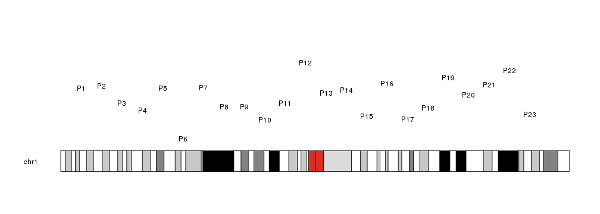
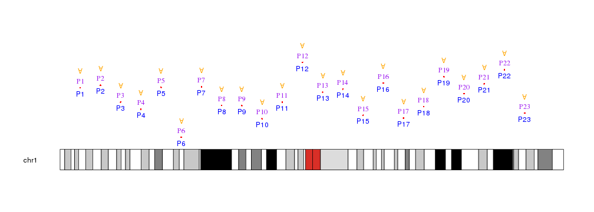

## Plotting Text

To plot Text in a karyoplot we need to use the `kpText` function. Given a
character vector _chr_, two integer vectors _x_ and _y_ and a character vector
_labels_, it will plot the text in _labels_ in the positions defined by _chr_,
_x_ and _y_. 


```r
library(karyoploteR)

x <- 1:23*10e6
y <- rnorm(23, mean=0.5, sd=0.25)
labels <- paste0("P", c(1:23))

kp <- plotKaryotype(chromosomes="chr1")
kpText(kp, chr="chr1", x=x, y=y, labels=labels)
```



Text are cutomizable with the same 
[graphical parameters](https://www.rdocumentation.org/packages/graphics/topics/par)
as in the R base graphics `text` function: _cex_, _pos_, _srt_, _col_...


```r
kp <- plotKaryotype(chromosomes="chr1")
kpPoints(kp, chr="chr1", x=x, y=y, col="red")
kpText(kp, chr="chr1", x=x, y=y, labels=labels, col="blue", pos=1)
kpText(kp, chr="chr1", x=x, y=y, labels=labels, col="purple", family="serif", pos=3)
kpText(kp, chr="chr1", x=x, y=y+0.2, labels="A", col="orange", srt=180)
```




