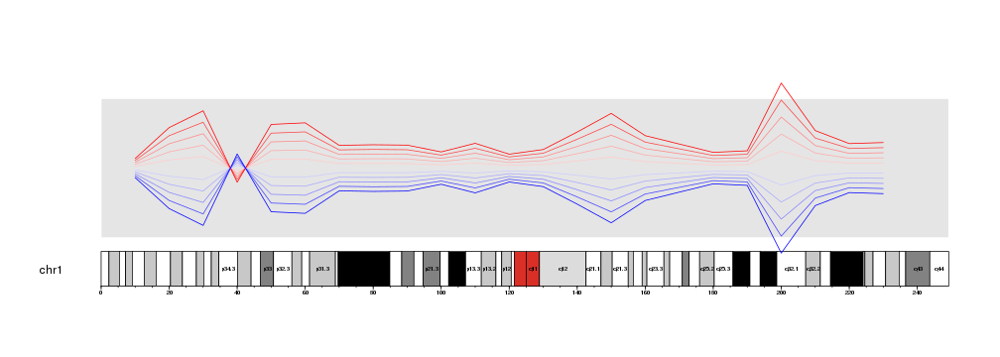
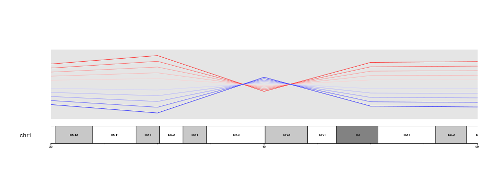
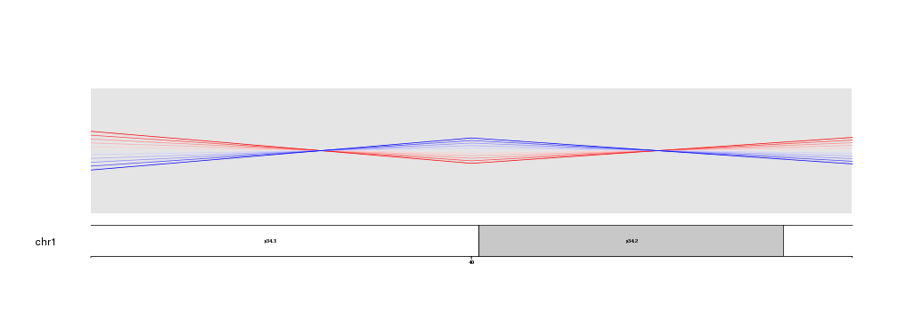
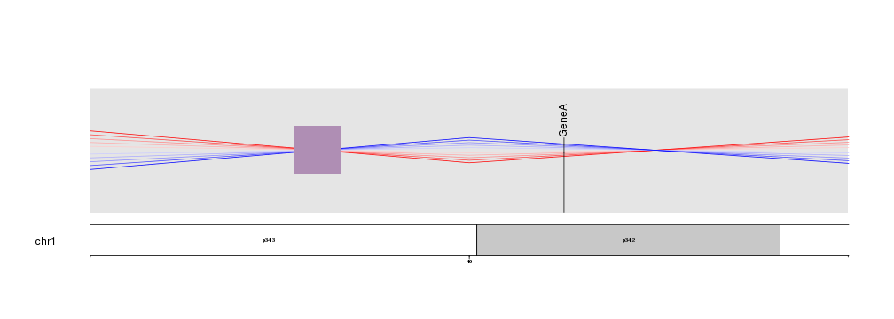
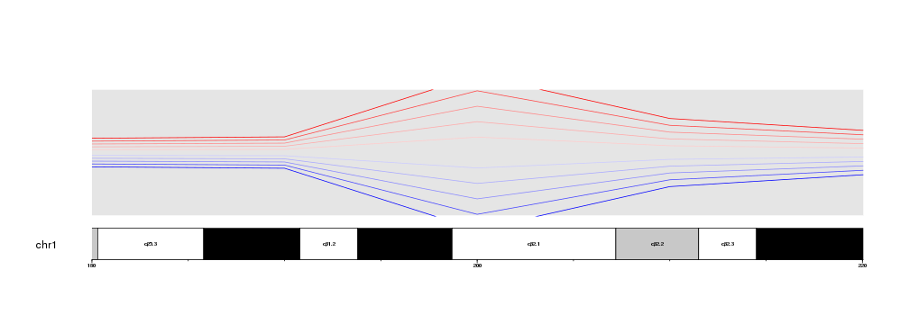
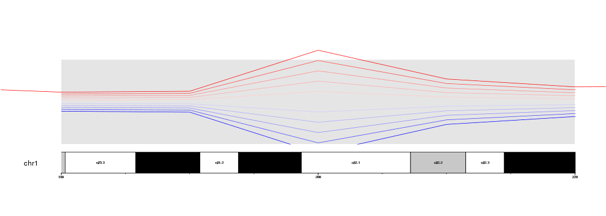

## Zooming in

Starting in version 1.3.9, karyoploteR supports a new zooming feature. With 
it, it is possible to zoom in on the genome and get a detailed view of a 
specific region. The region might be as big as a chromosome or as small as a 
single base.

For example, let's get the last plot from the previous section 
[data positioning]({{ site.baseurl }})
and add the base numbers and cytoband labels.


```r
library(karyoploteR)

x <- c(1:23*10e6)
y <- rnorm(n = 23, mean = 0.5, sd=0.3)

kp <- plotKaryotype(chromosomes="chr1")
kpDataBackground(kp)
kpAddBaseNumbers(kp)
kpAddCytobandLabels(kp)

kpLines(kp, chr="chr1", x=x, y=y, r0=0.5, r1=0.6, col="#FFCCCC")
kpLines(kp, chr="chr1", x=x, y=y, r0=0.5, r1=0.7, col="#FFAAAA")
kpLines(kp, chr="chr1", x=x, y=y, r0=0.5, r1=0.8, col="#FF8888")
kpLines(kp, chr="chr1", x=x, y=y, r0=0.5, r1=0.9, col="#FF4444")
kpLines(kp, chr="chr1", x=x, y=y, r0=0.5, r1=1, col="#FF0000")

kpLines(kp, chr="chr1", x=x, y=y, r0=0.5, r1=0.4, col="#CCCCFF")
kpLines(kp, chr="chr1", x=x, y=y, r0=0.5, r1=0.3, col="#AAAAFF")
kpLines(kp, chr="chr1", x=x, y=y, r0=0.5, r1=0.2, col="#8888FF")
kpLines(kp, chr="chr1", x=x, y=y, r0=0.5, r1=0.1, col="#4444FF")
kpLines(kp, chr="chr1", x=x, y=y, r0=0.5, r1=0, col="#0000FF")
```



Maybe we would want to see with greater detail the region where the lines cross
aroung 40Mb.

To do that, we only need to decide on a specific region to plot (for example
from 20Mb to 60Mb), build a GRanges with that region and pass it to 
`plotKaryotype` using the `zoom` parameter. 


```r
zoom.region <- toGRanges(data.frame("chr1", 20e6, 60e6))

kp <- plotKaryotype(chromosomes="chr1", zoom=zoom.region)
kpDataBackground(kp)
kpAddBaseNumbers(kp)
kpAddCytobandLabels(kp)

kpLines(kp, chr="chr1", x=x, y=y, r0=0.5, r1=0.6, col="#FFCCCC")
kpLines(kp, chr="chr1", x=x, y=y, r0=0.5, r1=0.7, col="#FFAAAA")
kpLines(kp, chr="chr1", x=x, y=y, r0=0.5, r1=0.8, col="#FF8888")
kpLines(kp, chr="chr1", x=x, y=y, r0=0.5, r1=0.9, col="#FF4444")
kpLines(kp, chr="chr1", x=x, y=y, r0=0.5, r1=1, col="#FF0000")

kpLines(kp, chr="chr1", x=x, y=y, r0=0.5, r1=0.4, col="#CCCCFF")
kpLines(kp, chr="chr1", x=x, y=y, r0=0.5, r1=0.3, col="#AAAAFF")
kpLines(kp, chr="chr1", x=x, y=y, r0=0.5, r1=0.2, col="#8888FF")
kpLines(kp, chr="chr1", x=x, y=y, r0=0.5, r1=0.1, col="#4444FF")
kpLines(kp, chr="chr1", x=x, y=y, r0=0.5, r1=0, col="#0000FF")
```



Or we can get an even closer look and plot only from 35Mb to 45Mb.


```r
zoom.region <- toGRanges(data.frame("chr1", 35e6, 45e6))

kp <- plotKaryotype(chromosomes="chr1", zoom=zoom.region)
kpDataBackground(kp)
kpAddBaseNumbers(kp)
kpAddCytobandLabels(kp)

kpLines(kp, chr="chr1", x=x, y=y, r0=0.5, r1=0.6, col="#FFCCCC")
kpLines(kp, chr="chr1", x=x, y=y, r0=0.5, r1=0.7, col="#FFAAAA")
kpLines(kp, chr="chr1", x=x, y=y, r0=0.5, r1=0.8, col="#FF8888")
kpLines(kp, chr="chr1", x=x, y=y, r0=0.5, r1=0.9, col="#FF4444")
kpLines(kp, chr="chr1", x=x, y=y, r0=0.5, r1=1, col="#FF0000")

kpLines(kp, chr="chr1", x=x, y=y, r0=0.5, r1=0.4, col="#CCCCFF")
kpLines(kp, chr="chr1", x=x, y=y, r0=0.5, r1=0.3, col="#AAAAFF")
kpLines(kp, chr="chr1", x=x, y=y, r0=0.5, r1=0.2, col="#8888FF")
kpLines(kp, chr="chr1", x=x, y=y, r0=0.5, r1=0.1, col="#4444FF")
kpLines(kp, chr="chr1", x=x, y=y, r0=0.5, r1=0, col="#0000FF")
```



Nothing else needs to be changed. No code need to be adapted to go from a 
whole genome view to a detailed view. In addition, zooming is compatible with 
all plotting functions in karyoploteR, giving you the maximum flexibility.


```r
zoom.region <- toGRanges(data.frame("chr1", 35e6, 45e6))

kp <- plotKaryotype(chromosomes="chr1", zoom=zoom.region)
kpDataBackground(kp)
kpAddBaseNumbers(kp)
kpAddCytobandLabels(kp)

kpLines(kp, chr="chr1", x=x, y=y, r0=0.5, r1=0.6, col="#FFCCCC")
kpLines(kp, chr="chr1", x=x, y=y, r0=0.5, r1=0.7, col="#FFAAAA")
kpLines(kp, chr="chr1", x=x, y=y, r0=0.5, r1=0.8, col="#FF8888")
kpLines(kp, chr="chr1", x=x, y=y, r0=0.5, r1=0.9, col="#FF4444")
kpLines(kp, chr="chr1", x=x, y=y, r0=0.5, r1=1, col="#FF0000")

kpLines(kp, chr="chr1", x=x, y=y, r0=0.5, r1=0.4, col="#CCCCFF")
kpLines(kp, chr="chr1", x=x, y=y, r0=0.5, r1=0.3, col="#AAAAFF")
kpLines(kp, chr="chr1", x=x, y=y, r0=0.5, r1=0.2, col="#8888FF")
kpLines(kp, chr="chr1", x=x, y=y, r0=0.5, r1=0.1, col="#4444FF")
kpLines(kp, chr="chr1", x=x, y=y, r0=0.5, r1=0, col="#0000FF")

kpPlotMarkers(kp, data=toGRanges(data.frame("chr1", 41.2e6, 41.3e6)), y = 0.6, labels = "GeneA")
kpPoints(kp, chr="chr1", x=38e6, y=0.5, pch=15, cex=10, col="#AF8EB4")
```



## Clipping

When zooming is active, by default data is clipped to the data panel. That means 
that only the data points falling inside the data panel will be plotted. For 
examples, if instead of the 40Mb region, we get a detailed view of the 200Mb, 
where the lines are most apart, we will see that the parts falling above and 
below the margins are clipped and the lines appear as cut.


```r
zoom.region <- toGRanges(data.frame("chr1", 180e6, 220e6))

kp <- plotKaryotype(chromosomes="chr1", zoom=zoom.region)
kpDataBackground(kp)
kpAddBaseNumbers(kp)
kpAddCytobandLabels(kp)

kpLines(kp, chr="chr1", x=x, y=y, r0=0.5, r1=0.6, col="#FFCCCC")
kpLines(kp, chr="chr1", x=x, y=y, r0=0.5, r1=0.7, col="#FFAAAA")
kpLines(kp, chr="chr1", x=x, y=y, r0=0.5, r1=0.8, col="#FF8888")
kpLines(kp, chr="chr1", x=x, y=y, r0=0.5, r1=0.9, col="#FF4444")
kpLines(kp, chr="chr1", x=x, y=y, r0=0.5, r1=1, col="#FF0000")

kpLines(kp, chr="chr1", x=x, y=y, r0=0.5, r1=0.4, col="#CCCCFF")
kpLines(kp, chr="chr1", x=x, y=y, r0=0.5, r1=0.3, col="#AAAAFF")
kpLines(kp, chr="chr1", x=x, y=y, r0=0.5, r1=0.2, col="#8888FF")
kpLines(kp, chr="chr1", x=x, y=y, r0=0.5, r1=0.1, col="#4444FF")
kpLines(kp, chr="chr1", x=x, y=y, r0=0.5, r1=0, col="#0000FF")
```



It is possible to disable the clipping simply by setting `clipping=FALSE` in 
a plotting function. Clipping can be activated and deactivated independently 
for every plotting function call.


```r
zoom.region <- toGRanges(data.frame("chr1", 180e6, 220e6))

kp <- plotKaryotype(chromosomes="chr1", zoom=zoom.region)
kpDataBackground(kp)
kpAddBaseNumbers(kp)
kpAddCytobandLabels(kp)

kpLines(kp, chr="chr1", x=x, y=y, r0=0.5, r1=0.6, col="#FFCCCC")
kpLines(kp, chr="chr1", x=x, y=y, r0=0.5, r1=0.7, col="#FFAAAA")
kpLines(kp, chr="chr1", x=x, y=y, r0=0.5, r1=0.8, col="#FF8888")
kpLines(kp, chr="chr1", x=x, y=y, r0=0.5, r1=0.9, col="#FF4444")
kpLines(kp, chr="chr1", x=x, y=y, r0=0.5, r1=1, col="#FF0000", clipping=FALSE)

kpLines(kp, chr="chr1", x=x, y=y, r0=0.5, r1=0.4, col="#CCCCFF")
kpLines(kp, chr="chr1", x=x, y=y, r0=0.5, r1=0.3, col="#AAAAFF")
kpLines(kp, chr="chr1", x=x, y=y, r0=0.5, r1=0.2, col="#8888FF")
kpLines(kp, chr="chr1", x=x, y=y, r0=0.5, r1=0.1, col="#4444FF")
kpLines(kp, chr="chr1", x=x, y=y, r0=0.5, r1=0, col="#0000FF")
```


Hovewer, we have to take into account that clipping is deactivated completely,
in this case extending the red line on the lateral margins of the plot. If 
finer control is needed, it might be necessary to adjust the data points and
filter them before passing them to the plotting functions.


